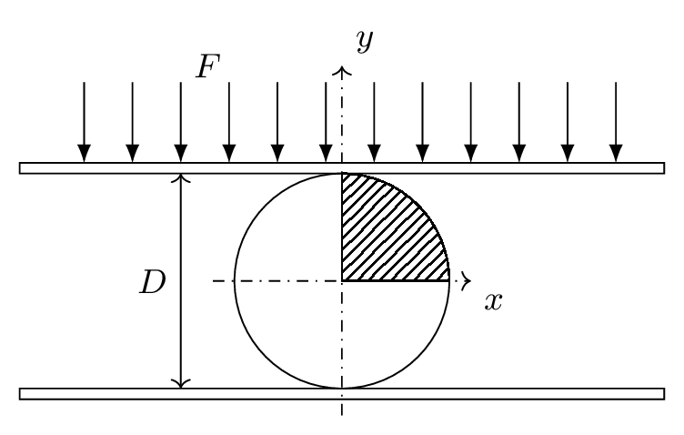
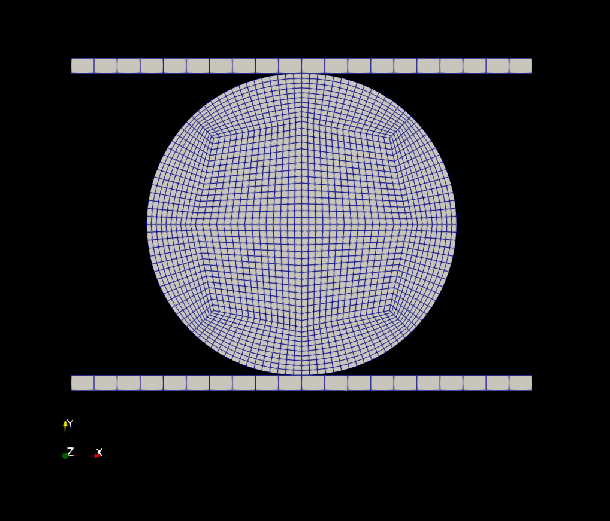
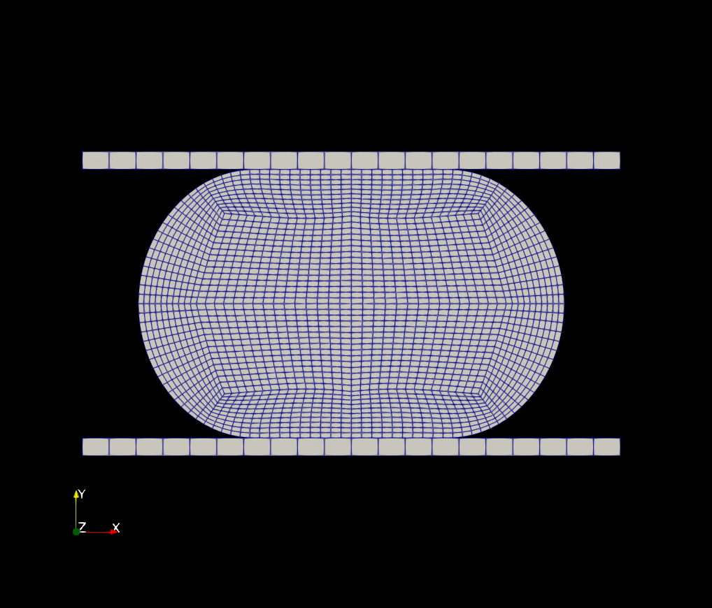
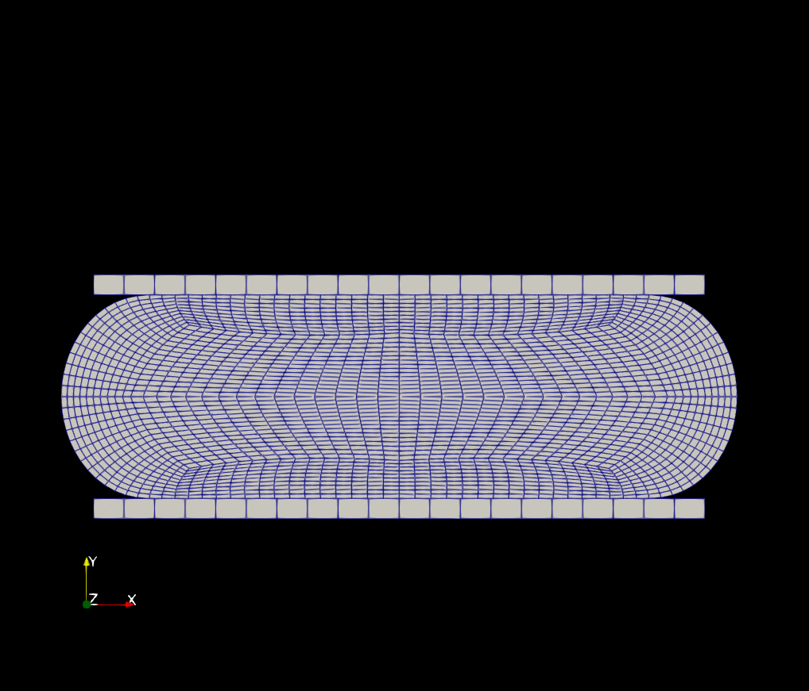
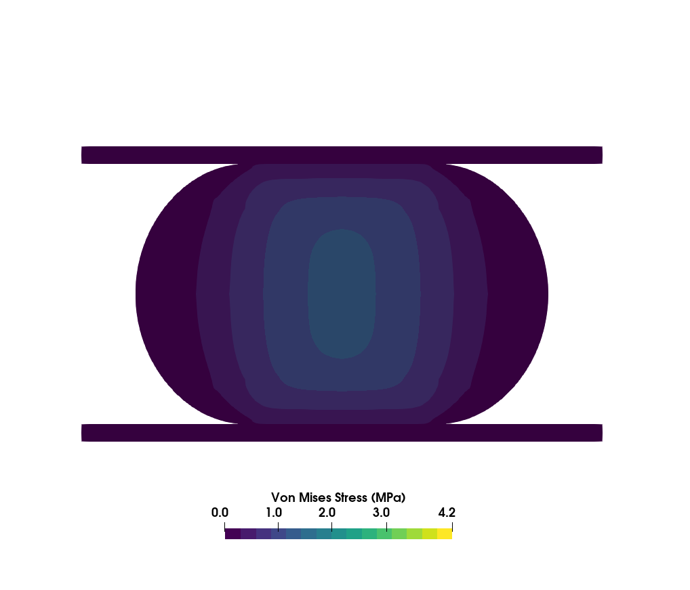
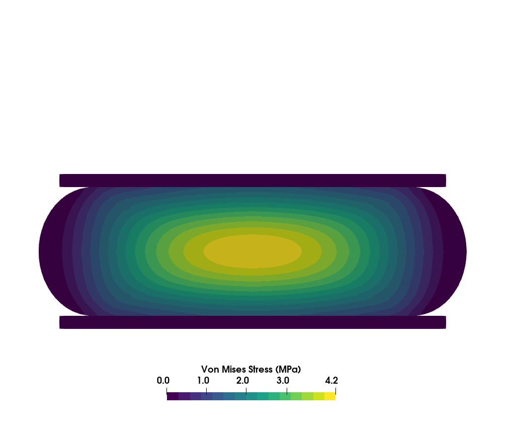
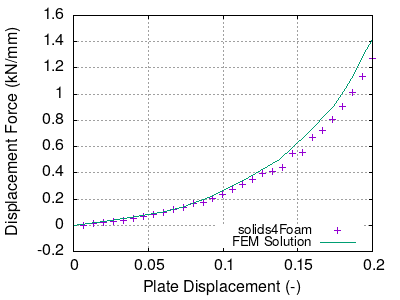
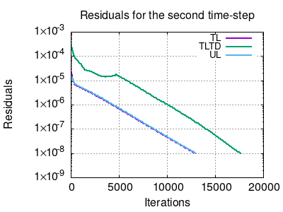
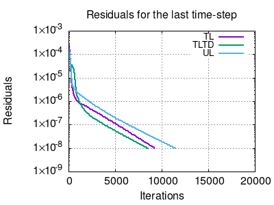

# Tutorial: `cylinderCrush`

---

## Tutorial Aims

- Exemplify the use of a hyperelastic mechanical law with large deformations
  and a solid contact boundary condition.
- Compare the convergence behavior of updated and total Lagrangian formulations.

## Case overview

**Figure 1: Solid cylinder compressed between two rigid plates**

The third benchmark is a solid cylinder made of a rubbery material crushed
between two rigid plates, as schematically shown in Figure 1. The cylinder has
a diameter of 0.4 m and is compressed between rigid plates with a total
compressed displacement of half its diameter. The contact between the cylinder
and plate surfaces was modeled as frictionless.

This problem was investigated by [[1] T. Sussman and K.-J. Bathe, “A finite
element formulation for nonlinear incompresible elastic and inelastic
analysis,” Computers and Structures, vol. 26, pp. 357–409, 1987.
](https://www.sciencedirect.com/science/article/pii/0045794987902653) and also
by [I. Bijelonja, I. Demirdžić, and S. Muzaferija, “A finite volume method for
large strain analysis of incompressible hyperelastic materials,” International
Journal for Numerical Methods in Engineering, vol.  64, pp. 1594–1609, Nov.
2005](https://hrcak.srce.hr/206941). The latter modeled the material of the
cylinder as purely incompressible and the former assumed a
nearly-incompressible behavior, which is characterized by the authors as when
"the ratio of the bulk modulus to the shear modulus is typically several
thousand". In the tutorial, the same material law employed by the authors was
used: the Mooney-Rivlin law with    *c10 = 0.293 MPa*,
*c01 = 0.177 MPa*, and the bulk modulus *1410 MPa*.

The domain used was only a quarter of the cylinder due to symmetry (hatched
area in Figure 1). A mesh with 500 quadrilateral control volumes arranged in a
block-structured mesh were simulated and the updated Lagrangian approach was
employed. The plate is linearly displaced in 30 increments.

---

## Expected results

Figure 2 shows the displacement of the mesh of the (a) undeformed
configuration, and an intermediate and final instants of the simulation (b and
c, respectively). Figure 3 shows the Von Mises stress field for the
intermediate and final configuration of the cylinder.

**Figure 2: Mesh of the undeformed configuration and the deformed mesh at a
intermediate and final instants of time.**

**Figure 3: Von Mises stress fields at the intermediate and final instants of
time.**

The verification of the solution given by `solids4Foam` can be seen in the
Figure 4 which shows the displacement force applied to the cylinder as a
function of the plate vertical displacement obtained with the
`nonLinearGeometryUpdatedLagrangian` model.  The plot compares the numerical
solution by using the FEM solution provided by Bijelonja et al. (2005).

**Figure 4: Displacement force versus deflection of the cylinder with
`solid4Foam` and a reference solution using the FEM method published in
[Bijelonja et al. (2005)](https://hrcak.srce.hr/206941).**

Note from Figures 2 and 3 that the deformation of this case is quite large,
with the mesh being considerably deformed towards the later time-steps. It is
instructive in this tutorial to assess the impact of the updated and total
Lagrangian formulations on the convergence of the case. To that end, we also
ran this tutorial with the `nonLinearGeometryUpdatedLagrangian` (label UL) and
`nonLinearGeometryTotalLagrangianTotalDisplacement` (labeled TL). The
comparison is made through Figure 5 that shows the residuals of the second and
last time-steps. We see that there is a change in the best approach according
to the instant in time.  This may also occur depending on the problem you
simulating.

 **Figure 5: Residuals of this tutorial using an updated and total Lagrangian
 approaches at the second (left panel) and last (right panel) time-steps.**

---

## Data Availability

The results and gnuplot scripts used to generate the figures above are available in the [solids4foam tutorials benchmark data](https://github.com/solids4foam/solids4foam-tutorials-benchmark-data) repository.
