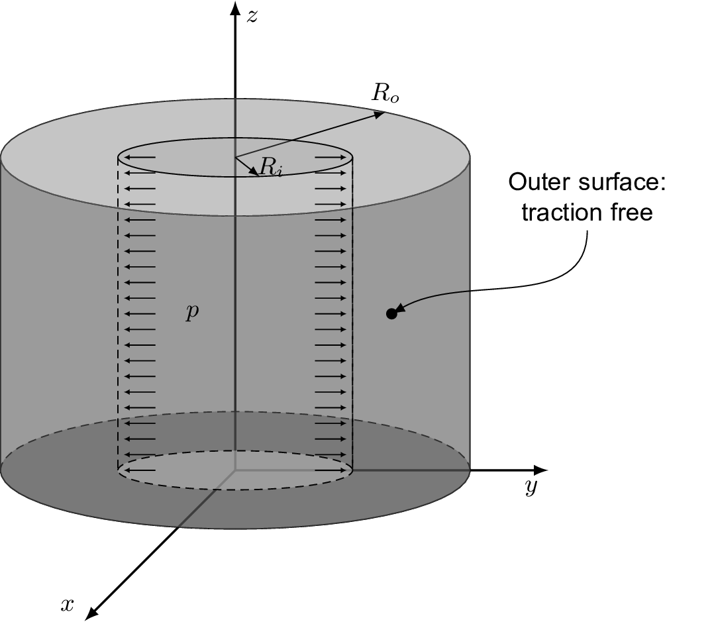
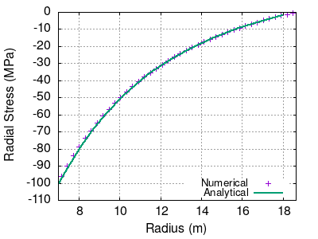
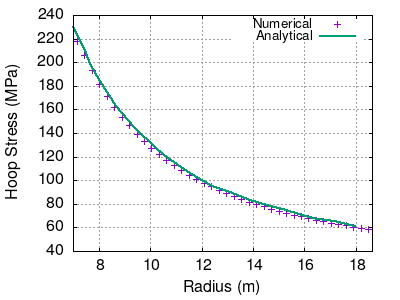

# Tutorial: `cylindricalPressureVessel`

Prepared by Iago Lessa de Oliveira

---

## Tutorial Aims

- Exemplify the use of a hyperelastic mechanical law with large deformations;
- Assess the effect of the bulk modulus on the residual convergence of
  segregated algorithms for solids.

```warning
This tutorial currently only works with foam-extend-4.1.
```

## Case Overview



**Figure 1: Thick cylindrical vessel under inner pressure.**

This benchmark consists of a thick cylindrical shell with an inner radius
$$R_i = 7$$ m and outer radius $$R_o = 18.625$$ m. Its material
is modelled as incompressible with the Mooney-Rivlin law with material
parameters $$c_{10} = 80$$ MPa_, $$c_{01} = 20$$ MPa, and
$$c_{11} = 0.0$$ MPa. The strain state is assumed to be plane due to the
geometric symmetry along the z-axis direction (see Figure 1). For the
simulation, the inner pressure was linearly applied in equal increments along
time until $$p = 100$$ MPa.

Due to symmetry, only a quarter of the cylinder section was simulated with a
mesh density of 20 x 20 cells in the radial and circumferential directions,
created using the `blockMesh` utility, respectively. A residual tolerance for
the momentum equation of 10$$^{-6}$$ was selected. For the results
presented here, we employed the
`nonLinearGeometryTotalLagrangianTotalDisplacement` model, one of the total
Lagrangian approaches available that solves for the _total_ displacement, which
is why you have to use the `D` file in the directory `0/`.

---

## Expected Results

Figure 2 shows the radial and circumferential (or hoop stress) components of the
Cauchy stress tensor along the _undeformed_ radius of the cylinder when the
inner pressure is equal to _100 MPa_. To solve for the undeformed configuration,
i.e. without automatically moving the mesh, you have to use one of the _total
Lagrangian_ formulations available. The solution reference was found in
[I. Bijelonja, I. Demirdžić, and S. Muzaferija, “A finite volume method for
large strain analysis of incompressible hyperelastic materials,” International
Journal for Numerical Methods in Engineering, vol. 64, pp. 1594–1609, Nov.
2005](https://hrcak.srce.hr/206941)




Figure 2 - Radial (left) and circumferential, or hoop, stresses (right) along
the radius of the cylinder

The results shown in the plots of Figure 2 were obtained with a Poisson's ratio
of 0.49, which yielded a Jacobian in the interval _[0.98,0.99]_ for the last
time-step. The Jacobian is the determinant of the deformation gradient (the `F`
field that you find in the solution of non-linear cases), and should be equal to
1 when the solid is incompressible. The hyperelastic laws in `solids4foam` are
implemented using a _volumetric decomposition_, where the deviatoric and
volumetric portions of the constitutive law are modelled separately. In this
case, the volumetric portion represents the isochoric motion of the solid and
the compressibility of material can be set directly by using its bulk modulus
(the field `K` in `constant/mechanicalProperties`), if available, or through the
Poisson ratio (the scalar `nu` in `constant/mechanicalProperties`), where thus
the bulk modulus is computed via the equation of the linearised theory.

By using this formulation, purely incompressible behaviour can be achieved by
making either the bulk modulus "too large" or the Poisson ratio closer to 0.5.
However, an important feature of displacement-based segregated solvers is that
the convergence deteriorates as the incompressible behaviour is approximated. To
demonstrate this, Figure 3 shows the residual drop of the first time step of the
solution for four different values of the Poisson ratio, `nu`: 0.30, 0.40, 0.45,
and 0.49.


Figure 3 - Effect on convergence when approximating the purely incompressible
behaviour in a solid

It is important to have this in mind when using the non-linear mechanical laws
implemented.

---

## Data Availability

The results and gnuplot scripts used to generate the figures above are available
in the
[solids4foam tutorials benchmark
data](https://github.com/solids4foam/solids4foam-tutorials-benchmark-data)
repository.
