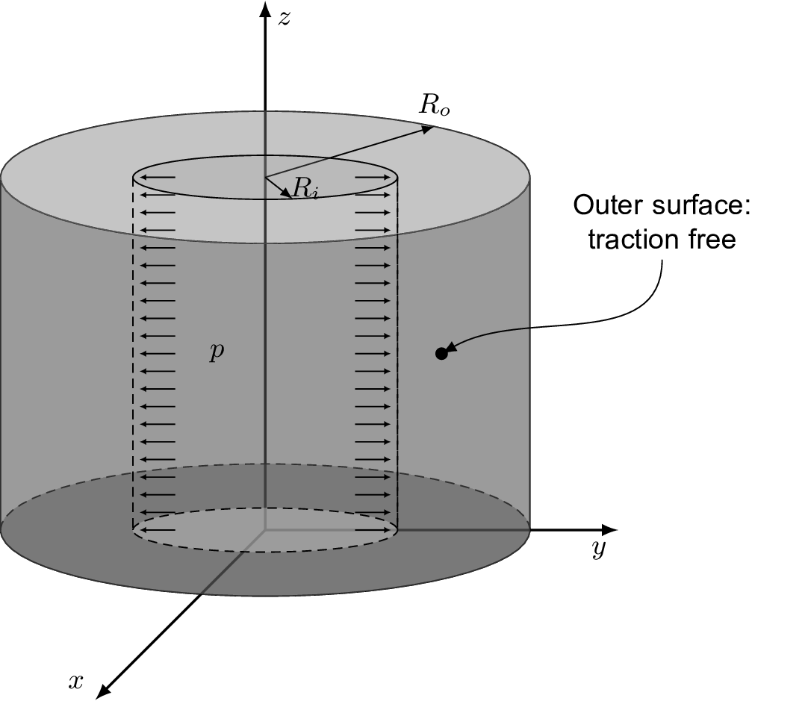

# My tutorial: `cylindricalPressureVessel`

---

## Tutorial Aims

- Exemplify the use of a hyperelastic mechanical law with large deformations;
- Assess the effect of the bulk modulus on the residual convergence of
  segregated algorithms for solids.

## Case Overview

**Figure 1: Thick cylindrical vessel with an inner pressure**

This benchmark consists in a thick cylindrical shell with inner radius
*Ri = 7 m* and outer radius *Ro = 18.625 m*, with
material modeled with the Mooney-Rivlin law with material parameters
*c10 = 80 MPa* and *c01 = 20 MPa*. The strain state is
assumed to be plane due to the geometric symmetry along the z-axis direction
(see Figure 1).  The inner pressure was applied in equal increments along time
until *p = 100 MPa*.

Due to symmetry, only a quarter of the cylinder section was simulated with a
mesh density of 20 x 20 cells in the radial and circumferential directions,
respectively. A residual tolerance for the momentum equation of 10-9
was selected.

---

## Expected Results

Figure 2 show the radial and circumferential (or hoop stress) components of the
Cauchy stress tensor along the *undeformed* radius of the cylinder when the
inner pressure is equal to 100 MPa. To solve for the underformed configuration,
i.e. without automatically moving the mesh, we used the *total Lagrangian*
formulation by default in the tutorial. Nevertheless, you can also test with
the *updated Lagrangian* `solidModel` options. The solution reference was found
in [I. Bijelonja, I. Demirdžić, and S. Muzaferija, “A finite volume method for
large strain analysis of incompressible hyperelastic materials,” International
Journal for Numerical Methods in Engineering, vol.  64, pp. 1594–1609, Nov.
2005, doi: 10.1002/nme.1413.  ](https://hrcak.srce.hr/206941)

**Figure 2: Radial (left) and circunferential, or hoop, stresses (right) along
the radius of the cylinder.**

The results shown in the plots of Figure 2 were obtained with a Poisson ratio
of 0.49, which yielded a Jacobian in the interval $[0.98,0.99]$ for the last
time-step. As explained in the theoretical documentation (LINK TO BE ADDED),
the hyperelastic laws in `solids4foam` are implemented using a *volumetric
decomposition*, where the deviatoric and volumetric portions of the
constitutive law are modeled separately. In this case, the volumetric portion
represents the isochoric motion of the solid and the compressibility of
material can be set directly by using its bulk modulus, if available, or
through the Poisson ratio, where thus the bulk modulus is computed via the
equation of the linearized theory. 

By using this formulation, the purely incompressible behavior can be achieved
by making either the bulk modulu too large or the Poisson ratio closer to 0.5.
However, an important feature of the displacement-based segregated solver is
that the convergence deteriorates as the incompressible behavior is
approximated. To demostrate this, Figure 3 shows the residuals drop of the
first time step of he solution for four diferent value of the Poisson ratio
(represented by the keyword `nu`): 0.30, 0.40, 0.45, and 0.49.

**Figure 3: Effect on convergence when approximating the purely incompressible
behavior in a solid.**

---

## Data Availability

The results and gnuplot scripts used to generate the figures above are available in the [solids4foam tutorials benchmark data](https://github.com/solids4foam/solids4foam-tutorials-benchmark-data) repository.
