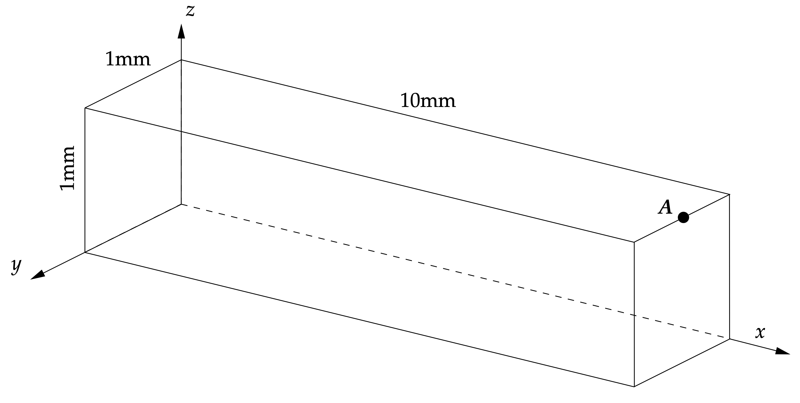
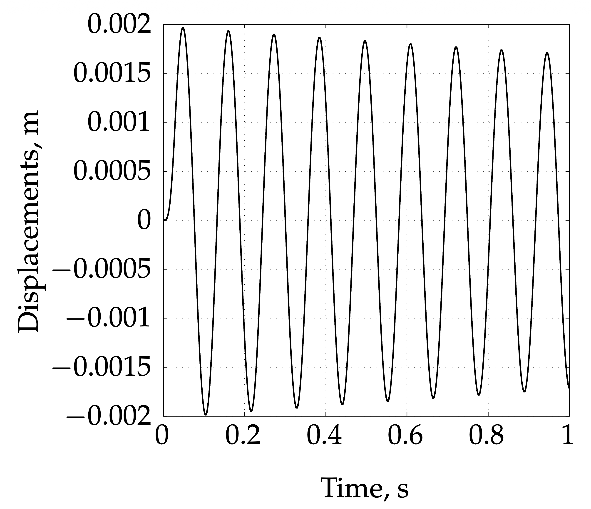
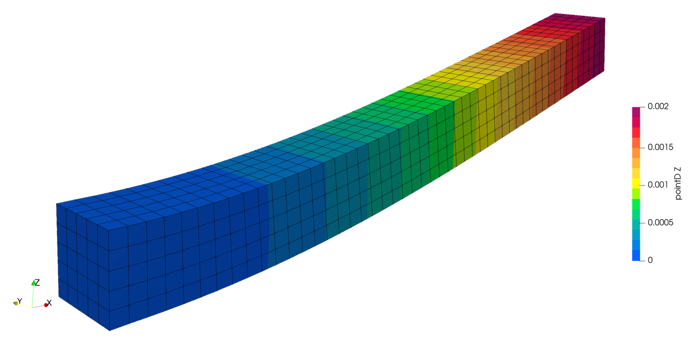
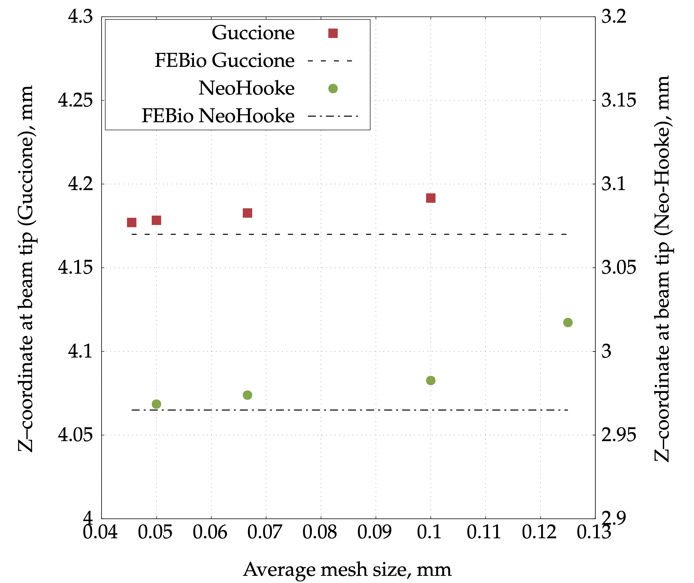

# Heart Tissue Beam: `heartTissueBeam`

---

Prepared by Anja Horvat, Philip Cardiff, Ivan Batistić and Željko Tuković

---

## Tutorial Aims

- Demonstrate the simulation of large-strain incompressible hyperelastic
  deformation of a heart-tissue beam.
- Demonstrate the foam-extend block-coupled pressure-displacement formulation
  with the Guccione material law.
- Check the predicted transient tip-displacement response.

---

## Case Overview

This benchmark test case was proposed by Land et al. [2] as a simplified strip
of passive cardiac tissue. The geometry is a thick cantilever beam with length
$$10$$ mm and a $$1$$ mm $$\times$$ $$1$$ mm square cross-section, as shown in
Figure 1. The left side of the beam is fixed, and a pressure load is applied to the
bottom surface.

The local tutorial uses the incompressible Guccione hyperelastic material law,
which represents the anisotropic passive response of myocardium. The fibre
direction is aligned with the beam axis, using the initial fibre field
`f0 = (1 0 0)`. The material properties are defined in
`constant/mechanicalProperties`: $$k = 2000$$ Pa, $$c_f = 8$$, $$c_t = 2$$,
$$c_{fs} = 4$$, $$\nu = 0.5$$, and $$\rho = 1000$$ kg/m³.

The mesh is a structured hexahedral mesh generated with `blockMesh`. The
default mesh in this tutorial contains $$80 \times 8 \times 8$$ cells. The
pressure loading is specified in `constant/timeVsPressure`: it ramps from
$$0$$ to $$4$$ Pa by $$t = 0.01$$ s and is then held constant for the default
run.

**Figure 1 - Beam reference configuration, with point A indicated**

```note
This case is foam-extend-only because it uses the block-coupled
pressure-displacement solid model from [1].
```

---

## Expected Results

The beam bends upward under the pressure applied to the bottom surface. The
default tutorial setup uses the Euler temporal discretisation scheme with a
time-step size of $$\Delta t = 10^{-4}$$ s and runs to $$t = 0.2$$ s. The
monitored point displacement is written by the `solidPointDisplacement`
function object in `system/controlDict`.

If `gnuplot` is installed, the `Allrun` script generates
`tipPointDisplacement.png`, showing the z-displacement of the monitored beam
tip point as a function of time. The expected response is an oscillatory beam
motion, as shown in Figure 2.

**Figure 2 - Displacement of the beam tip as a function of time, using the Euler
temporal discretisation scheme [1]**

The broader benchmark study in [1] also reports a steady-state pressure-loading
case, where the finite volume result is compared with FEBio [3], and a mesh
sensitivity study for the beam-tip z-coordinate. Those reference results are
shown in Figures 3 and 4.



**Figure 3 - Deformed computational mesh coloured by the z-component of the
displacement vector for the Neo-Hookean material law [1]**



**Figure 4 - Beam-tip z-coordinate for different mesh densities. The results
converge to a consensus solution as the number of volumes increases [1]**

The paper [1] reports second-order spatial convergence for the benchmark, and
first- and second-order temporal convergence for the Euler and backward time
schemes, respectively. The composite scheme also attains second-order accuracy
for sufficiently small time-step sizes.

---

## Running the Case

The tutorial case is located at
`solids4foam/tutorials/solids/hyperelasticity/heartTissueBeam`. The case can
be run using the included `Allrun` script:

```bash
./Allrun
```

The `Allrun` script copies the required initial
fields from `0.orig` to `0`, creates the mesh with `blockMesh`,
and then runs the `solids4Foam` solver.

The case can also be run in parallel using:

```bash
./Allrun parallel
```

In parallel, the script decomposes the case according to
`system/decomposeParDict`, runs `solids4Foam` in parallel, and reconstructs the
decomposed fields. If `gnuplot` is installed, the script also runs
`tipPointDisplacement.gplt` after the solver finishes and generates
`tipPointDisplacement.png`.

---

## References

[1]
[A. Horvat, P. Milović, I. Karšaj, and Ž. Tuković, "A Block-Coupled Finite
Volume Method for Incompressible Hyperelastic Solids", *Applied Sciences*,
15(23), 12660, 2025](https://doi.org/10.3390/app152312660)

[2]
[S. Land, V. Gurev, S. Arens, C. M. Augustin, L. Baron, R. Blake, C. Bradley,
S. Castro, A. Crozier, M. Favino, et al., "Verification of cardiac mechanics
software: benchmark problems and solutions for testing active and passive
material behaviour", *Proceedings of the Royal Society A*, 471, 20150641](https://doi.org/10.1098/rspa.2015.0641)

[3]
[Maas, S.A., Ellis, B.J., Ateshian, G.A., Weiss, J.A., FEBio: Finite Elements for
Biomechanics. J. Biomech. Eng. 2012, 134.](https://doi.org/10.1115/1.4005694)
