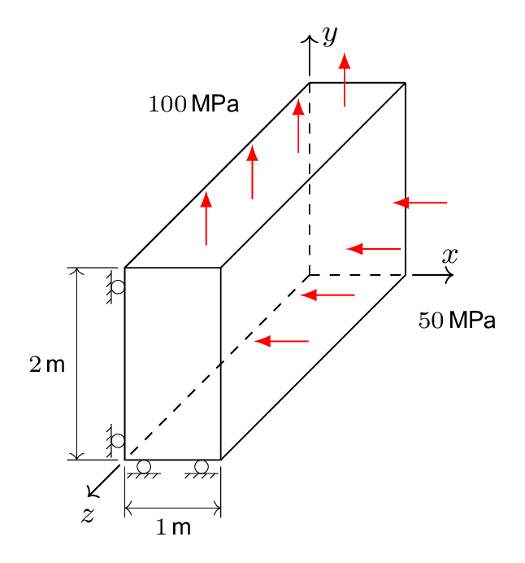

# Tutorial: `longWall`

Prepared by Iago Lessa de Oliveira

---

## Tutorial Aims

- Demonstrate how to perform a solid-only analysis in solids4foam;
- Exemplify the use of a hyperelastic mechanical law with large deformations.

## Case Overview

**Figure 1: Deformation of a long wall under two forces**

This benchmark consists of a wall with _1 m_ x _2 m_ (width x height) and
assumed infinitely long in length, i.e. along the z-axis (see Figure 1). Due to
symmetry, it can be assumed to be in a biaxial deformation state. A compressing
load of _50 MPa_ is applied on the right surface, and a traction of _100 MPa_ on
the upper surface. The left and bottom surfaces are free to slide along its
tangential but constrained to move along their normal. The material was assumed
isotropic and incompressible and characterised by the Mooney-Rivlin hyperelastic
law, with material parameters _c10 = 80 MPa_, _c01 = 20
MPa_, and _c11 = 0.0 MPa_, under plane-strain conditions (see the
file `constant/mechanicalProperties` to change these values).

The default mesh in the tutorial had 20 x 20 volumes. You can use both total and
updated Lagrangian approaches in this tutorial because both yielded the same
results in terms of accuracy and convergence speed. For the results presented
here, we employed the `nonLinearGeometryTotalLagrangian` model, one of the total
Lagrangian approaches available that solves for the _increment_ of the
displacement, which is why you have to use the `DD` file in the directory `0/`.

The boundary conditions were applied in 100 equal incremental steps and note the
use of the `fixedDisplacementZeroShear` boundary condition applied to the bottom
and left surfaces of the wall that must be allowed to slip freely but
constrained in their normal direction. A normalised residual tolerance for the
momentum equation of _10-8_ was used.

---

## Expected Results

The results are compared in Table 1 against two references: one numerical and
another analytical provided by
[I. Bijelonja, I. Demirdžić, and S. Muzaferija, “A finite volume method for large strain analysis of incompressible hyperelastic materials,” International Journal for Numerical Methods in Engineering, vol. 64, pp. 1594–1609, Nov. 2005, doi: 10.1002/nme.1413.](https://hrcak.srce.hr/206941).
The _σxx_ and _σyy_ are the Cauchy stress components along
the _x_ and _y_ directions, respectively, while _ux_ and
_uy_ are the total displacements along the x and y directions.

**Table 1: Comparison of Cauchy stress and the wall displacement in the x and y
directions.**

| Source      | _σxx_ (MPa) | _σyy_ (MPa) | _ux_ (m) | _uy_ (m) |
| ----------- | ---------------------- | ---------------------- | ------------------- | ------------------- |
| solids4foam | -49.99                 | 100.0                  | -0.1636             | 0.4010              |
| Reference   | -49.00                 | 100.0                  | -0.1676             | 0.4022              |
| Analytical  | -50.00                 | 100.0                  | -0.1675             | 0.4025              |
