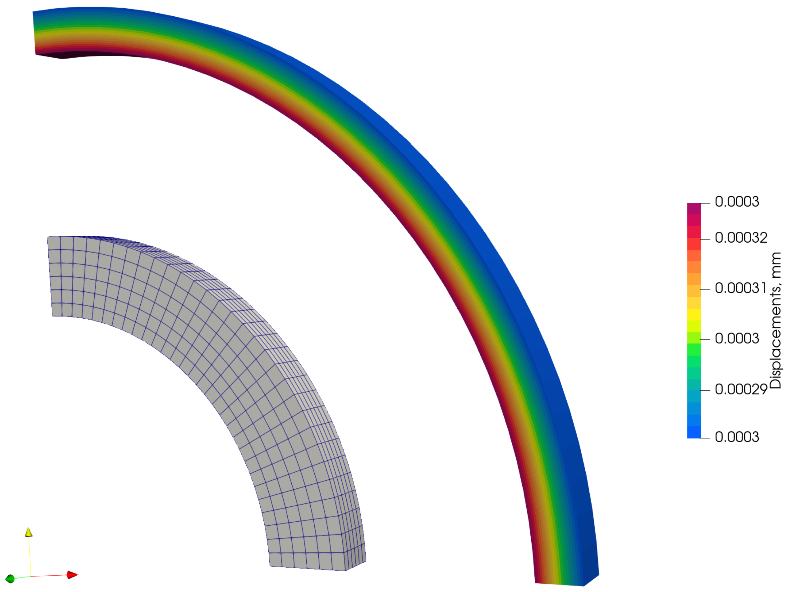
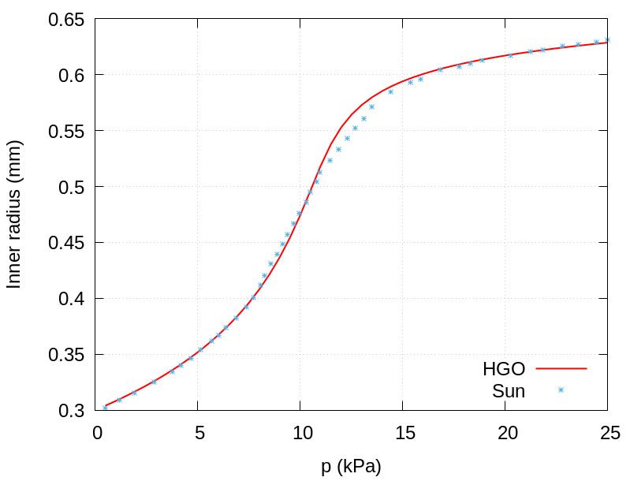

# Inflation of a Rat Carotid Artery: `ratCarotid`

---

Prepared by Anja Horvat, Philip Cardiff, Ivan Batistić and Željko Tuković

---

## Tutorial Aims

- Demonstrate the simulation of large-strain incompressible hyperelastic
  inflation of an idealised rat carotid artery.
- Demonstrate the use of the anisotropic Holzapfel-Gasser-Ogden (HGO)
  hyperelastic mechanical law in a block-coupled pressure-displacement solid
  formulation.
- Compare the predicted pressure-radius response with experimental and finite
  element reference data.

---

## Case Overview

This test case is based on the experimental study reported in [2], where rat
carotid arteries were subjected to internal pressurisation and the radius was
measured as a function of the applied pressure. The availability of
experimental pressure-radius data and finite element benchmark results makes
the case suitable for quantitative validation.

The artery wall is modelled using the Holzapfel-Gasser-Ogden (HGO)
hyperelastic law [3], with the material parameters calibrated in [4]. The HGO
law represents the arterial wall response as an isotropic matrix contribution
and an anisotropic fibre contribution associated with collagen recruitment at
higher pressure levels.

The material properties used in this tutorial are: $$E = 132.69$$ kPa, $$\nu = 0.5$$,
$$k_1 = 206$$ Pa, and $$k_2 = 1.465$$. The collagen fibres are assumed to be
symmetrically oriented at $$\pm 39.76^\circ$$ with respect to the
circumferential direction.

The local tutorial setup follows the rat carotid artery inflation case
described in [1]. The computational domain is a one-quarter cylindrical segment
with inner radius $$r_i = 0.3$$ mm, outer radius $$r_o = 0.4$$ mm, and length
$$0.05$$ mm. Symmetry boundary conditions are applied on the corresponding planes,
the outer wall is traction-free, and the inner pressure increases linearly from
$$0$$ to $$25$$ kPa over the unit pseudo-time.



**Figure 1 - Reference configuration with mesh and deformed configuration at the
final loading step, coloured by the displacement field**

```note
This case is foam-extend-only because it uses the block-coupled
pressure-displacement solid model from [1].
```

---

## Expected Results

Figure 1 shows the expected deformation pattern at the final loading step. The
arterial wall inflates smoothly under the applied internal pressure, with the
largest displacement occurring at the inner surface.

The `pointHystory.gplt` script plots the evolution of the inner radius as a
function of internal pressure. The generated curve follow the
experimental data from [2] and the finite element results from [5], as reported
for this benchmark in [1].

**Figure 2 - The variation of the inner radius with respect to internal pressure**

---

## Running the Case

The tutorial case is located at
`solids4foam/tutorials/solids/hyperelasticity/ratCarotid`. The case
can be run using the included `Allrun` script:

```bash
./Allrun
```

 The `Allrun` script first compiles the
case-local `calcLocCoordinates` utility from the `src` directory. It then
generates `constant/polyMesh/blockMeshDict` from
`constant/polyMesh/blockMeshDict.m4` using `m4`, creates the mesh with
`blockMesh`, copies the required initial fields from `0.orig` to `0`,
calculates the local coordinate systems using `calcLocCoordinates` utility,
and then runs the `solids4Foam` solver.

The case can also be run in parallel using:

```bash
./Allrun parallel
```

In parallel, the script decomposes the case according to
`system/decomposeParDict`, runs `solids4Foam` in parallel, and reconstructs the
decomposed fields. If `gnuplot` is installed, the script also runs
`pointHystory.gplt` after the solver finishes and generates `innerRadius.png`.

---

## References

[1]
[Horvat A., Milović P., Karšaj I., Tuković Ž., A Block-Coupled Finite Volume Method for Incompressible Hyperelastic Solids. *Applied Sciences*. 2025; 15(23):12660](https://doi.org/10.3390/app152312660)

[2]
[Fridez, P., Makino, A., Miyazaki, H., Meister, J., Hayashi, K., Stergiopulos, N., Short-Term biomechanical adaptation of the rat carotid to acute hypertension: Contribution of smooth muscle,  Ann. Biomed. Eng. 2001, 29, 26–34](https://doi.org/10.1114/1.1342054)

[3]
[Holzapfel, G.A., Gasser, T.C., Ogden, R.W., A new constitutive framework for arterial wall mechanics and a comparative study of material models, J. Elast. 2000, 61, 1–48](https://doi.org/10.1023/A:1010835316564)

[4]
[Zulliger, M.A., Fridez, P., Hayashi, K., Stergiopulos, N., A strain energy function for arteries accounting for wall composition and structure, J. Biomech. 2004, 37, 989–1000](https://doi.org/10.1016/j.jbiomech.2003.11.026)

[5]
[Sun, W.; Chaikof, E.L.; Levenston, M.E. Numerical Approximation of Tangent Moduli for Finite Element of
Nonlinear Hyperelastic Material Models. J. Biomech. Eng. 2008, 130, 061003](https://doi.org/10.1115/1.2979872)
