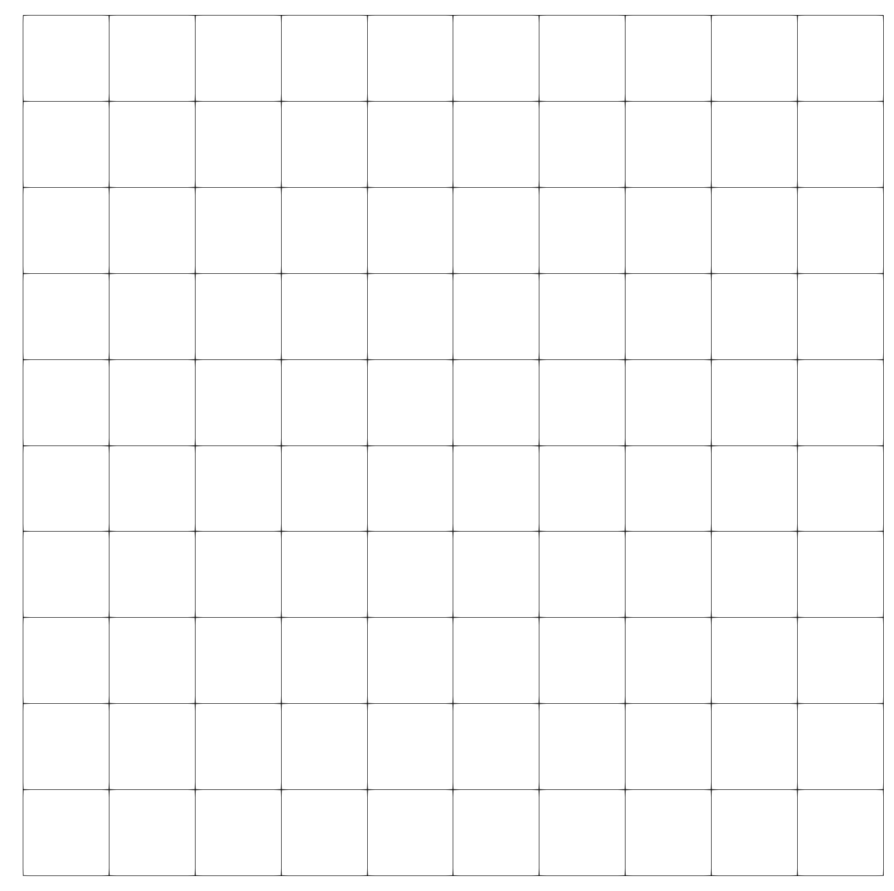
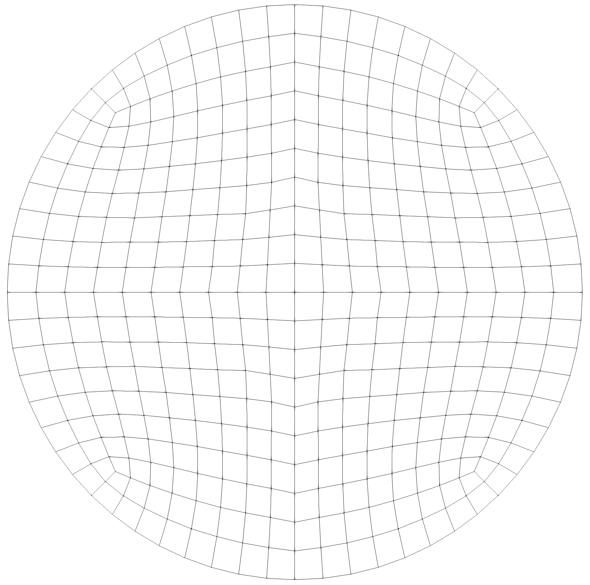
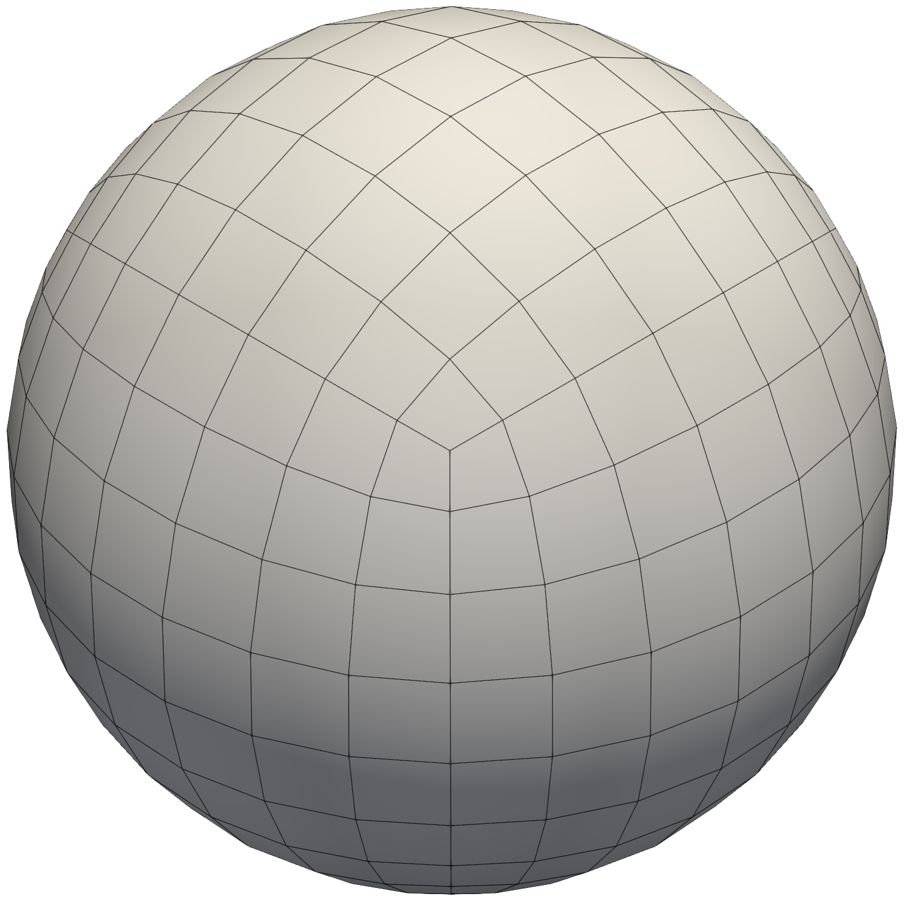
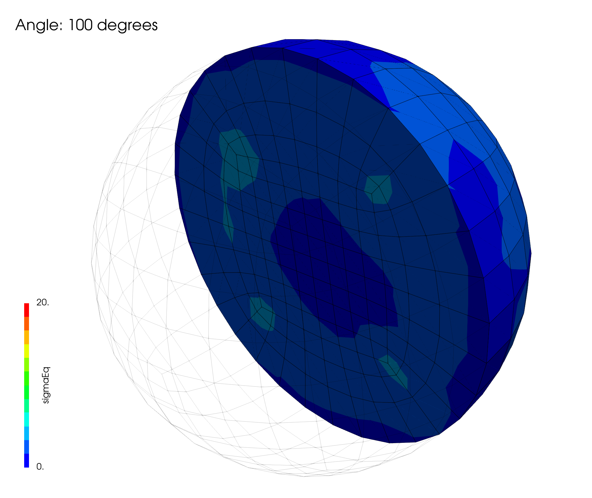

# Rigid body rotation of a block, a cylinder and a sphere: `rigidRotation`

---

Prepared by Philip Cardiff

---

## Tutorial Aims

- The aim of this tutorial is to verify that the predicted strains and stresses remain zero or numerically insignificant for finite strain solid models.

---

## Overview of Cases

Quasi-static rigid translations and rigid rotations should not cause strains or strains to develop. As small strain (linear geometry) approaches neglect the higher-order strain terms, unphysical stresses are predicted when rotations are large. For rotation in the $$x-y$$ plane about the $$z$$ axis, the definition of engineering stress gives the following non-zero, unphysical stresses [1]:

$$
\sigma_{xx} = \sigma_{yy} = 2(\mu + \lambda)\left[\cos(\theta) - 1\right]
$$

$$
\sigma_{zz} =  2\lambda\left[\cos(\theta) - 1\right]
$$

$$
\sigma_{xy} = 0
$$

where $$\theta$$ is the rotation angle, $$\mu$$ is the shear modulus, and $$\lambda$$ is the first Lam\'{e} modulus. It is interesting to note that for $$1^{\circ}$$ rigid rotation, small strain procedures predict unphysical uniform stresses of the order of 60 MPa for a material with a Young's modulus of 200 GPa and Poisson's ratio of 0.3.

In contrast, a correctly implemented finite strain (nonlinear geometry) procedure should predict strains and stresses that remain zero or numerically insignificant. Such rigid rotation cases are useful verification cases for testing various aspects of finite strain procedures, including the governing equation formulation, discretisation and material model implementation. See the section on [solid model formulations](https://www.solids4foam.com/documentation/solid-models.html) for more details on small strain (linear geometry) and finite strain (nonlinear geometry) procedures.

Three test cases are examined here (Figure 1), where rigid rotation about the object's centre of mass is prescribed to the outer boundary:
1. **Rigid Rotation of a Block** (`rotatingBlock`): a 2-D, $$1\times1$$ m square block with a uniform, quadrilateral, orthogonal mesh.
2. **Rigid Rotation of a Cylinder** (`rotatingCylinder`): a 2-D cylinder of diameter $$0.1$$ m with an unstructured quadrilateral mesh. Unlike the block, the boundary faces contain non-orthogonality, allowing boundary condition non-orthogonal correction procedures to be verified.
3. **Rigid Rotation of a Sphere** (`rotatingSphere`): a 3-D sphere of diameter $$0.2$$ m with an unstructured, hexahedral mesh. This case is the most general, allowing solver verification on 3-D unstructured meshes with boundary non-orthogonality.

<div style="text-align: center;">
  
  
  
    <figcaption>
     <strong>Figure 1: Problem geometry for the three rigid rotation cases: rotatingBlock (left), rotatingCylinder (centre) and rotatingSphere (right)</strong>
    </figcaption>
</div>

All three cases assume a St.\ Venant Kirchhoff hyperelastic material with a Young's modulus of 200 GPa and a Poisson's ration of 0.3; however, all nonlinear geometry laws should satisfy these tests.

A rigid rotation is applied to the outer boundary of the domain in all three cases using the `fixedRotation` boundary condition; for example, in `rotatingCylinder/0/D` this is specified as 

```
    cylinder
    {
        type            fixedRotation;
        rotationAngleSeries
        {
            "fileName|file"        "$FOAM_CASE/constant/timeVsAngle";
            outOfBounds     clamp;
        }
        rotationAxis     ( 0 0 1 );
        rotationOrigin   ( 0 0 0 );
        value            uniform   ( 0 0 0 );
    }
```

where the `timeVsAngle` file specifies a rotation of $$1^{\circ}$$ per second up to a maximum of $$100^{\circ}$$ at 100 s:

```
(
        ( 0     0 )
        ( 100 100 )
)
```

In all three cases, a segregated, cell-centred finite volume, total Lagrangian solid model (`nonLinearGeometryTotalLagrangianTotalDisplacement`) is used, which solves for the total displacement `D`; however, all nonlinear geometry solid models should pass these tests.

---

## Expected Results

For each of these test cases, the expected results are:
- **Strains**: Zero or numerically insignificant strains throughout the rotation.
- **Stresses**: Zero or numerically insignificant stresses throughout the rotation.

The term numerically insignificant is problem-dependent but can be interpreted as the stress being small relative to Young's modulus or similar material properties. For example, if the Young's modulus is 200 GPa, then stresses of the order of 1 kPa are 8 orders of magnitude smaller and can be considered small in most cases. Similarly, if expected strains are in the order of 0.1 (10$$\%$$), then strains less than $10^{-9}$ can be considered small in most cases.

Before examining the results, it is worth considering the effect of numerical errors in this case, i.e., discretisation, iteration, and round-off errors. As the displacement field is linear in space for a rigid rotation, mesh (discretisation) errors should not affect the predicted stresses. That is, if a finite strain erroneously predicts non-zero stresses for a rigid rotation, refining the mesh will not help. However, iteration errors can have an effect. Here, iteration errors refer to the errors introduced by not solving the nonlinear governing equations to machine tolerance. For example, stopping the outer Picard or Newton-Raphson iterations before the residual reaches machine zero. In practice, machine zero is rarely required, but loosening the solution tolerance by an order of magnitude may lead to an order of magnitude increase in unphysical stresses. Round-off error dictates the achievable machine tolerance and is less of a concern for the user unless large numbers of time-steps are being performed.

Video 1 shows a cross-section of the mesh from time = 0 s to time = 100 s in the `rotatingSphere` case. Note that the end time is set to 10 s in the tutorial but has been increased here to 100 s.

Figure 2 shows the equivalent (von Mises) stress after $$100^{\circ}$$ of rigid rotation, with the maximum value being below 20 Pa. As noted above, this can be considered small, confirming that the implemented finite strain procedures accurately account for rigid body motion without unphysical deformations. Similar results can be seen in the `rotatingBlock` and `rotatingCylinder` cases.

<div style="text-align: center;">
  
    <figcaption>
     <strong>Figure 2: equivalent (von Mises) stress (in Pa) after 100 degrees of rigid body rotation</strong>
    </figcaption>
</div>




**Video 1: Cross-section of the mesh in the `rotatingSphere` case.**


---

## Running the Case

The three tutorial cases are located at `solids4foam/tutorials/solids/hyperelasticity/rigidRotation`. The cases can be run using the included `Allrun` scripts, i.e. `> ./Allrun`.  The mesh in the `rotatingBlock` case is generated using the `blockMesh` utility. In contrast, the meshes for the `rotatingCylinder` and `rotatingSphere` cases are stored in the cases in the Fluent `.msh` format, and the meshes are created with the `fluentMeshToFoam` utility. The `solids4foam` solver runs all three cases (`> solids4Foam`).

---

### References 

[1] Maneeratana K, 2000, Development of the finite volume method for non-linear structural applications. PhD thesis, Imperial College, London.
