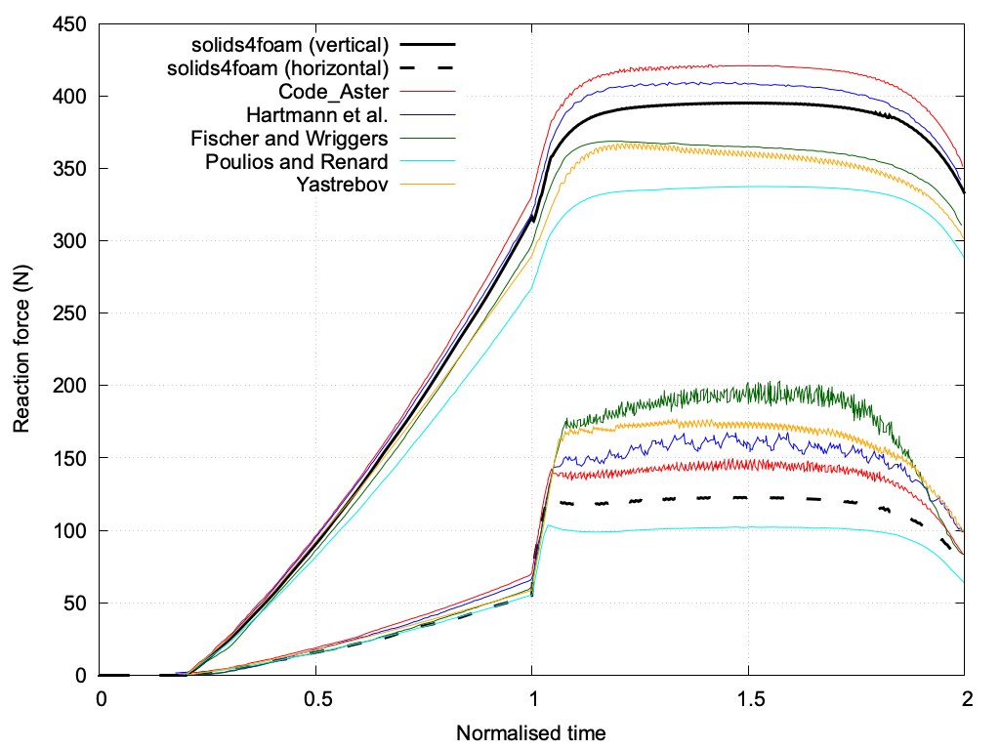

# Shallow ironing: `shallowIroning`

Prepared by Ivan Batistić

---

## Tutorial Aims

- Demonstrate how to perform a finite-strain hyperelastic analysis with large
  sliding frictional contact between two deformable bodies.
- Demonstrate a multi-material case, where each body has its own mechanical
  law defined on a cell zone.
- Compare the predicted reaction forces with results reported in the
  literature for the shallow ironing benchmark.

---

## Case Overview

A pressed elastic block with a rounded contact surface slides over an elastic
rectangular foundation [1, 3, 5]. The foundation is fixed at the bottom and
the block has a prescribed vertical and horizontal displacement on its top
surface. The problem geometry, material data and dimensions are shown in
Figure 1. A vertical displacement of the top surface of the block
($$u_y = 1$$ mm) is applied from $$0$$ to $$1$$ s using $$100$$ equal
displacement increments. A horizontal displacement ($$u_x = 10$$ mm) is
subsequently applied between $$1$$ and $$6$$ s using $$500$$ equal
displacement increments (`constant/timeVsDisp`). The problem is solved under
the plane strain assumption, neglecting inertia, body forces and gravitational
effects.

Both bodies are modelled as compressible neo-Hookean solids
(`neoHookeanElastic`) with Poisson's ratio $$\nu = 0.32$$. The foundation has a
Young's modulus of $$E_s = 68.96 \times 10^7$$ Pa and the block is ten times
stiffer, $$E_b = 10 E_s$$. The two materials are assigned to the `foundation`
and `slab` cell zones in `constant/mechanicalProperties`, where `slab` is the
cell zone of the rounded block; the cell zones are created by `blockMesh` from
the names of the blocks in `system/blockMeshDict.m4`.

Contact is enforced with the `solidContact` boundary condition on the
`foundationContact` (master) and `slabContact` (slave) patches, using the
penalty-based segment-to-segment method of Batistić et al. [1] with Coulomb
friction and a coefficient of friction of $$\mu = 0.3$$. The foundation is
discretised with $$120 \times 30$$ cells and the block with $$12 \times 6$$
cells (3 672 cells in total), and the problem is solved with the updated
Lagrangian `nonLinearGeometryUpdatedLagrangian` solid model.

The contact traction is under-relaxed within the momentum corrector loop,
using a relaxation factor of 0.005 for the normal traction and 0.01 for the
friction traction (`relaxationFactor` in `0/DD`). The momentum loop of each
time step is considered converged when the relative change of the displacement
increment falls below `alternativeTolerance` ($$10^{-6}$$), or when both it
and the linear solver residual fall below `solutionTolerance` ($$10^{-8}$$),
with at most `nCorrectors` ($$10\,000$$) correctors per time step
(`constant/solidProperties`).

### Changes from the original benchmark case

This tutorial is based on the `nonLinearGeometryUpdatedLagrangian` case of the
shallow ironing benchmark in the
[solid-benchmarks](https://github.com/solids4foam/solid-benchmarks)
repository (`hyperElasticity/shallowIroning`). The geometry, mesh, material
properties, loading, time steps, contact models, penalty factors, discretisation
and tolerances are unchanged. The differences are:

- The normal and friction contact traction relaxation factors are increased
  from 0.0001 to 0.005 and 0.01, respectively. With the original value of
  0.0001 and the current solids4foam version, the contact traction is updated
  so slowly that almost every time step in contact reaches the limit of
  $$10\,000$$ correctors without meeting the tolerance: in a run of the
  original settings stopped at $$t = 1.68$$ s, 144 of the 148 time steps after
  the first contact at $$t = 0.21$$ s were capped, at about 33 s per time step,
  so the full run would take over 5 hours. The relaxation factors only change
  the path of the corrector iterations, not the converged solution: with normal
  traction relaxation factors of 0.005 and 0.02, the converged reaction forces
  agree to within 0.03% between $$t = 0.25$$ s and $$t = 0.78$$ s. Up to
  $$t = 0.85$$ s, the capped original run scatters about the converged values
  by up to 0.4% in the vertical force and 7% in the horizontal force. Lowering
  the friction penalty scale factor from 1 to 0.2 also gives convergence, but
  reduces the horizontal reaction force by 14% to 27% during the indentation,
  and making `slabContact` the master patch leads to capped time steps from
  $$t = 0.27$$ s, so neither is used.
- The `stabilisation` entries in `constant/mechanicalProperties` are removed,
  as they are not read by the mechanical law (momentum stabilisation is
  defined in `constant/solidProperties`, and the default is used here).
- The `blockMeshDict` is generated in `system` (moved to `constant/polyMesh`
  for foam-extend by `solids4Foam::convertCaseFormat`), and the cell zones
  needed by the mechanical law are created directly by `blockMesh` from the
  block names, so `setsToZones` is not needed.

![Figure 1: Problem geometry (dimensions in mm) [1]](./images/shallowIroning-geometry.png)

Figure 1: Problem geometry (dimensions in mm) [1]

```warning
This case currently only runs with foam-extend (tested with foam-extend-4.1);
with other versions, the Allrun script exits without running the case.
```

---

## Running the Case

The tutorial case is located at
`solids4foam/tutorials/solids/hyperelasticity/shallowIroning`. The case can be
run using the included `Allrun` script, i.e. `> ./Allrun`. The `Allrun` script
first creates the `blockMeshDict` file using the `m4` scripting language from
the `blockMeshDict.m4` file located in the `system` directory. Afterwards,
`blockMesh` (`> blockMesh`) is used to create the mesh and the `solids4Foam`
solver is used to run the case (`> solids4Foam`). Optionally, if `gnuplot` is
installed, the evolution of the vertical and horizontal reaction forces is
compared with the reference data in the `reactionForces.png` file.

The case takes about 1 hour and 50 minutes to run in serial (6 717 s with
`foam-extend-4.1` on an Apple M-series processor). The momentum loop converges
in 589 of the 600 time steps, typically within 700 to 950 correctors during
the indentation and 3 400 to 3 700 correctors during the sliding. The
remaining 11 time steps reach the limit of $$10\,000$$ correctors: one time
step early in the sliding stage ($$t = 1.1$$ s), where the contact changes
from stick to slip, and the time steps at $$t = 4.7$$ s and between
$$t = 4.97$$ s and $$t = 5.17$$ s; the small kink in the vertical reaction
force at a normalised time of about 1.82 in Figure 2 corresponds to the
latter. Time steps that reach the limit are reported in `log.solids4Foam` by
the warning `Max iterations reached within momentum loop`.

---

## Expected Results

The quantity of interest is the evolution of the horizontal and vertical
components of the total reaction force on the top surface of the block (the
`displacement` patch), which is written to
`postProcessing/0/solidForcesdisplacement.dat` by the `solidForces` function
object in `system/controlDict`. There is no unique agreement among the results
reported using the various finite element contact treatments [2-8]. The
reference data of Code_Aster [5], Hartmann et al. [4], Fischer and Wriggers
[2], Poulios and Renard [6] and Yastrebov [3] are included in the `reference`
directory. In the reference data, time is normalised so that the vertical
displacement is applied from 0 to 1 and the horizontal displacement from 1 to
2; the `solids4foam` time $$t \in (1, 6]$$ s corresponds to the normalised
time $$1 + (t - 1)/5$$.

In addition to the reaction forces, another parameter to consider is the ratio
between the horizontal and vertical reaction forces, referred to in the
literature as the global coefficient of friction $$\mu_g$$. Table 1 summarises
the values of the global coefficient of friction from the literature and
`solids4foam`.

Table 1: Comparison of global coefficients of friction $$\mu_g$$ (at a
normalised time of 1.5, i.e. $$t = 3.5$$ s in `solids4foam`)

| Quantity | [6] | [1] | [8] | [5] | [4] | [3] | [2] | solids4foam |
|:---:|:---:|:---:|:---:|:---:|:---:|:---:|:---:|:---:|
| $$(\mu_g)_{t=1.5}$$ | 0.30 | 0.32 | 0.32 | 0.34 | 0.38 | 0.47 | 0.53 | 0.31 |

Table 2 compares the reaction forces with the reference solutions at the end
of the indentation (normalised time 1.0, $$t = 1$$ s) and in the middle of
the sliding (normalised time 1.5, $$t = 3.5$$ s). The reference values are
linearly interpolated from the digitised curves in the `reference` directory.

Table 2: Vertical and horizontal reaction forces (N)

| Source | V, 1.0 | H, 1.0 | V, 1.5 | H, 1.5 |
|:---|---:|---:|---:|---:|
| solids4foam (tutorial) | 316.4 | 55.0 | 395.1 | 122.7 |
| Code_Aster [5] | 332.0 | 71.0 | 421.0 | 143.3 |
| Hartmann et al. [4] | 319.5 | 67.2 | 408.4 | 160.2 |
| Fischer and Wriggers [2] | 297.9 | 62.1 | 365.1 | 188.8 |
| Yastrebov [3] | 289.7 | 58.5 | 359.5 | 170.8 |
| Poulios and Renard [6] | 267.9 | 55.3 | 337.4 | 102.1 |

The predicted vertical reaction force lies within the spread of the reference
solutions throughout the load history, between the results of Code_Aster [5]
and Hartmann et al. [4] and those of Fischer and Wriggers [2] and Yastrebov
[3]. During the sliding, the horizontal reaction force lies between the results
of Poulios and Renard [6] and Code_Aster [5], and the global coefficient of
friction is $$\mu_g = 0.31$$, within the range of 0.30 to 0.53 reported in the
literature and close to the prescribed coefficient of friction of 0.3.

```note
The original benchmark case, run with an earlier version of solids4foam,
reported larger reaction forces during the sliding (a vertical force of about
418 N and a horizontal force of about 148 N at a normalised time of 1.5), very
close to Code_Aster, and $$\mu_g = 0.36$$. The original benchmark settings run
with the current solids4foam version give reaction forces close to those of
this tutorial (see "Changes from the original benchmark case"), so the
difference is due to changes in solids4foam since the benchmark was prepared,
rather than to the changed contact relaxation factors.
```

The evolution of the vertical and horizontal reaction forces is shown in
Figure 2, which is the `reactionForces.png` file generated by the `Allrun`
script. Except for the data of Yastrebov [3], the reference curves have been
digitised using the [WebPlotDigitizer](https://apps.automeris.io/wpd/)
software.



Figure 2: Evolution of the vertical and horizontal reaction forces on the top
surface of the block versus normalised time (`foam-extend-4.1`)

---

## Regression Test

As the full ironing stroke takes almost two hours to run, `regressionTest.sh`
only runs the first half of the vertical indentation stage, up to
$$t = 0.5$$ s (the block comes into contact with the foundation at
$$t = 0.21$$ s), which takes about 80 s; the sliding stage is not
covered by the regression test. The test checks that the momentum loop
converged in every time step of this run, i.e. no time step reached the
maximum number of correctors, and in particular at the checked instants. It
then checks the total reaction force on the `displacement` patch at
$$t = 0.25$$ s and $$t = 0.5$$ s against the values it was calibrated with
(vertical force within about 1%, horizontal force within about 2%), and that
the vertical force at $$t = 0.5$$ s (90.2 N) lies within the spread of the
reference solutions at that instant (81.5 N to 96.2 N).

---

## References

[1]
[I. Batistić, P. Cardiff and Ž. Tuković, “A finite volume penalty based
segment-to-segment method for frictional contact problems,” Applied
Mathematical Modelling, vol. 101, pp. 673–693,
2022.](https://www.sciencedirect.com/science/article/abs/pii/S0307904X21004248)

[2]
[K. A. Fischer and P. Wriggers, “Mortar based frictional contact formulation
for higher order interpolations using the moving friction cone,” Computer
Methods in Applied Mechanics and Engineering, vol. 195, no. 37-40, pp.
5020–5036, 2006.](https://www.sciencedirect.com/science/article/abs/pii/S0045782505005359)

[3]
[V. Yastrebov, Computational contact mechanics: geometry, detection and
numerical techniques. PhD thesis, École Nationale Supérieure des Mines de
Paris, 2011.](https://pastel.hal.science/pastel-00657305/file/yastrebov.pdf)

[4]
[S. Hartmann, J. Oliver, R. Weyler, J. Cante, and J. Hernández, “A contact
domain method for large deformation frictional contact problems. Part 2:
Numerical aspects,” Computer Methods in Applied Mechanics and Engineering,
vol. 198, no. 33-36, pp. 2607–2631,
2009.](https://www.sciencedirect.com/science/article/abs/pii/S0045782509001297)

[5]
[Code_Aster, “General public licensed structural mechanics finite element
software, [v6.03.153] SSNP153 - deformable-deformable 2D rubbing contact in
large deformations (shallow ironing).”,
2020.](https://www.code-aster.org/V2/doc/default/en/man_v/v6/v6.03.153.pdf)

[6]
[K. Poulios and Y. Renard, “An unconstrained integral approximation of large
sliding frictional contact between deformable solids,” Computers &
Structures, vol. 153, pp. 75–90,
2015.](https://www.sciencedirect.com/science/article/pii/S0045794915000656)

[7]
[J. Kopačka, Efficient and Robust Numerical Solution of Contact Problems by
the Finite Element Method, PhD Thesis, Czech Technical University, Prague,
2018.](https://www.researchgate.net/publication/325797406_Efficient_and_Robust_Numerical_Solution_of_Contact_Problems_by_the_Finite_Element_Method)

[8]
[H. Houssein, Finite element modeling of mechanical contact problems for
industrial applications, PhD thesis, Sorbonne Université, Paris,
2022.](https://theses.hal.science/THESES-SU/tel-03699706v1)
