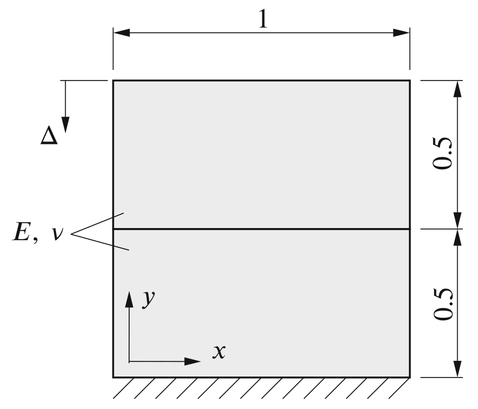
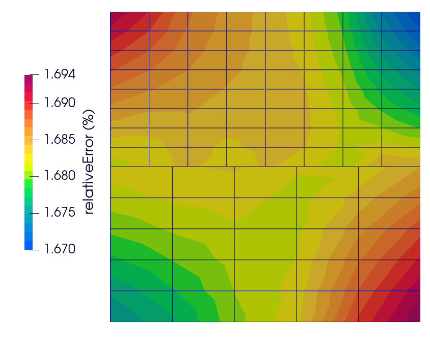

# Contact patch test: `contactPatchTest`

---

Prepared by Ivan Batistić

---

## Tutorial Aims

- Demonstrate that a uniform pressure field can be transmitted across a non-conformal contact interface;
- Examine the solver performance when solving contact problems in small deformation settings.

---

## Case Overview

The contact patch test is designed to check can a uniform pressure field can be transmitted across a non-conformal contact interface. There are different versions of the patch test in the literature [[1](https://link.springer.com/book/10.1007/978-3-662-04864-1), [2](https://www.sciencedirect.com/science/article/abs/pii/S0045794901000487)]; here patch test proposed in [[3]](https://onlinelibrary.wiley.com/doi/abs/10.1002/%28SICI%291097-0207%2820000530%2948%3A3%3C435%3A%3AAID-NME891%3E3.0.CO%3B2-V) is considered. The lower block is fixed at the bottom surface, whereas the upper block has a prescribed displacement $$\Delta = 0.01$$ m at its top surface (see Figure 1). Both blocks have the same dimensions, $$1$$ m width and $$0.5$$ m height, and the same material properties, Young’s modulus $$E = 1 × 10^6$$ Pa and zero Poisson’s ratio $$\nu = 0$$.  Gravitation effects are neglected, and there are no body forces. The problem is solved as static, using one loading increment. At the contact interface, frictionless contact is considered, i.e. $$\mu=0$$.

<div style="text-align: center;">
  
    <figcaption>
     <strong>Figure 1: Problem geometry (dimensions in m) [4]</strong>
    </figcaption>
</div>
---

## Expected Results

* Under plane strain conditions, the analytical solution to the problem is  [[1]](https://onlinelibrary.wiley.com/doi/abs/10.1002/%28SICI%291097-0207%2820000530%2948%3A3%3C435%3A%3AAID-NME891%3E3.0.CO%3B2-V):
$$
  \sigma_{x} = \tau_{xy}=0\qquad \sigma_{y} = \dfrac{E}{1-\nu^2}\Delta \qquad \sigma_z = \nu \sigma_y.
$$

For the considered case with $$\nu=0$$, there are no $$\sigma_x$$ and $$\sigma_z$$ stresses. If one wants to set $$\nu > 0$$ the above equation can be used only if the bottom surface of the lower block is allowed to deform freely in the tangential direction. Here the bottom surface of the lower block is held fixed as there is no displacement in the $$x$$ direction. 

The analytical solution is generated alongside solution fields using the function object compiled when running `>./Allrun` script. Function object inputs are located in `controlDict ` where one needs to upper block top surface vertical displacement and material data:

```
functions
{
    analyticalSolution
    {
        type    contactPatchTestAnalyticalSolution;

        // Upper block top surface vertical displacement
        displacement   0.01;

        // Young's modulus
        E       1e6;

        // Poisson's ratio
        nu      0.0;
    }
}
```

Figure 2 shows the distribution of the relative error field $$e$$. The relative error (in percentages) is defined as:
$$
e(\%)=\dfrac{\left| \sigma_y - \sigma_y^{analytical} \right|}{\left|\sigma_y^{analytical}\right|} \cdot 100.
$$

One can see that the error distribution is uniform, meaning that the `solidContact` boundary condition can correctly transmit a spatially uniform pressure field across a flat non-conformal interface in complete contact. Results for Fig. 2 are obtained using `foam-extend 4.1`  and `linearGeometryTotalDisplacement` solver, with the normal penalty scale set to $$f_n^{scale}=5$$.

<div style="text-align: center;">
  
    <figcaption>
     <strong>Figure 2: Distribution of the relative error</strong>
    </figcaption>
</div>
---

## Running the Case

The tutorial case is located at `solids4foam/tutorials/solids/linearElasticity/contactPatchTest`. The case can be run using the included `Allrun` script, i.e. `> ./Allrun`.  In this case, the Allrun consists of creating the mesh using `blockMesh` (`> blockMesh`) followed by running the `solids4foam` solver (`> solids4Foam`).

---

### References 

[1] [Wriggers, P.. Computational contact mechanics. Vol. 2. Berlin: Springer, 2006.](https://link.springer.com/book/10.1007/978-3-662-04864-1)

[2] [N. El-Abbasi, K.J. Bathe, Stability and patch test performance of contact discretizations and a new solution algorithm, Computers & Structures 79, 2001.](https://www.sciencedirect.com/science/article/abs/pii/S0045794901000487)

[3] [Crisfield MA. Re-visiting the contact patch test. Int J Numer Methods Eng. 2000](https://onlinelibrary.wiley.com/doi/abs/10.1002/%28SICI%291097-0207%2820000530%2948%3A3%3C435%3A%3AAID-NME891%3E3.0.CO%3B2-V).

[4] [Batistić I, Cardiff P, Ivanković A, Tuković Ž. A finite volume penalty-based implicit procedure for the treatment of the frictionless contact boundaries. Int J Numer Methods Eng. 2023](https://onlinelibrary.wiley.com/doi/full/10.1002/nme.7302)

