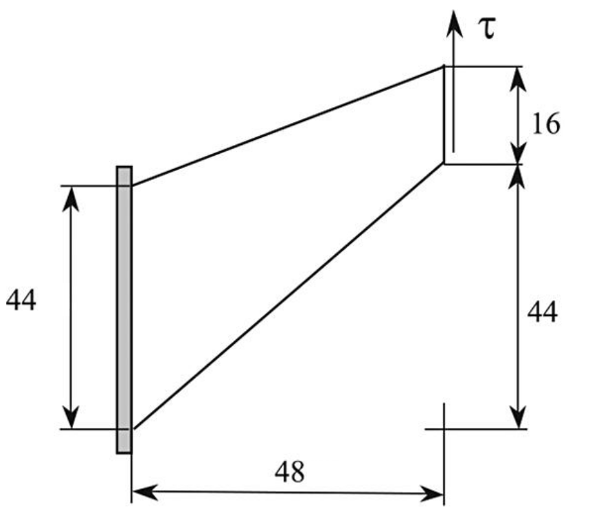

# Tutorial: `cooksMembrane`

Prepared by Ivan Batistić

---

## Tutorial Aims

- Demonstrate how to perform a solid-only analysis in solids4foam.
- To demonstrate solver performance under both shear and bending conditions in combination with a skew numerical mesh.

---

## Case Overview

Cook's membrane is a well-known bending-dominated benchmark case. The tapered panel (trapezoid) is fixed on one side and subjected to uniform shear traction on the opposite side. The prescribed shear traction is 6250 Pa. The vertices of the trapezoid (in mm) are (0, 0), (48, 44), (48, 60), and (0, 44), as shown in Figure 1. The Young's modulus is 70 Pa, and the Poisson's ratio is 1/3. Gravitation effects are neglected, and there are no body forces. The problem is solved as static, using one loading increment.

<div style="text-align: center;">
  
    <figcaption>
     <strong>Figure 1: Problem geometry</strong>
    </figcaption>
</div>

---

## Expected Results

* Around the top-left corner, the elastic body is squeezed the most (positive hydrostatic compression).
* The body is most stretched near the bottom side (negative hydrostatic compression).
* There is no known analytical solution for this problem, but results from various codes and procedures are available in the literature.

Table 1 summarises predictions from various finite element codes for the top-right corner vertical displacement [[1](https://cofea.readthedocs.io/en/latest/benchmarks/002-cook-membrane/results.html)]. For the mesh consisting of $$20 \otimes 20$$ cells, the `solids4foam` prediction is 32.12 mm (using `foam-extend-4.1`). As the mesh is refined, the `solids4foam` prediction converges to the values reported in Table 1.

**Table 1: Finite element predictions for the top-right corner vertical displacement, reported at [CoFEA [1]](https://cofea.readthedocs.io/en/latest/benchmarks/002-cook-membrane/results.html)**

|   Solver   | Very Fine Mesh <br>  quadratic (Hexahedral mesh) [in mm] | Very Fine Mesh <br>  quadratic (Tetrahedral mesh) [in mm] |
| :--------: | :------------------------------------------------------: | :-------------------------------------------------------: |
|  Calculix  |                          32.27                           |                           32.27                           |
| Code_Aster |                          32.20                           |                           32.20                           |
|   Elmer    |                          32.28                           |                           32.27                           |

In the `solids4foam` case, the vertical displacement at the top right corner is extracted using the `solidPointDisplacement` function object placed in the `controlDict`:

```
functions
{
    pointDisp
    {
        type    solidPointDisplacement;
        point   (0.048 0.060 0);
    }
}

```
The `solidPointDisplacement` function finds the mesh vertex nearest to the specified `point` and writes the displacement of this vertex to the following file in the case:  

`postProcessing/0/solidPointDisplacement_pointDisp.dat`

---

## Running the Case
The tutorial case is located at `solids4foam/tutorials/solids/linearElasticity/cooksMembrane`. The case can be run using the included `Allrun` script, i.e. `> ./Allrun`.  In this case, the Allrun consists of creating the mesh using `blockMesh` (`> ./blockMesh`) followed by running the `solids4foam` solver (`> ./solids4Foam`).

---

## References 

[1] [https://cofea.readthedocs.io/en/latest/benchmarks/002-cook-membrane/results.html](https://cofea.readthedocs.io/en/latest/benchmarks/002-cook-membrane/results.html)

[2] [Kasper EP, Taylor RL. A mixed-enhanced strain method: 
Part I: Geometrically linear problems. Computers & Structures. 2000 Apr 1;75(3):237-50.](https://www.sciencedirect.com/science/article/abs/pii/S0045794999001340)

[3] [Bijelonja I, Demirdžić I, Muzaferija S. Mixed finite volume method for linear thermoelasticity at all Poisson’s ratios. Numerical Heat Transfer, 
Part A: Applications. 2017 Aug 3;72(3):215-35.](https://www.tandfonline.com/doi/abs/10.1080/10407782.2017.1372665?journalCode=unht20)

[4] [Bijelonja I, Demirdžić I, Muzaferija S. A finite volume method for incompressible linear elasticity. Computer methods in applied mechanics and engineering. 2006 Sep 15;195(44-47):6378-90.](https://www.sciencedirect.com/science/article/abs/pii/S0045782506000387)

