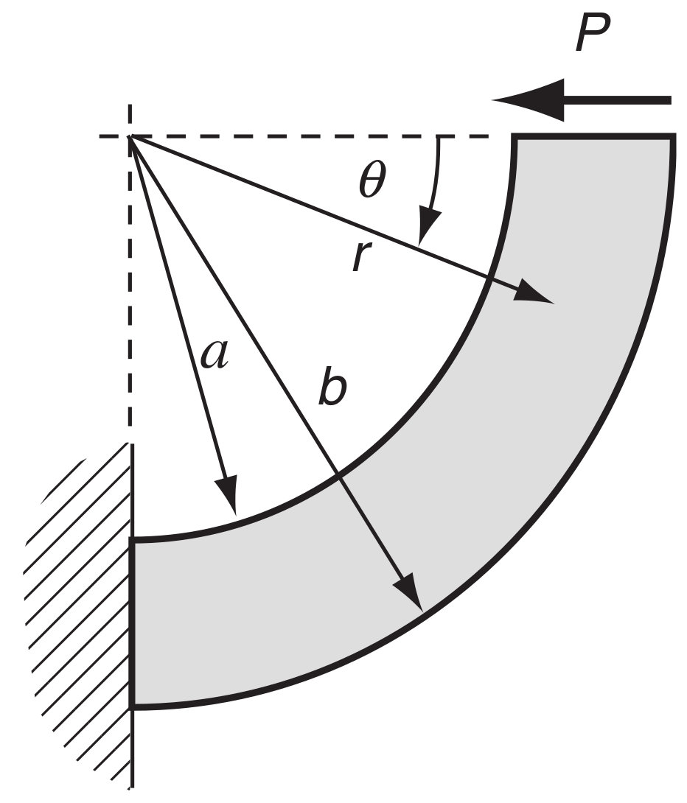
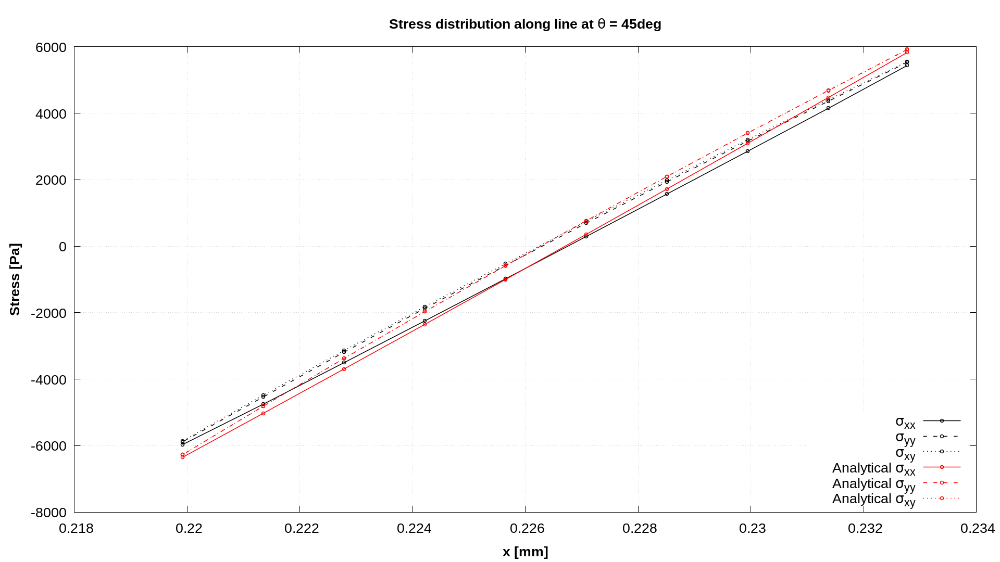
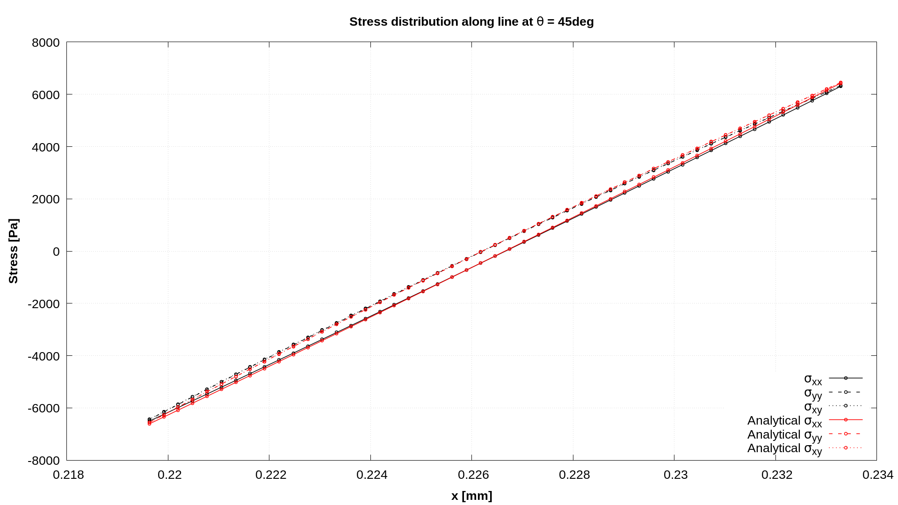

# Curved Cantilever Beam: `curvedCantilever`

---

Prepared by Ivan Batistić

---

## Tutorial Aims

- Demonstrate how to perform a solid-only analysis in `solids4foam`;
- Examine solver performance under conditions in which the shear-locking
  phenomena can occur.

---

## Case Overview

The curved cantilever beam is fixed on the left side, and the right side has
prescribed horizontal traction, as shown in Fig 1. The prescribed horizontal
traction is $$200$$ Pa. The beam's inner radius is set to $$a= 0.31$$ m and the
beam's outer radius to $$b =  0.33$$ m. The Young's modulus is $$E= 100$$ Pa and
the Poisson's ratio is $$\nu = 0.3$$. Gravitation effects are neglected, and
there are no body forces. The problem is solved as static, using one loading
increment.

<div style="text-align: center;">
  
    <figcaption>
     <strong>Figure 1: Problem geometry [1]</strong>
    </figcaption>
</div>

---

## Expected results

- Stress is dependent on the angular coordinate $$\theta$$;

- The analytical solution for the stress field is
  [[1]](https://www.sciencedirect.com/book/9780123744463/elasticity):

$$
N = {a}^2 - {b}^2 + ({a}^2+{b}^2)\;\text{ln}\left(\frac{b}{a}\right),
$$

$$
\sigma_{r} = \frac{P}{N}\left(r+\frac{a^2b^2}{r^3}-\frac{a^2+b^2}{r}\right)\sin (\theta),
$$

$$
\sigma_{\theta} = \frac{P}{N}\left(3r-\frac{a^2b^2}{r^3}-\frac{a^2+b^2}{r}\right)\sin (\theta),
$$

$$
\tau_{r\theta} = \tau_{\theta r} =-\frac{P}{N}\left(r+\frac{a^2b^2}{r^3}-\frac{a^2+b^2}{r}\right)\cos (\theta).
$$

The analytical solution is generated alongside solution fields using the
function object located in the `system/controlDict`, where one needs to input
geometry and material data:

```
  functions
  {
      analyticalSolution
      {
          type    curvedCantileverAnalyticalSolution;

          // Inner beam radius
          rInner  0.31;

          // Outer beam radius
          rOuter  0.33;

          // Applied shear force (in N/m)
          force   4;

          // Young's modulus
          E       100;

          // Poisson's ratio
          nu      0.3;
      }
  }
```

Figures 2 and 3 show $$\sigma_{xx}$$, $$\sigma_{xy}$$ and $$\sigma_{yy}$$ stress
distributions along the line $$\theta=45^{\circ}$$ for computational meshes
consisting of $$100\times100$$ and $$200\times50$$ cells. One can see that with
mesh refinement, numerical results converge to analytical ones. The data for
plots presented in Figures 2 and 3 is extracted using the `sampleDict` located
in the `system` directory.

<div style="text-align: center;">
  
    <figcaption>
     <strong>Figure 2: Stress distribution for mesh consisting of 100x10 cells</strong>
    </figcaption>
</div>

<div style="text-align: center;">
  
    <figcaption>
     <strong>Figure 3: Stress distribution for mesh consisting of 200x50 cells</strong>
    </figcaption>
</div>

---

## Running the Case

The tutorial case is located at
`solids4foam/tutorials/solids/linearElasticity/curvedCantilever`. The case can
be run using the included `Allrun` script, i.e. `> ./Allrun`. In this case, the
`Allrun` consists of creating the mesh using `blockMesh` (`> ./blockMesh`)
followed by running the `solids4foam` solver (`> ./solids4Foam`) and
`> ./sample` utility. Optionally, if `gnuplot` is installed, the stress
distribution is plotted in the `sigmaAtTheta45deg.png` file.

```warning
The coupled version of this case, which uses the `coupledUnsLinearGeometryLinearElastic`, can currently only be run using solids4foam built on foam-extend. To modify the case to run with the segregated `linearGeometryTotalDisplacement` solid model, follow the instructions in `tutorials/solids/linearElasticity/narrowTmember/README.md` file.
```

---

### References

[1]
[Sadd MH. Elasticity: Theory, Applications, and Numerics. Elsevier 2009.](https://www.sciencedirect.com/book/9780123744463/elasticity)

[2]
[Pablo Castrillo, Alfredo Canelas, Eugenio Schillaci, Joaquim Rigola and Asensio Oliva. High-order finite volume method for linear elasticity on unstructured meshes. Computers & Structures. Volume 268, 2022,](https://www.sciencedirect.com/science/article/pii/S004579492200089X)
