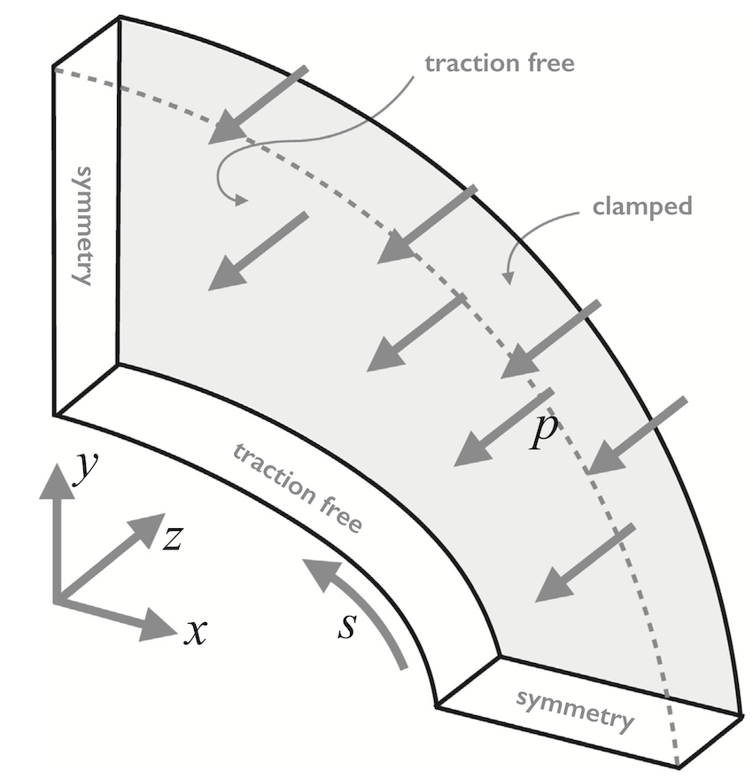
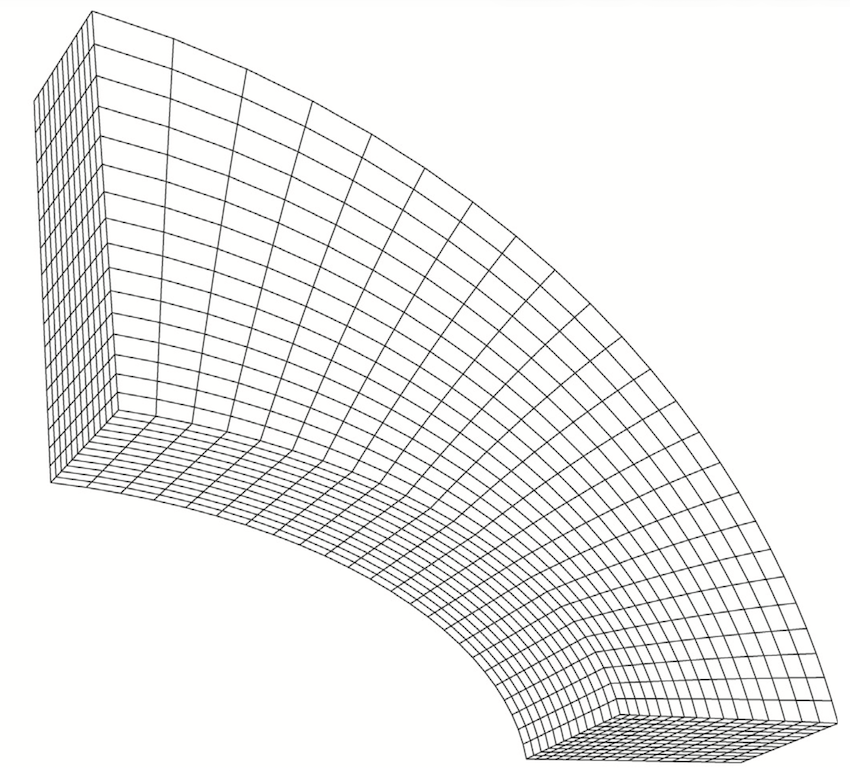
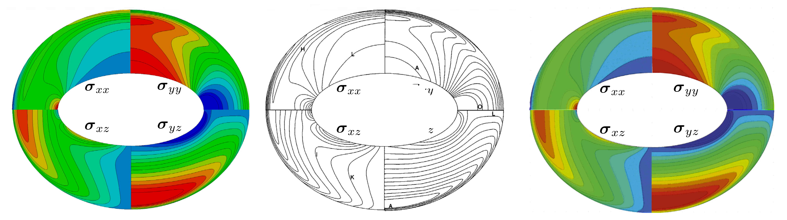

# Out-of-plane bending of an elliptic plate: `ellipticPlate`

---

Prepared by Philip Cardiff and Ivan Batistić

---

## Tutorial Aims

- Demonstrate how to perform a 3D linear-static stress analysis in solids4foam
- Compare the performance of three variants of the same tutorial case:
  `petscSnes`, which uses the `linearGeometryTotalDisplacement` solid model
  with a PETSc SNES solution algorithm; `segregated`, which uses the same
  solid model with an implicit segregated solution algorithm; and
  `unsCoupled`, which uses the original
  `coupledUnsLinearGeometryLinearElastic` solid model.
- Demonstrates using the solids4foam solid solver based on the PETSc SNES
  nonlinear solver.

---

## Case Overview

This 3-D test case consists of a thick elliptic plate with a centred elliptic
hole (Fig. 1); a constant pressure of $$1$$ MPa is applied to the upper surface,
and the outer surface is fully clamped. The case has been described by the
National Agency for Finite Element Methods and Standards (NAFEMS) [1], and, in
the context of the FV method, has been examined and benchmarked in detail by
Demirdžić et al. [2]. The assumed mechanical properties are Young’s modulus
$$E = 210$$ GPa and Poisson’s ratio $$\nu = 0.3$$. Due to double symmetry,
only a quarter of the plate is analysed. The thickness of the plate is
$$0.6$$ m, and the inner and outer ellipses are given by:

$$
\left(\dfrac{x}{2}\right)^2 + y^2 = 1
$$

for the inner ellipse, and

$$
\left(\dfrac{x}{3.25}\right)^2
+ \left(\dfrac{y}{2.75}\right)^2 = 1
$$

for the outer ellipse.

The problem is solved as quasi-static with one loading increment, neglecting
gravitational effects. The mesh is generated using the `blockMesh` utility and
consists of 12 cell layers through the thickness, 24 cells in the
circumferential direction, and 16 cells in the radial direction, as shown in
Figure 2. The mesh density corresponds to mesh 3 used in [3].

```note
The target stress value given in the NAFEMS benchmark cannot be used directly
for comparison, as the fixed displacement boundary conditions used in the
current study mimic those used in Demirdžić et al. [2] and do not correspond
exactly to those in the NAFEMS benchmark.
```



**Figure 1 - Problem geometry and loading [2]**



**Figure 2 - Hexahedral mesh (mesh 3 in [2])**

## Expected Results

Figure 3 shows the stress contours on the $$z=0.3$$ m $$x$$–$$y$$ plane for
the finest mesh.
The predictions agree closely with the results of Demirdžić et al. [2].
Further comparisons can be found in [3]:
[Cardiff et al., 2016, A block-coupled finite volume methodology for linear
elasticity and unstructured meshes][cardiff-2016].



**Figure 3 - Stress component distributions on the plane $$z=0.3$$ m. The
second image is from [2], and the third is generated using finite elements with
Abaqus [3].**

The wall-clock times and memory requirements for each run are given in Table 1,
where the results for the `unsCoupled` and `segregated` variants are compared.
The `unsCoupled` solver used a bi-conjugate gradient stabilised linear solver
with ILU(0) preconditioner, while the `segregated` variant used an implicit
segregated solve with the same convergence tolerance of
$$1 \times 10^{-6}$$. In this case, the `unsCoupled` variant is faster than the
`segregated` method by a factor of 2.5–6. As expected, its memory requirements
are greater, by approximately 4.5 times in the largest mesh case. Interestingly,
when compared to the FE solution, `unsCoupled` is faster and considerably more
memory efficient in all cases; in the finest mesh case, `unsCoupled` is almost
6 times faster and uses 8 times less memory.

```note
The wall-clock times given in Table 1 were recorded in 2015 using one core of a
2.4 GHz Intel Ivy Bridge CPU. Better performance can be expected using a new
machine.
```

**Table 1: Wall-clock time (in s) and maximum memory usage (in MB) [2].**

| Mesh | unsCoupled | segregated | Abaqus |
| --- | --- | --- | --- |
| 500 | 0.08 s, 11 MB | 58 s, 20 MB | 3 s, 40 MB |
| 4 500 | 0.5 s, 50 MB | 384 s, 27 MB | 4 s, 113 MB |
| 12 500 | 1.4 s, 140 MB | 1 387 s, 43 MB | 5 s, 197 MB |
| 50 000 | 6 s, 570 MB | 4 737 s, 112 MB | 16 s, 881 MB |
| 200 000 | 36 s, 2 500 MB | -, - | 73 s, 1800 MB |

```warning
The `coupledUnsLinearGeometryLinearElastic` solid model currently does not run
in parallel. For a coupled solid model that *does* run in parallel, use the
`vertexCentredLinGeomSolid` solid model.
```

## Running the Case

The tutorial case is located at
`solids4foam/tutorials/solids/linearElasticity/ellipticPlate`. The case can be
run using the included `Allrun` script. The `Allrun` script optionally takes an
argument that specifies the solution approach:

```bash
./Allrun                # Defaults to the petscSnes variant
./Allrun segregated     # Segregated variant
./Allrun unsCoupled     # Original foam-extend-only variant
```

The `Allrun` script starts by updating the files in the case to match the
selected approach; the following files are updated: `0/D`,
`constant/solidProperties`, `system/fvSchemes`, and `system/fvSolution`.
Subsequently, the mesh is created with `blockMesh`, followed by running the
solver `solids4Foam`.

The default `petscSnes` variant uses the `linearGeometryTotalDisplacement`
solid model with PETSc SNES. The original `unsCoupled` variant is also
provided through the `.unsCoupled` file suffixes, and uses the
`coupledUnsLinearGeometryLinearElastic` solid model together with the original
`block*` boundary conditions and coupled discretisation settings. The
`unsCoupled` variant can currently only be run using solids4foam built on
foam-extend.

The `segregated` variant uses the same `linearGeometryTotalDisplacement`
solid model as `petscSnes`, but with `solutionAlgorithm implicitSegregated;`
in `constant/solidProperties`. This variant is intended for comparison with the
PETSc SNES path using the same geometry and boundary conditions.

```note
OpenFOAM v2412 does not support the foam-extend `ellipse` block edge type in
`blockMeshDict`. The foam-extend mesh dictionary is kept in
`system/blockMeshDict.foamExtend` and uses the original `ellipse` entries. The
OpenFOAM mesh dictionary is kept in `system/blockMeshDict.openfoam` and
replaces those edges with `spline` edges sampled from the ellipses using the
helper script located in `system/makeBlockMeshDict.py`. The `Allrun` script
links the appropriate `blockMeshDict` for the loaded OpenFOAM variant.
```

---

## References

[1] National Agency for Finite Element Methods and Standards (U.K.). The
standard NAFEMS benchmarks. NAFEMS; 1990.

[2] Demirdžić, I., Muzaferija, S., Perić, M.: Benchmark solutions of some
structural analysis problems using finite-volume method and multigrid
acceleration. International journal for numerical methods in engineering
40(10), 1893–1908 (1997).

[3] P. Cardiff, Ž. Tuković, H. Jasak, A. Ivanković, A block-coupled finite
volume methodology for linear elasticity and unstructured meshes. *Computers and
Structures*, 175, 2016, 100–122, 10.1016/j.compstruc.2016.07.004.

[4] [P. Cardiff, D. Armfield, Ž. Tuković, I. Batistić, A Jacobian-free
Newton-Krylov method for cell-centred finite volume solid mechanics.
*International Journal for Numerical Methods in Engineering*, 127, e70268,
2026, 10.1002/nme.70268.](https://doi.org/10.1002/nme.70268)

[cardiff-2016]: https://doi.org/10.1016/j.compstruc.2016.07.004
