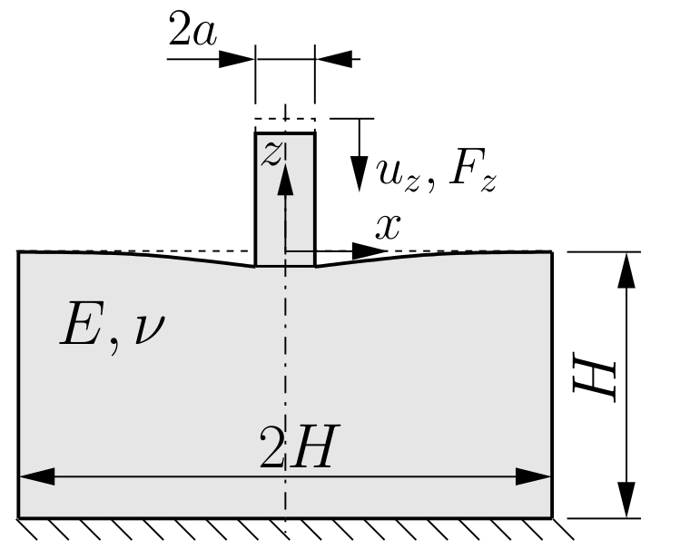
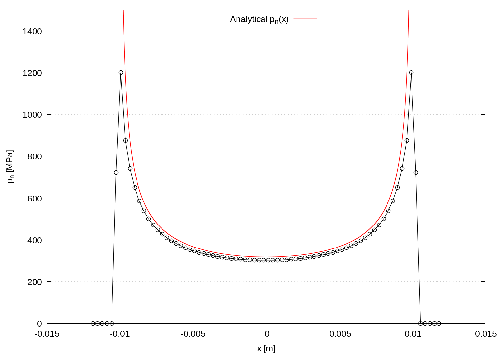

# Indentation of elastic half-space with a flat-ended rigid indenter: `flatEndedRigidIndenter`

---

Prepared by Ivan Batistić

---

## Tutorial Aims

- Demonstrate a contact problem between a rigid and deformable body;
- Compare the accuracy of a solid model against the available analytical solution.

---

## Case Overview

A rigid flat-ended indenter is pressed onto an elastic-half space, as shown in Fig. 1. The elastic half-space is modelled as finite, with dimensions $$2H \times H$$, with Young’s modulus $$E = 200$$ GPa and Poisson’s ratio $$\nu= 0.3$$. The problem is solved by assuming a plane stress state and a 2D model with unit thickness. The top surface of the rigid indenter has a prescribed vertical displacement $$u_z = 0.0967$$ mm corresponding to vertical force $$F_z = 10 000$$ N (see Eq (4)). The bottom surface of the finite half-space is held fixed (zero displacement). The contact between the punch and the elastic half-space is modelled as frictionless.

  
    <figcaption>
     <strong>Figure 1: Problem geometry (H = 0.2 m, a = 0.01 m) [1]</strong>
    </figcaption>

---

## Expected Results

* The analytical solution for the pressure distribution (plane stress) is [[2]](https://www.cambridge.org/core/books/contact-mechanics/E3707F77C2EBCE727C3911AFBD2E4AC2):
  $$
  p_n(x) = \frac{F}{\pi\sqrt{a^2-x^2}} \qquad \text{for } |x| \leq a,
  $$
  which is singular at the edge of the fixed contact zone. The indentation depth, i.e. indenter displacement, can be obtained using:
  $$
  u_z = \frac{F}{\pi E}\left[ 2 \text{ln} \left(\frac{2L}{a}\right) - (1+\nu) \right],
  $$
  where $L$ is the thickness of the elastic half-space. The boundary displacement outside the contact zone can be calculated as:
  $$
  u_z(x) = \frac{F}{\pi E}\left[ 2 \text{ln} \left(\frac{2L}{a}\right) - (1+\nu) \right].
  $$

Figure 2 shows the distribution of the contact pressure. The diagram is created automatically within the `Allrun` script using `sample` utility and `gnuplot`. Further mesh refinement would lead to a closer approximation of the analytical solution. As the mesh is refined, the predicted contact pressure at the contact edge goes to infinity, as expected.

The main cause of the shift between the analytical and the numerical curve is the applied pressure calculation method in the `solidContact` boundary condition. The arising error can be reduced with mesh refinement or by using the pressure integration method proposed in [[1]](https://repozitorij.unizg.hr/islandora/search/Segment-to-Segment%20Algorithm%20for%20Finite%20Volume%20Mechanical%20Contact%20Simulations?type=dismax) (this improved contact condition will soon be available in solids4foam).

  
    <figcaption>
     <strong>Figure 2: Contact pressure distribution</strong>
    </figcaption>

---

## Running the Case

The tutorial case is located at `solids4foam/tutorials/solids/linearElasticity/flatEndedRigidIndenter`. The case can be run using the included `Allrun` script, i.e. `> ./Allrun`.  In this case, the Allrun consists of creating the mesh using `blockMesh` (`> blockMesh`) followed by running the `solids4foam` solver (`> solids4Foam`). Optionally, if `gnuplot` is installed, the stress distribution is plotted in the `pressureDistribution.png` file.

---

### References 

[1] [Ivan Batistić. Segment-to-Segment Algorithm for Finite Volume Mechanical Contact Simulations. University of Zagreb, PhD thesis, 2022.](https://repozitorij.unizg.hr/islandora/object/fsb%3A8301)

[2] [K. L. Johnson, Contact Mechanics. Cambridge University Press, 1985.](https://www.cambridge.org/core/books/contact-mechanics/E3707F77C2EBCE727C3911AFBD2E4AC2)

