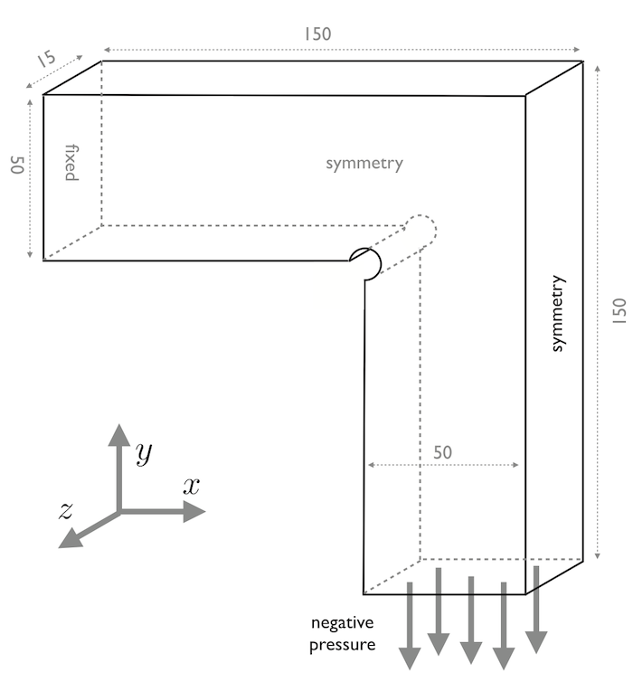
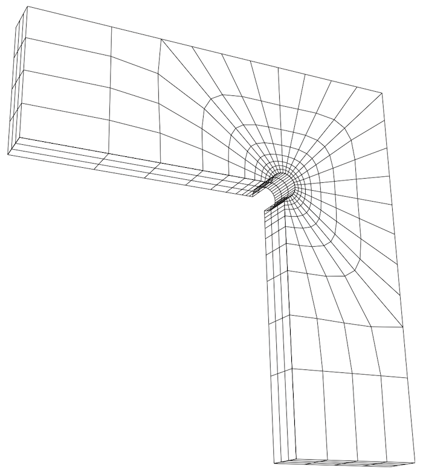
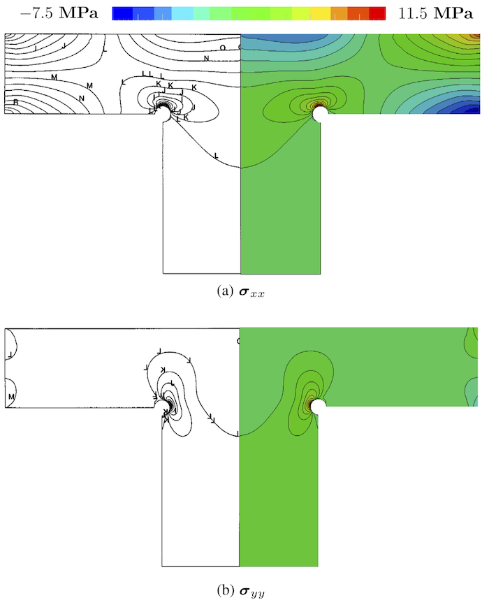

# Tutorial: `narrowTmember`

Prepared by Philip Cardiff

---

## Tutorial Aims

- Demonstrate how to perform a linear-static stress analysis of a 3-D
  engineering component in solids4foam;
- Compare the performance of three variants of the same tutorial case:
  `petscSnes`, which uses the `linearGeometryTotalDisplacement` solid model
  with a PETSc SNES solution algorithm; `segregated`, which uses the same
  solid model with an implicit segregated solution algorithm; and
  `unsCoupled`, which uses the original
  `coupledUnsLinearGeometryLinearElastic` solid model.
- Show how to modify a case, which originally used the
  `coupledUnsLinearGeometryLinearElastic` solid model, to instead use the
  `linearGeometryTotalDisplacement` solid model with PETSc SNES.

## Case Overview

This case comprises a narrow engineering component with a T cross-section
(Figure 1). This case was proposed as a benchmark by
[Demirdzic et al., 1997, Benchmark solutions of some structural analysis
problems using the finite-volume method and multigrid acceleration. Int J Numer
Methods Eng.](<http://refhub.elsevier.com/S0045-7949(16)30604-6/h0015>)
Due to symmetry, the solution domain consists of one-quarter of the component. A
constant negative pressure of 1 MPa is applied to the lower surface, and the
upper left surface is fully clamped (Figure 1). The Young’s modulus is 210 GPa,
and Poisson’s ratio is 0.3. A radius $$R = 5$$ mm hole is located at the
expected stress concentration. Four separate systematically refined hexahedral
meshes (624, 4992, 39 936, and 319 488 cells) are examined here, mimicking the
meshes employed by Demirdzic et al.; the coarsest mesh is shown in Figure 2.



Figure 1 - Geometry and loading with dimensions in mm



Figure 2 - Coarest hexahedral mesh (624 cells)

---

## Running the Case

The tutorial case is located at
`solids4foam/tutorials/solids/linearElasticity/narrowTmember`. The case can be
run using the included `Allrun` script. Two variants are available:

```bash
./Allrun                # Defaults to the petscSnes variant
./Allrun segregated     # Segregated variant
./Allrun unsCoupled     # Original foam-extend-only variant
```

In both cases, the `Allrun` script simply creates the mesh using `blockMesh`
and then runs the solids4foam solver.

The default `petscSnes` variant uses the `linearGeometryTotalDisplacement`
solid model with PETSc SNES. The original `unsCoupled` variant is also
provided through the `.unsCoupled` file suffixes, and uses the
`coupledUnsLinearGeometryLinearElastic` solid model together with the original
`block*` boundary conditions and coupled discretisation settings. The
`unsCoupled` variant can currently only be run using solids4foam built on
foam-extend.

The `segregated` variant uses the same `linearGeometryTotalDisplacement`
solid model as `petscSnes`, but with `solutionAlgorithm implicitSegregated;`
in `constant/solidProperties`. This variant is intended for comparison with the
PETSc SNES path using the same geometry and boundary conditions.

The case can then be run as before, i.e. `> blockMesh && solids4Foam`.

---

## Expected Results

Figure 3 shows the $$\sigma_{xx}$$ and $$\sigma_yy$$ stress distributions on the
plane z = 0 m (symmetry plane) for the finest mesh. The predictions agree
closely with the results of Demirdzic et al. Further comparisons can be found in
[Cardiff et al., 2016, A block-coupled Finite Volume methodology for linear
elasticity and unstructured meshes, Comp. and
Struct.](https://www.sciencedirect.com/science/article/pii/S0045794916306046)



**Figure 3: Predicted stress component distributions on the plane z = 0:0 m
(right) compared with results from Demirdzic et al. (left).**

The wall-clock times and memory requirements for each run are given in Table 1,
where the results for the `unsCoupled` and `segregated` variants are compared.
The `unsCoupled` solver used a bi-conjugate gradient stabilised linear solver
with ILU(0) preconditioner, while the `segregated` variant used an implicit
segregated solve with the same convergence tolerance of
$$1 \times 10^{-6}$$. In this case, the `unsCoupled` variant is approximately
four times faster than the `segregated` variant but requires about four times
more memory.

```note
The wall-clock times given in Table 1 were recorded in 2015 using one core of a
2.4 GHz Intel Ivy Bridge CPU. Better performance can be expected using a new
machine.
```

**Table 1: Wall-clock time (in s) and maximum memory usage (in MB).**

| Mesh    | unsCoupled |            | segregated |            |
| ------- | ---------- | ---------- | ---------- | ---------- |
|         | **Time**   | **Memory** | **Time**   | **Memory** |
| 624     | 0.2        | 15         | 0.7        | 8          |
| 4 992   | 2          | 58         | 6          | 24         |
| 39 936  | 29         | 340        | 98         | 88         |
| 319 488 | 421        | 2 400      | 2 220      | 560        |

```note
PETSc timing and memory data for the `petscSnes` variant have not yet been
added. Based on the current setup, the PETSc results are expected to be close
to, or better than, the `unsCoupled` variant.
```

```warning
The `coupledUnsLinearGeometryLinearElastic` solid model currently does not run
in parallel. For a coupled solid model that *does* run in parallel, use the
`vertexCentredLinGeomSolid` solid model.
```
