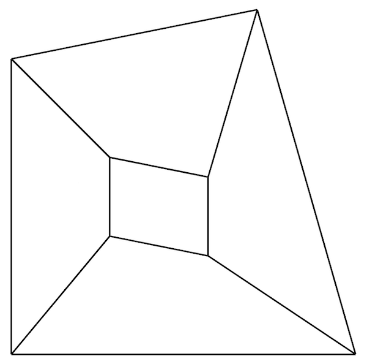
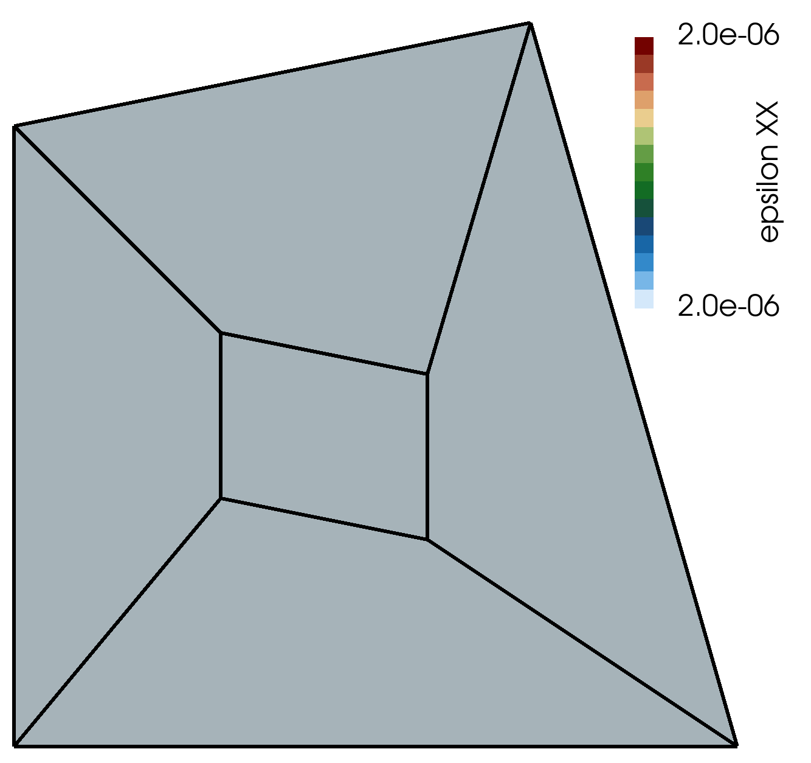

# Patch Test: `patchTest`

Prepared by Philip Cardiff

---

## Tutorial Aims

- Demonstrate the standard _patch test_, which is commonly used to test finite
  element formulations.

## Case Overview

The patch test checks the ability of the discretisation to reproduce polynomials
of a specified order, known as _polynomial completeness_ of the displacement
field. For example, if a local linear displacement field is assumed when
deriving a discretisation, then this discretisation should produce zero
discretisation (mesh) errors on cases where the true displacement solution is
linear. For further details, see
[T Belytschko, WK Liu, B Moran, K Elkhodary, Nonlinear finite elements for
continua and structures, 2014, Wiley, 2nd
Edition](https://www.wiley.com/en-br/Nonlinear+Finite+Elements+for+Continua+and+Structures,+2nd+Edition-p-9781118632703).

The case geometry (Figure 1) consists of an irregular quadrilateral, which is
meshed using five irregular quadrilateral cells. It is important that distorted
cells are used, as orthogonal cells may satisfy the patch test when arbitrary
quadrilaterals do not.



Figure 1 - Standard patch test geometry and mesh

Uniform, linear elastic material properties are assumed; in this case, Young's
modulus of 200 GPa and Poisson's ratio of 0.3. Body forces are set to zero. In
this case, where we are examining spatially second-order solid solvers, a
linearly-varying displacement field is prescribed for the four boundary patches:

$$
d_x = \alpha_{x0} +  \alpha_{x1}x +  \alpha_{x2}y, \quad d_y = \alpha_{y0} +
\alpha_{y1}x +  \alpha_{y2}y
$$

Where $$d_x$$ is the x-component of displacement, $$d_y$$ is the y-component,
$$x$$ is the x-coordinate, $$y$$ is the y-coordinate, and the constant
$$\alpha$$ are set by the user. In this case, $$\alpha_{x0} = 1e-6$$,
$$\alpha_{x1} = 2e-6$$, $$\alpha_{x2} = 3e-6$$, $$\alpha_{y0} = 4e-6$$,
$$\alpha_{y1} = 5e-6$$, and $$\alpha_{y2} = 6e-6$$.

For the discretisation to pass the patch test, the strains (`epsilon`) should be
constant in the domain and given by

$$
\epsilon_{xx} = \frac{\partial d_x}{\partial x} = \alpha_{x1}, \quad
\epsilon_{yy} = \frac{\partial d_y}{\partial y} = \alpha_{y2}, \quad
\epsilon_{xy} = \epsilon_{yx}= \frac{1}{2} \left(\frac{\partial d_x}{\partial
y} + \frac{\partial d_y}{\partial x} \right) = \frac{1}{2} \left( \alpha_{x2} +
\alpha_{y1}\right)
$$

The stresses should also be constant in the domain.

```note
If higher-order discretisations were to be tested, higher-order displacement
conditions would be applied.
```

The patch test is not specific to solid mechanics, and, in fact, it can be used
to test the polynomial completeness of any numerical discretisation. In
OpenFOAM/foam, achieving polynomial completeness on irregular meshes requires
that boundary patch non-orthogonal corrections are enabled. One way to achieve
this is through custom boundary conditions, as used in solids4foam. In
particular, the `evalaute` and `snGrad` functions should be updated. Polynomial
completeness is related to the order of accuracy that can be achieved in
irregular meshes; for example, without these boundary-patch non-orthogonal
corrections, standard OpenFOAM/foam solvers will reduce from second to
first-order accuracy when boundary cells are non-orthogonal.

---

## Running the Case

The tutorial case is located at
`solids4foam/tutorials/solids/linearElasticity/patchTest`. The case can be run
using the included `Allrun` script, i.e. `./Allrun`. In this case, the Allrun
simply consists of creating the mesh using blockMesh (`./blockMesh`) followed by
running the solids4foam solver (`./solids4Foam`).

```warning
For OpenFOAM.com and OpenFOAM.org, the `pointCellsLeastSquares` or
`edgeCellsLeastSquares` gradient schemes should be used for calculating the
gradient of displacement; these are the only gradient schemes available in
these versions, which are consistent with the required boundary non-orthogonal
corrections.
```

---

## Expected Results

As noted above, the strain tensor should be constant in the domain and, for the
chosen $$\alpha$$ paramters, equal to:

$$
\epsilon_{xx} = \alpha_{x1} = 2e-6, \quad
\epsilon_{yy} = \alpha_{y2} = 6e-6, \quad
\epsilon_{xy} = \frac{1}{2} \left( \alpha_{x2} + \alpha_{y1}\right) = 4e-6
$$

The constant xx-component of strain field (`epsilon[XX]`) is shown in Figure 2.



Figure 2 - Constant xx-component of the strain field ($$\epsilon_{xx}$$,
`epsilon[XX]`) in the patch test
