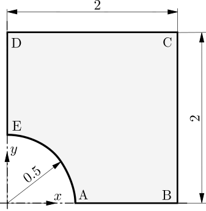

# Hole in a Infinite Plate Subjected to Remote Stress: `plateHole`

---

Prepared by Philip Cardiff and Ivan Batistić

---

## Tutorial Aims

- Demonstrate the solver accuracy for a linear elastic test case.

---

## Case Overview

In this case, a thin, infinitely large plate with a circular hole is subjected to
uniaxial tension of $$\sigma_{xx} = T = 1$$ MPa, see Figure 1. Owing to the symmetry
of the geometry and loading, only one quarter of the plate is modelled.
To minimise the influence of the finite computational boundaries, the exact
tractions obtained from the analytical solution [1,2,3] are prescribed
on the outer edges BC and CD. They are defined with
 `analyticalPlateHoleTraction` boundary conditions, which require
geometry (hole radius) and loading (far-field  traction):

```c++
right
{
    type            analyticalPlateHoleTraction;
    farFieldTractionX 1e6;
    holeRadius      0.5;
    value           uniform (0 0 0);
}
```

Symmetry boundary conditions are applied on
boundaries AB and DE, while zero traction is specified on the hole boundary.
The material properties are defined by a Young’s modulus of $$E = 200 GPa$$
and a Poisson’s ratio of $$\nu = 0.3$$. Gravitational and inertial effects are
neglected, and the case is solved using one loading increment.



**Figure 1 - Problem geometry [3]**

---

## Expected Results

The analytical solution for the stress field is [1,2,3]:

$$
\sigma_{xx} = T \left[ 1 - \dfrac{R^2}{r^2} \left( \dfrac{3}{2}\cos(2\theta)
+\cos (4\theta)\right) + \dfrac{3}{2}\dfrac{R^4}{r^4}\cos (4\theta) \right],
$$

$$
\sigma_{yy} = T \left[ - \dfrac{R^2}{r^2} \left( \dfrac{1}{2}\cos(2\theta)
-\cos (4\theta)\right) - \dfrac{3}{2}\dfrac{R^4}{r^4}\cos (4\theta) \right],
$$

$$
\sigma_{xy} = T \left[  - \dfrac{R^2}{r^2} \left( \dfrac{1}{2}\sin(2\theta)
+\sin (4\theta)\right) + \dfrac{3}{2}\dfrac{R^4}{r^4}\sin (4\theta) \right].
$$

where $$r=\sqrt{x^2+y^2}$$ and $$\theta=\tan^{-1}(y/x)$$ are the
usual polar co-ordinates.
$$R$$ is the hole radius.
Stresses in cylindrical coordinates:
$$
\sigma_r = \frac{T}{2}\left( 1-\frac{a^2}{r^2}\right)
+ \frac{T}{2} \left( 1+\frac{3a^4}{r^4} - \frac{4a^2}{r^2} \right)cos(2\theta),
$$

$$
\sigma_{\theta} = \frac{T}{2}\left( 1+\frac{a^2}{r^2}\right)
- \frac{T}{2} \left( 1+\frac{3a^4}{r^4} \right)\cos(2\theta),
$$

$$
\sigma_{r\theta} =  - \frac{T}{2} \left( 1-\frac{3a^4}{r^4}
+ \frac{2a^2}{r^2} \right)\sin(2\theta).
$$

Displacement field in cartesian coordinates:
$$
u_x = \frac{Ta}{8\mu}\left( \frac{r}{a}(\kappa+1)\cos\theta+\frac{2a}{r}
\left((1+\kappa)\cos(\theta)+\cos (3\theta)\right)
-\frac{2a^3}{r^3}\cos(3\theta)  \right),
$$

$$
u_y = \frac{Ta}{8\mu}\left( \frac{r}{a}(\kappa-3)\sin\theta+\frac{2a}{r}
\left((1-\kappa)\sin(\theta)+\sin (3\theta)\right)
-\frac{2a^3}{r^3}\sin(3\theta)  \right),
$$

 where $$a$$ is hole radius, $$T$$ is far field traction in $$x$$ direction,
$$\nu$$ is Poisson's ratio, $$\mu$$ is shear modulus and $$\kappa$$ parameter is
equal to $$3-4\nu$$.

A custom `plateHoleAnalyticalSolution` function object is added to the
 `controlDict` to calculate the analytical solutions for displacement and stress
 and compute the errors:

```c++
plateHoleAnalyticalSolution1
{
    type          plateHoleAnalyticalSolution;
    farFieldTractionX 1e6;    // Farfield sigma_xx
    holeRadius    0.5;        // Hole radius
    E             200e+9;     // Young modulus
    nu            0.3;        // Poissons ratio

    //Optional
    cellDisplacement true;
    pointDisplacement true;
    cellStress true;
    pointStress true;
}
```

The function object prints the average $$L_1$$, $$L_2$$, and $$L_\infty$$ norms
 for the stress components ($$\sigma_{xx}$$, $$\sigma_{yy}$$, and $$\sigma_{xy}$$)
 and for the displacement field:

```c++
Writing cellStressDifference field
    Component: 0
    Norms: mean L1, mean L2, LInf:
    3284.42 10421.2 105024

    Component: 1
    Norms: mean L1, mean L2, LInf:
    2100.42 6111.58 59602.5

    Component: 3
    Norms: mean L1, mean L2, LInf:
    2917.5 8547 87630.5

Writing DDifference field
    Norms: mean L1, mean L2, LInf:
    1.2549e-08 1.37329e-08 4.24642e-08
```

In `solids4foam` the error normas  $$L_1$$,$$L_2$$ and $$L_\inf$$ are defines as:

$$
L_1 =\frac{1}{N_{\text{c}}} \sum_{i=1}^{N_{\text{c}}} | \Delta \phi_i|,
$$

$$
L_2 = \sqrt{\frac{1}{N_{\text{c}}}\sum_{i=1}^{N_{\text{c}}} \Delta \phi_i^2},
$$

$$
L_{\infty} = \max_{1 \leq i \leq N_{\text{c}}} |\Delta \phi_i|.
$$

where $$\Delta \phi_i$$ is the difference between expected and predicted solutions
For variable $$\phi$$ at computational nodes and $$N_{\text{c}}$$ is the
overall number of computational nodes, i.e. cells.

---

## Running the Case

The tutorial case is located at
`solids4foam/tutorials/solids/linearElasticity/plateHole`. The case can be run
using the included `Allrun` script. The `Allrun` script optionally takes an
argument which specifies the solution approach:

```bash
./Allrun             # Defaults to the segregated approach
./Allrun segregated  # Segregated second-order approach
./Allrun petscSnes   # PETSc SNES second-order approach [4]
./Allrun highOrder   # PETSc SNES high-order approach [5]
```

The `Allrun` script starts by updating the files in the case to match the
selected approach; the following files are updated:
`constant/solidProperties`, `system/fvSchemes`, and `system/fvSolution`.
Subsequently, the tutorial-local library in the `src` directory is compiled,
the mesh is created with `blockMesh`, followed by running the solver
`solids4Foam`.

Any approach can be run in parallel by adding `parallel` as the second argument,
for example:

```bash
./Allrun segregated parallel
./Allrun petscSnes parallel
./Allrun highOrder parallel
```

The script also supports pressure-displacement solution options (foam-extend
only):

```bash
./Allrun pressureDisplacementCompressible coarse
./Allrun pressureDisplacementCompressible medium
./Allrun pressureDisplacementIncompressible coarse
./Allrun pressureDisplacementIncompressible medium
```

These pressure-displacement options use `coupledPressureDisplacementSolid` with
`nonLinear false` in `constant/solidProperties`. The material law is selected as
`neoHookeanElastic` because that law provides the pressure-displacement stress
form, but with `nonLinear false` the case remains a linear-geometry
linear-elastic plate-hole benchmark.

---

### References

[1]
[[Timoshenko, Stephen. *Theory of elasticity*. Oxford, 1951.](https://asmedigitalcollection.asme.org/appliedmechanics/article/37/3/888/427761/Theory-of-Elasticity-3rd-ed)

[2]
[Demirdžić, I., Muzaferija, S., Perić, M.: Benchmark solutions of
some structural analysis problems using finite-volume method
and multigrid acceleration. International journal for numerical
methods in engineering 40(10), 1893–1908 (1997)](https://onlinelibrary.wiley.com/doi/10.1002/(SICI)1097-0207(19970530)40:10%3C1893::AID-NME146%3E3.0.CO;2-L)

[3]
[I. Demirdžić, and S. Muzaferija. "Finite volume method for stress analysis in
complex domains." *International journal for numerical methods in engineering*
37: 3751-3766 (1994)](https://onlinelibrary.wiley.com/doi/abs/10.1002/nme.1620372110)

[4]
[P. Cardiff, D. Armfield, Ž. Tuković, I. Batistić, A Jacobian-free Newton–Krylov
 method for cell-centred finite volume solid mechanics. *International Journal for
 Numerical Methods in Engineering*, 127, e70268, 2026,
 10.1002/nme.70268.](https://doi.org/10.1002/nme.70268)

[5]
[I. Batistić, P. Castrillo and P. Cardiff. "A Jacobian-free Newton-Krylov
method for high-order cell-centred finite volume solid mechanics."
_arXiv preprint (2026)](https://arxiv.org/abs/2601.18417)
