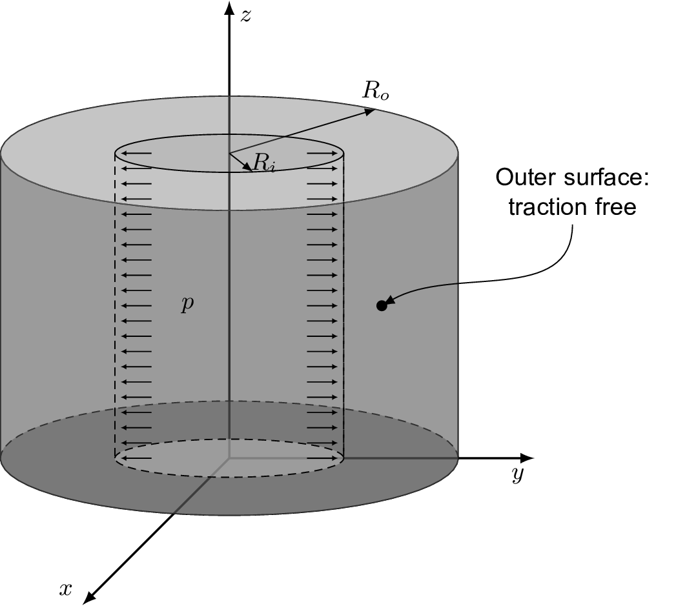
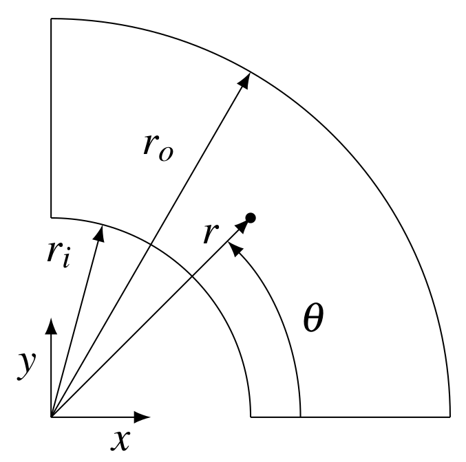
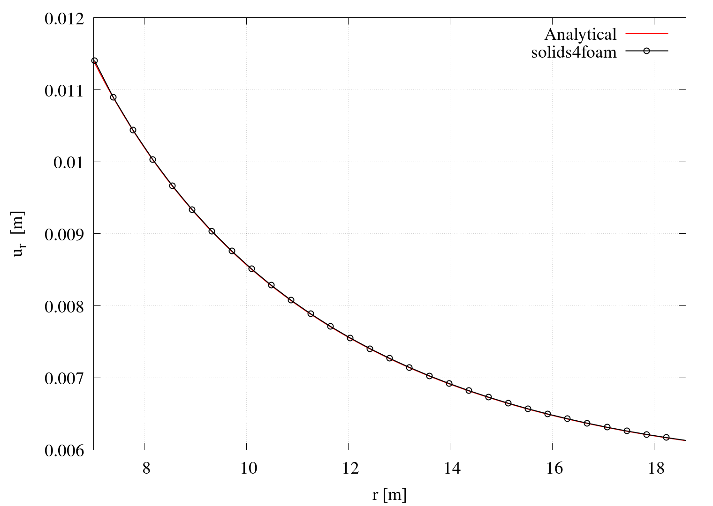
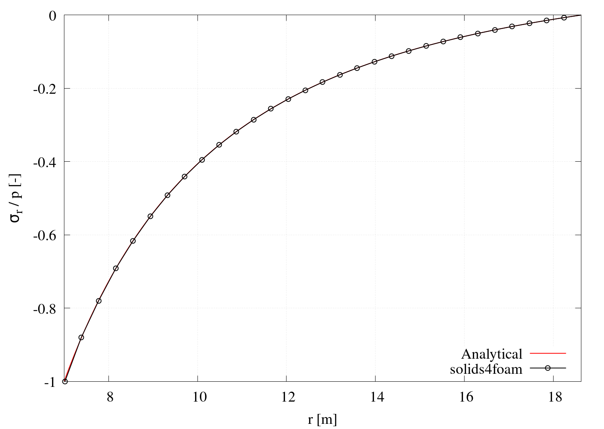
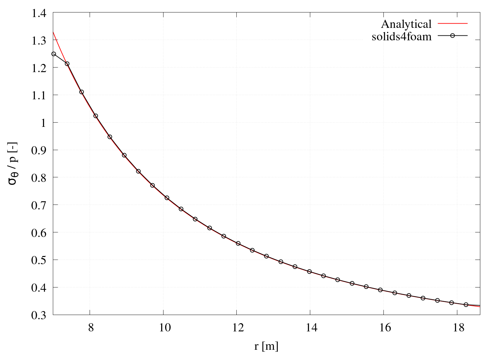
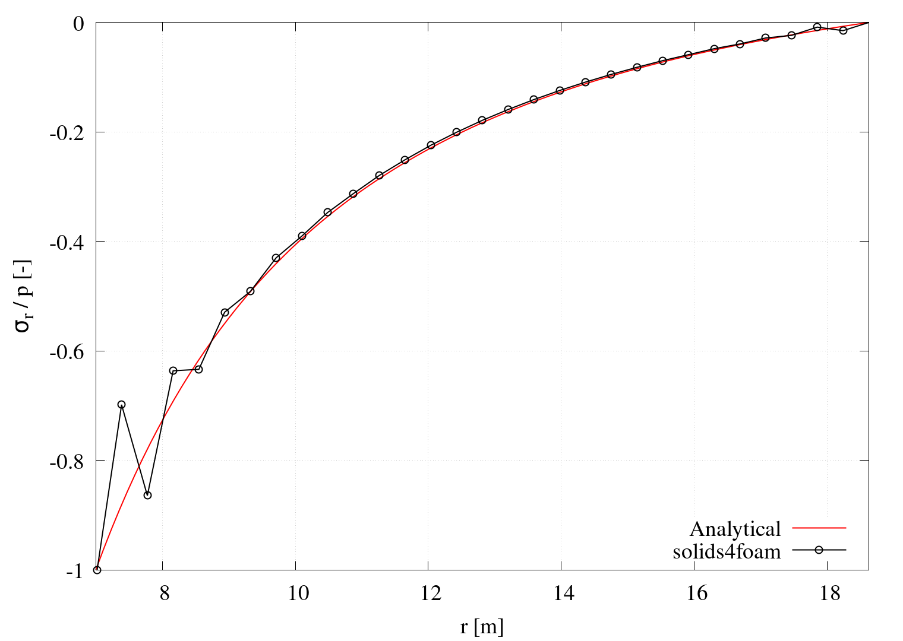
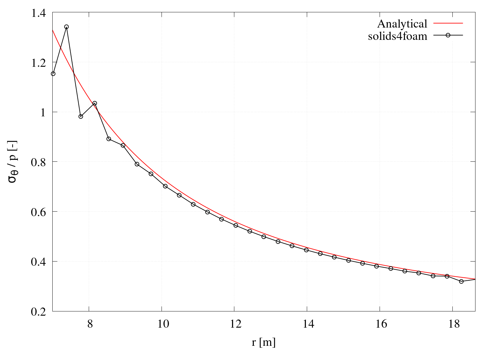

# Internally pressurised thick-walled cylinder: `pressurisedCylinder`

---

Prepared by Iago Lessa de Oliveira, Ivan Batistić and Philip Cardiff

---

## Tutorial Aims

- Demonstrate the solver accuracy for a compressible linear elastic test case;
- Examine the solver performance when approaching the incompressibility limit.

---

## Case Overview

In this case, a homogeneous thick-wall cylindrical pressure vessel with an inner radius $$r_i = 7$$ m, outer radius $$R_o = 18.625$$ m, and loaded internally with pressure $$p = 100$$ MPa is analysed. The material is considered linear elastic with Young modulus $$E=10$$ GPa and Poisson's ratio $$\nu=0.3$$. The problem is considered plane stress, with the 2-D computational domain comprising a quarter of the cylinder geometry. The cylinder is discretised with $$900$$ cells: $$30$$ cells in the radial and $$30$$ in the circumferential direction. Gravitational and inertial effects are neglected, and the case is solved using one loading increment.

<div style="text-align: center;">
  
  
    <figcaption>
     <strong>Figure 1: Problem geometry</strong>
    </figcaption>
</div>


---

## Results

The analytical solution for the stress field is [1]:  
$$
\sigma_r = p \dfrac{r_i^2}{r_o^2-r_i^2}\left(1-\dfrac{r_o^2}{r^2}\right),
$$

$$
\sigma_{\theta} = p \dfrac{r_i^2}{r_o^2-r_i^2}\left(1+\dfrac{r_o^2}{r^2}\right),
$$

$$
\sigma_{z} = 0,
$$

and for radial displacement:
$$
u_r = \dfrac{p}{E}\dfrac{r_i^2}{r_o^2-r_i^2}\left[(1-\nu)r+(1+\nu)\dfrac{r_o^2}{r}\right].
$$

Results presented in Figures 2 and 3 show numerical and analytical calculations of radial displacement $$u_r$$, circumferential $$\sigma_{\theta}$$ and radial $$\sigma_r$$ stress, showing good agreement. The plotting script `plot.gnuplot` automatically generates these diagrams when running the `Allrun` script; however, note that geometry and material properties are hardcoded in the `plot.gnuplot`  script:

```bash
Ri = 7        # Inner cylinder radius
Ro = 18.625   # Outer cylinder radius
E = 1e10      # Young modulus
p = 10e6      # Internal pressure
nu = 0.3      # Poissons ratio
```

<div style="text-align: center;">
  
    <figcaption>
     <strong>Figure 2: Distribution of the radial displacement across cylinder thickness</strong>
    </figcaption>
</div>

<div style="text-align: center;">
  
  
    <figcaption>
     <strong>Figure 3: Distribution of the circumferential and radial stress across cylinder thickness</strong>
    </figcaption>
</div>

### Approaching the Incompressibility Limit

Formulating the governing momentum balance with the displacement variable as the only dependent variable has limitations in modelling incompressible materials. Specifically, the formulation exhibits efficiency degradation and volumetric locking while approaching Poisson’s ratio of $$0.5$$. An appropriate formulation for these problems is a pressure-displacement (mixed) formulation, in which the constitutive relation is defined via two unknowns (displacement and pressure). 

From Figures 4 and 5, one can see what happens with the resulting stress field when the displacement-based formulation is used to model nearly incompressible material ($$\nu=0.495$$). As expected, the stress distribution exhibits oscillatory behaviour. 

Note that for the analysed case, stresses are not a function of material properties (Young’s modulus and Poisson’s ratio) because of the plane stress condition ($$\sigma_{zz}=0$$). Accordingly, the case is solved with a plane strain assumption ($$\varepsilon_{zz}=0$$) to generate these plots.

<div style="text-align: center;">
  
  
    <figcaption>
     <strong>Figure 3: Distribution of the circumferential and radial stress across cylinder thickness</strong>
    </figcaption>
</div>

---

## Running the Case

The tutorial case is located at `solids4foam/tutorials/solids/linearElasticity/pressurisedCylinder`. The case can be run using the included `Allrun` script, i.e. `> ./Allrun`.  In this case, the `Allrun` consists of creating the mesh using `blockMesh` (`> ./blockMesh`) followed by running the `solids4foam` solver (`> ./solids4Foam`) and `> ./sample` utility. Optionally, if `gnuplot` is installed, the radial and circumferential stress distribution together with the profile of radial displacement are plotted in the `sigmaR.png`, `sigmaTheta.png` and `dispR.png` files.

```note
The same case is solved with Mooney-Rivlin hyperelastic material and can be found in the `solids/hyperelasticity/cylindricalPressureVessel`. The hyperelastic case was initially proposed by Bijelonja et al. [2,3].
```


---

### References 

[1] [J. G. S.P. Timoshenko, Theory of Elasticity. McGraw-Hill, New York, 1970.]()

[2] [I. Bijelonja, I. Demirdžić, and S. Muzaferija, “A finite volume method for incompressible linear elasticity,” Computer methods in applied mechanics and engineering, vol. 195, no. 44-47, pp. 6378–6390, 2006.](https://www.sciencedirect.com/science/article/abs/pii/S0045782506000387)

[3] [Bijelonja, I., I. Demirdžić, and S. Muzaferija. "A finite volume method for large strain analysis of incompressible hyperelastic materials." *International journal for numerical methods in engineering* 64.12 (2005): 1594-1609.](https://www.researchgate.net/publication/230308043_A_finite_volume_method_for_large_strain_analysis_of_incompressible_hyperelastic_materials)

