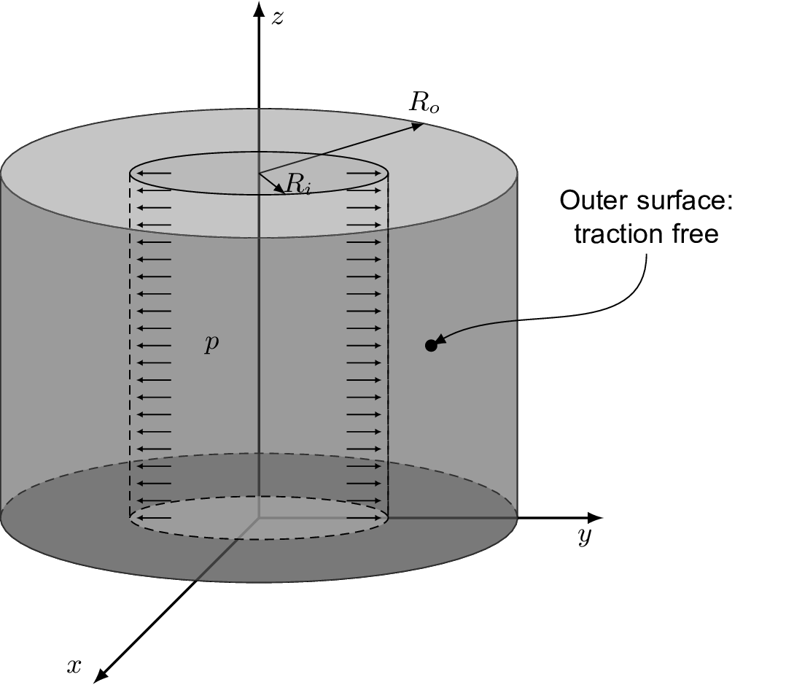
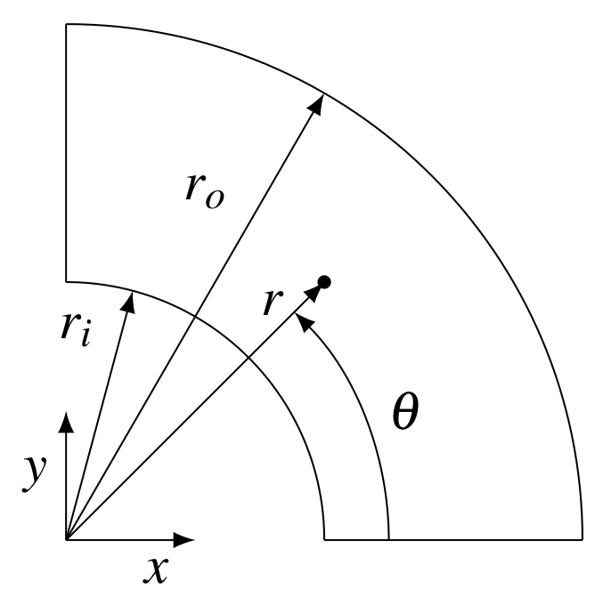
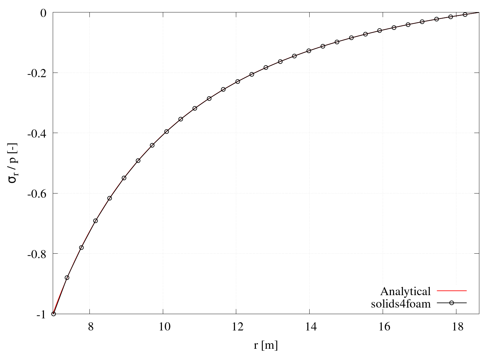
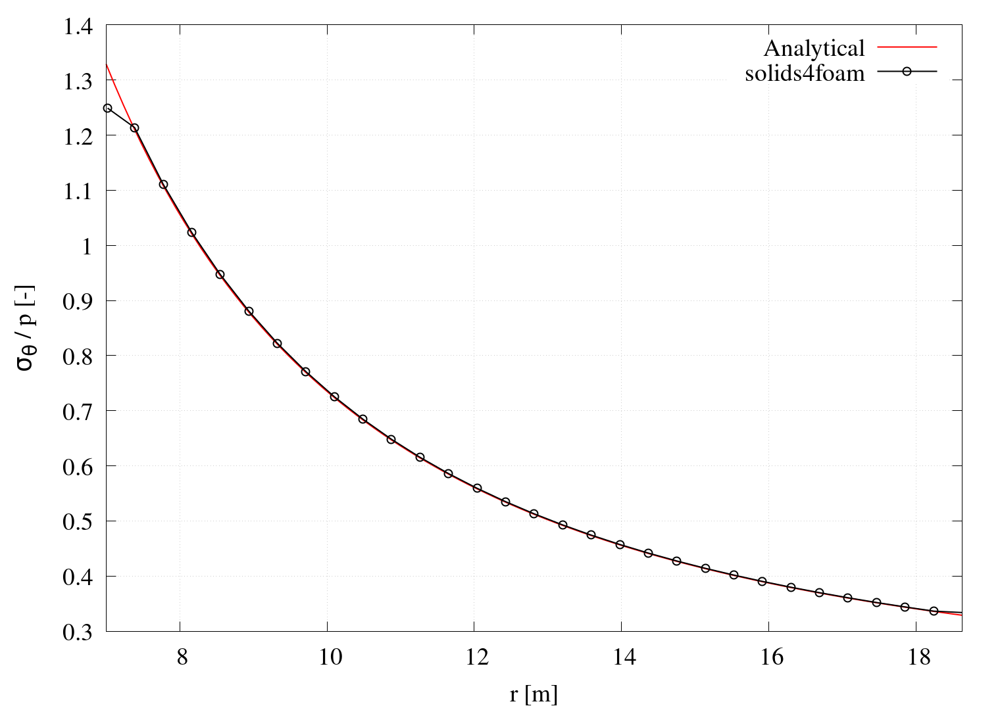
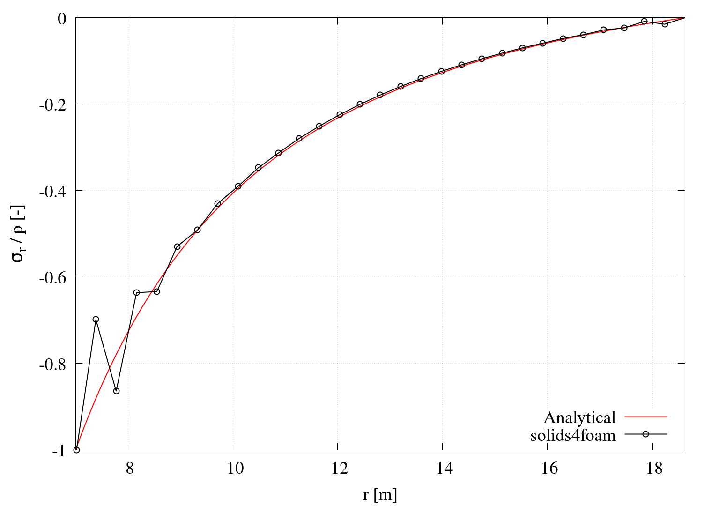
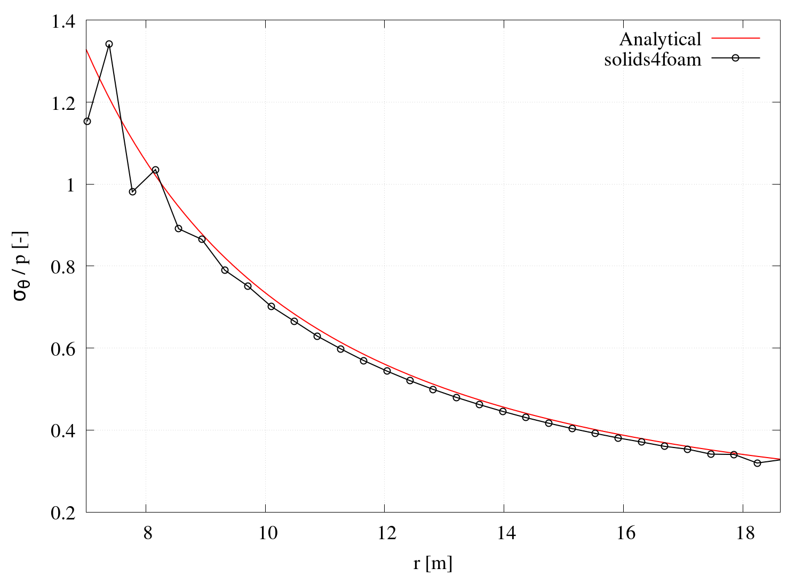

# Internally pressurised thick-walled cylinder: `pressurisedCylinder`

---

Prepared by Iago Lessa de Oliveira, Ivan Batistić and Philip Cardiff

---

## Tutorial Aims

- Demonstrate the solver accuracy for a compressible linear elastic test case;
- Examine the solver performance when approaching the incompressibility limit.
- Demonstrate how to set up a high-order cell-centred discretisation.

---

## Case Overview

In this case, a homogeneous thick-wall cylindrical pressure vessel with an inner
radius $$r_i = 7$$ m, outer radius $$R_o = 18.625$$ m, and loaded internally
with pressure $$p = 100$$ MPa is analysed. The material is considered linear
elastic with Young modulus $$E=10$$ GPa and Poisson's ratio $$\nu=0.3$$. The
problem is considered plane stress, with the 2-D computational domain comprising
a quarter of the cylinder geometry. The cylinder is discretised with $$900$$
cells: $$30$$ cells in the radial and $$30$$ in the circumferential direction.
Gravitational and inertial effects are neglected, and the case is solved using
one loading increment.




Figure 1 - Problem geometry

---

## Results

The analytical solution for the stress field is [1]:

$$
\sigma_r = p \dfrac{r_i^2}{r_o^2-r_i^2}\left(1-\dfrac{r_o^2}{r^2}\right),
$$

$$
\sigma_{\theta} = p \dfrac{r_i^2}{r_o^2-r_i^2}\left(1+\dfrac{r_o^2}{r^2}\right),
$$

$$
\sigma_{z} = 0,
$$

and for radial displacement:

$$
u_r =
\dfrac{p}{E}\dfrac{r_i^2}{r_o^2-r_i^2}
\left[(1-\nu)r+(1+\nu)\dfrac{r_o^2}{r}\right].
$$

The `pressurisedCylinderAnalyticalSolution` function object in
`system/controlDict` is used to generate analytical cylindrical displacement and
stress fields and compute the corresponding difference fields:
`cylAnalyticalD`, `cylAnalyticalCellStress`, `cylDDifference`, and
`cylCellStressDifference`.

```c++
functions
{
    pressurisedCylinderAnalytical
    {
       type    pressurisedCylinderAnalyticalSolution;

       // Inside radius
       Ri      7;
       // Outside radius
       Ro      18.625;
       // Internal pressure
       p       10e6;
       // Young modulus
       E       1e10;
       // Poisson's ratio
       nu      0.3;

       cellDisplacement yes;
       pointDisplacement no;
       cellStress yes;
       pointStress no;
    }
}
```

Results presented in Figures 2 and 3 show numerical and analytical calculations
of radial displacement $$u_r$$, circumferential $$\sigma_{\theta}$$ and radial
$$\sigma_r$$ stress, showing good agreement. The plotting script `plot.gnuplot`
automatically generates these diagrams when running the `Allrun` script;
however, note that geometry and material properties are hardcoded in the
`plot.gnuplot` script:

```bash
Ri = 7        # Inner cylinder radius
Ro = 18.625   # Outer cylinder radius
E = 1e10      # Young modulus
p = 10e6      # Internal pressure
nu = 0.3      # Poissons ratio
```


Figure 2: Distribution of the radial displacement across cylinder thickness




Figure 3 - Distribution of the circumferential and radial stress across cylinder
thickness

### Approaching the Incompressibility Limit

Formulating the governing momentum balance with the displacement variable as the
only dependent variable has limitations in modelling incompressible materials.
Specifically, the formulation exhibits efficiency degradation and volumetric
locking while approaching Poisson’s ratio of $$0.5$$. An appropriate formulation
for these problems is a pressure-displacement (mixed) formulation, in which the
constitutive relation is defined via two unknowns (displacement and pressure).

From Figures 4 and 5, one can see what happens with the resulting stress field
when the displacement-based formulation is used to model nearly incompressible
material ($$\nu=0.495$$). As expected, the stress distribution exhibits
oscillatory behaviour.

Note that for the analysed case, stresses are not a function of material
properties (Young’s modulus and Poisson’s ratio) because of the plane stress
condition ($$\sigma_{zz}=0$$). Accordingly, the case is solved with a plane
strain assumption ($$\varepsilon_{zz}=0$$) to generate these plots.




Figure 3 - Distribution of the circumferential and radial stress across cylinder
thickness

---

## Running the Case

The tutorial case is located at
`solids4foam/tutorials/solids/linearElasticity/pressurisedCylinder`. The case
can be run using the included `Allrun` script. The `Allrun` script optionally
takes an argument which specifies the solution approach:

```bash
./Allrun             # Defaults to the segregated approach
./Allrun segregated  # Segregated second-order approach
./Allrun petscSnes   # PETSc SNES second-order approach [4]
./Allrun highOrder   # PETSc SNES high-order approach [5]
```

The `Allrun` script starts by updating the files in the case to match the
selected approach; the following files are updated:
`constant/solidProperties`, `system/fvSchemes`, and `system/fvSolution`.
Subsequently, the mesh is created with `blockMesh`, followed by running the
solver `solids4Foam` and sampling the stress along the specified lines.

Optionally, if `gnuplot` is installed, the radial and circumferential stress
distribution together with the profile of radial displacement are plotted in the
`sigmaR.png`, `sigmaTheta.png` and `dispR.png` files.

```note
The same case is solved with Mooney-Rivlin hyperelastic material and can be
found in the `solids/hyperelasticity/cylindricalPressureVessel`. The
hyperelastic case was initially proposed by Bijelonja et al. [2,3].
```

---

### References

[1]
J. G. S.P. Timoshenko, Theory of Elasticity. McGraw-Hill, New York, 1970.

[2]
[I. Bijelonja, I. Demirdžić, and S. Muzaferija, “A finite volume method for
incompressible linear elasticity,” Computer methods in applied mechanics and
engineering, vol. 195, no. 44-47, pp. 6378–6390,
2006.](https://www.sciencedirect.com/science/article/abs/pii/S0045782506000387)

[3]
[Bijelonja, I., I. Demirdžić, and S. Muzaferija. "A finite volume method for
large strain analysis of incompressible hyperelastic materials." _International
journal for numerical methods in engineering_ 64.12 (2005):1594-1609.](https://www.researchgate.net/publication/230308043_A_finite_volume_method_for_large_strain_analysis_of_incompressible_hyperelastic_materials)

[4] [P. Cardiff, D. Armfield, Ž. Tuković, I. Batistić, A Jacobian-free Newton–Krylov
 method for cell-centred finite volume solid mechanics. _International Journal for
 Numerical Methods in Engineering_, 127, e70268, 2026,
 10.1002/nme.70268.](https://doi.org/10.1002/nme.70268)

[5] [IBatistić, Ivan, Pablo Castrillo, and Philip Cardiff. High-order cell-centred
finite-volume solid mechanics using a Jacobian-free Newton-Krylov method,
Journal of computational physics, (2026): 115056](https://doi.org/10.1016/j.jcp.2026.115056)
