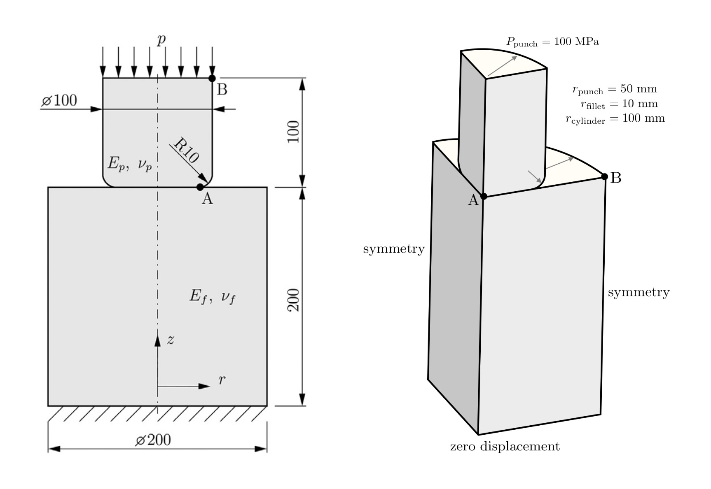
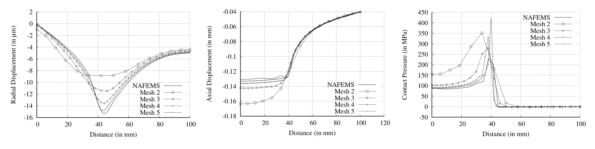

# Cylindrical punch with rounded edge: `punch`

---

Prepared by Philip Cardiff & Ivan Batistić

---

## Tutorial Aims

- Examine the solver performance when solving contact problems in small deformation settings;
- Demonstrate the process of meshing multiple bodies using the `cartesianMesh`;

---

## Case Overview

In this example, a cylindrical punch is pressed into an elastic cylindrical foundation (see figure below). This case is proposed as a contact mechanics benchmark by the National Agency for Finite Element Methods and Standards (NAFEMS) [[1]](https://www.nafems.org/publications/resource_center/r0094/). The material properties of the punch are similar to steel ($$E_p = 210$$ GPa, $$\nu_p = 0.3$$), whereas the foundation has aluminium Young’s modulus ($$E_f = 70$$ GPa, $$\nu_f = 0.3$$).  The punch is loaded with a uniform pressure distribution at its top surface $$p = 100$$ MPa. The bottom surface of the elastic foundation is fixed. Friction is considered, and the coefficient of friction is set to $$\mu=0.1$$. The problem is solved with one load increment, neglecting inertia and gravity effects. The case can be solved using an axisymmetric computational model; however, the setup herein considers a 3-D model with symmetries.

<div style="text-align: center;">
  
    <figcaption>
     <strong>Figure 1: Problem geometry [2, 3]</strong>
    </figcaption>
</div>

---

## Expected Results

The resulting displacement and stress fields are expected to be axisymmetric. At the end of the contact surface, a stress peak can be expected due to the singular pressure distribution. More precisely, the cylinder fillet radius is too small to avoid having a geometric discontinuity causing a singular pressure distribution. This means that peak contact pressure rises at this location with increasing mesh density; however, note that displacement fields converge. 

The figures below show the convergence of axial displacement, radial displacement, and contact pressure for different mesh densities [[2]](https://arxiv.org/abs/1808.10736). Overall, the `solids4foam` results match well with the results reported with finite element codes [[1]](https://www.nafems.org/publications/resource_center/r0094/).

<div style="text-align: center;">
  
    <figcaption>
     <strong>Figure 2: Radial and axial displacement predictions; contact pressure distribution [2]</strong>
    </figcaption>
</div>

---

## Running the Case

The tutorial case is located at `solids4foam/tutorials/solids/linearElasticity/punch`. The case can be run using the included `Allrun` script, i.e. `> ./Allrun`.  In this case, the `Allrun` script consists of the following steps: 

- Creating the punch mesh: 
  ```bash
  cp system/punch_top/meshDict system/meshDict
  solids4Foam::runApplication -s punch_top cartesianMesh
  mkdir constant/punch_top
  mv constant/polyMesh constant/punch_top/
  ```

- Creating the bottom mesh:
  ```bash
  cp system/punch_bottom/meshDict system/meshDict
  solids4Foam::runApplication -s punch_bottom cartesianMesh
  ```

- Merging two meshes ( all of this is done because `cfMesh` can not make mesh for separate bodies at once):
  ```bash
  solids4Foam::runApplication mergeMeshes . . -addRegion punch_top -noFunctionObjects
  ```

- Scaling mesh:
  ```bash
  transformPoints -scale "(0.001 0.001 0.001)" >& log.transformPoints
  ```

- Creating patches automatically and naming them:
  ```bash
  solids4Foam::runApplication autoPatch 45 -overwrite
  solids4Foam::runApplication createPatch -overwrite
  solids4Foam::runApplication splitPatch -overwrite
  ```

- Creating cell zones for the punch and foundation so different material properties can be assigned:
  ```bash
  solids4Foam::runApplication setSet -batch batch.setSet
  solids4Foam::runApplication setsToZones
  ```

- Running the case:

  ```bash
  solids4Foam::runApplication solids4Foam
  ```

---

### References 

[1] [A. Konter, FENet (Project), and National Agency for Finite Element Methods & Standards (Great Britain), Advanced Finite Element Contact Benchmarks. NAFEMS Limited, 2006.](https://www.nafems.org/publications/resource_center/r0094/)

[2] [P. Cardiff, A. Karač, P. De Jaeger, H. Jasak, J. Nagy, A. Ivanković, and Ž. Tuković, “An open-source finite volume toolbox for solid mechanics and
fluid-solid interaction simulations,” arXiv preprint arXiv:1808.10736, 2018.](https://arxiv.org/abs/1808.10736)

[4] [I. Batistić, P. Cardiff, and Ž. Tuković, “A finite volume penalty based segment-to-segment method for frictional contact problems,” Applied Mathematical Modelling, vol. 101, pp. 673–693, 2022.](https://www.sciencedirect.com/science/article/abs/pii/S0307904X21004248)
