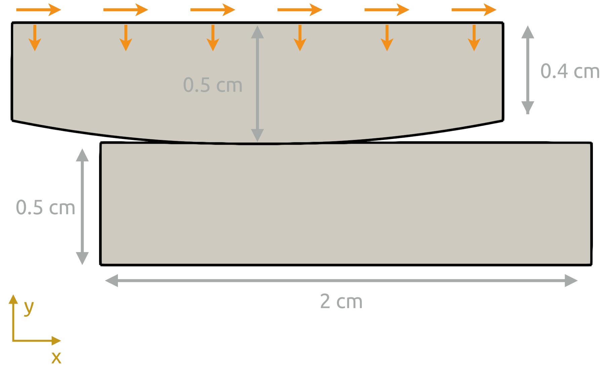

# Frictional sliding of an elastic cylinder segment: `slidingFrictionBall`

---

Prepared by Philip Cardiff and Ivan Batistić

---

## Tutorial Aims

- Demonstrate the analysis of a dynamic contact problem.

---

## Case Overview

This case consists of an elastic cylindrical segment (“ball”) that is pressed into the top of an elastic block  (see Figure 1). Cylindrical segment is slid in one direction, and then the sliding direction is reserved. Both bodies have the same material properties: density $$\rho=7854 $$ kg/m$$^3$$, Young modulus $$E=200$$ GPa and Poisson's radio $$\nu=0.3$$.  The bottom surface of the elastic block is fixed, whereas the top surface of the cylindrical segment has a prescribed displacement as follows:
$$
d_y = -0.1 \mathrm{~mm}, \qquad d_x = \begin{cases}2 t / 50 \mathrm{~cm}, & \text { if } t \leq 50 \mathrm{~s} \\ 2(100-t) / 50 \mathrm{~cm}, & \text { if } 50<t \leq 100 \mathrm{~s}\end{cases}
$$
The case is solved using a 2D model under the plane strain assumption and without gravitational effects. Time is discretised using 100 equally spaced increments. At the contact interface, the frictional response is considered and the Coulomb coefficient of friction is set to 0.1.

<div style="text-align: center;">
  
    <figcaption>
     <strong>Figure 1: Problem geometry [1]</strong>
    </figcaption>
</div>


---

## Expected Results

The evolution of the $$\sigma_{xy}$$ and $$\sigma_{eq}$$ fields is shown in Video 1. The same is shown in Figure 2 for the time $$t=30$$ and $$t=60$$ s.

<div style="text-align: center;">
  
    <figcaption>
     <strong>Figure 2: Sigma XY and sigma equivalent stress fields at 30 s and 60 s.</strong>
    </figcaption>
</div>




**Video 1: Evolution of the $$\sigma_{xy}$$ and $$\sigma_{eq}$$ fields during sliding**

---

## Running the Case

The tutorial case is located at `solids4foam/tutorials/solids/linearElasticity/slidingFrictionBall`. The case can be run using the included `Allrun` script, i.e. `> ./Allrun`.  In this case, the Allrun consists of creating the mesh using `blockMesh` (`> blockMesh`) followed by running the `solids4foam` solver (`> solids4Foam`). 

```warning
The case is currently not working with the ORG version of OpenFOAM!
```

---

### References

[1] [Philip Cardiff, solids4foam - Another solid mechanics tutorial frictional sliding, PhD Interdoctoral Course at Politecnico di Milano, Computational Fluid Dynamics with Open-Source Software,  2022.](https://www.researchgate.net/publication/358743700_2c_-_solids4foam_-_Another_solid_mechanics_tutorial_frictional_sliding_-_2022_-_Philip_Cardiff)
