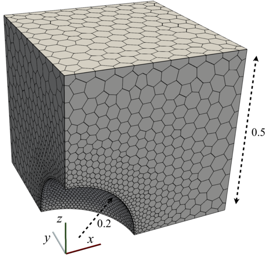
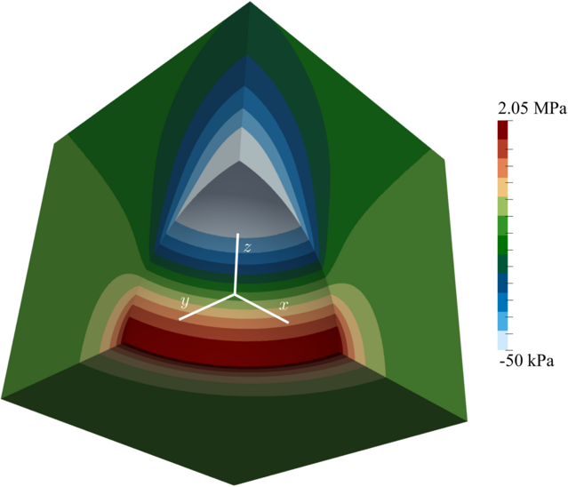

# Spherical cavity under uniaxial tensions: `sphericalCavity`

---

Prepared by Philip Cardiff and Ivan Batistić

---

## Tutorial Aims

- Demonstrate how to perform a 3D linear-static stress analysis in solids4foam;
- Demonstrate the process of meshing using Gmsh meshing utility and OpenFOAM `polyDualMesh` utility

---

## Case Overview

This classic 3-D problem consists of a spherical cavity with radius $a = 0.2$ m (Figure 1) in an infinite, isotropic linear elastic solid ($E = 200$ GPa, $\nu = 0.3$). Far from the cavity, the solid is subjected to a tensile stress $\sigma_{zz} = T = 1$ MPa, with all other stress components zero. The analytical expressions for the stress are derived by Southwell and Gough [1], while expression for displacement are derived by Goodier [2]. The problem is characterised by a localised stress concentration near the cavity on the plane perpendicular to the loading, which drops off rapidly away from the cavity. The computational solution domain is taken as one-eighth of a $1 \times 1 \times 1$ m cube aligned with the Cartesian axes, with one corner at the centre of the sphere. The problem is axisymmetric but is analysed here using a 3-D domain. The analytical tractions are applied at the far boundaries of the domain to mitigate the effects of finite geometry. They are defined with `analyticalSphericalCavityTraction` boundary conditions, which require geometry (cavity radius), loading (far-field traction), and material properties (Poisson's ratio):

```c++
    patch
    {
        type            analyticalSphericalCavityTraction;
        farFieldTractionZ 1e6;
        cavityRadius    0.2;
        nu              0.3;
        value           uniform (0 0 0);
    }
```



**Figure 1: Spherical cavity case geometry and mesh (4 555 cells).**

---

## Expected Results

The analytical expressions for the stress distributions around the cavity, first derived by Southwell and Gough [1]:

$$
\sigma_{rr} =
\frac{T}{14 - 10\nu} \frac{a^3}{R^3}
\left[ 9 - 15\nu - 12 \frac{a^2}{R^2}  - \frac{r^2}{R^2} \left( 72 - 15\nu - 105 \frac{a^2}{R^2} \right) + 15 \frac{r^4}{R^4} \left( 5 - 7 \frac{a^2}{R^2} \right) \right],
$$

$$
\sigma_{\theta\theta} =
\frac{T}{14 - 10\nu} \frac{a^3}{R^3}
\left[ 9 - 15\nu - 12 \frac{a^2}{R^2}  - 15 \frac{r^2}{R^2} \left( 1 - 2\nu - \frac{a^2}{R^2} \right) \right],
$$

$$
\sigma_{zz} =
T \left[ 1 - \frac{1}{14 - 10\nu} \frac{a^3}{R^3} \left\{ 38 - 10\nu - 24 \frac{a^2}{R^2}
- \frac{r^2}{R^2} \left( 117 - 15\nu - 120 \frac{a^2}{R^2} \right)
+ 15 \frac{r^4}{R^4} \left( 5 - 7 \frac{a^2}{R^2} \right) \right\} \right]
$$

$$
\sigma_{zr} =
\frac{T}{14 - 10\nu} \frac{a^3 z r}{R^5}
\left[ -3(19 - 5\nu) + 60 \frac{a^2}{R^2} + 15 \frac{r^2}{R^2} \left( 5 - 7 \frac{a^2}{R^2} \right)  \right].
$$

where $a$ is the hole radius, $T$ is the distant stress applied in the $z$ direction, $\nu$ is the Poisson's ratio, $r^2 = x^2 + y^2$ is the cylinderical radial coordinate, $R^2 = r^2 + z^2$ is the spherical radial coodinate, and $x$, $y$, $z$ are the Cartesian coordinates.

The displacement distributions were later derived by Goodier [2]:
$$
u_r = -\frac{A}{r^2} - \frac{3B}{r^4} + \left[ \frac{5-4\nu}{1-2\nu} \frac{C}{r^2}-9\frac{B}{r^4} \right]\cos (2\theta),
$$

$$
\\
u_{\theta} = - \left[ \frac{2C}{r^2} + 6\frac{B}{r^4}  \right]\sin(2\theta),
$$

where the constants $A$, $B$ and $C$ are defined as follows:
$$
\frac{A}{a^3} = -\frac{T}{8\mu}\frac{13-10\nu}{7-5\nu}, \qquad
\frac{B}{a^5} = -\frac{T}{8\mu}\frac{1}{7-5\nu}, \qquad
\frac{C}{a^3} = -\frac{T}{8\mu}\frac{5(1-2\nu)}{7-5\nu}.
$$
and $\mu$ is the shear modulus.  

The analytical solution is generated alongside solution fields using the function object `sphericalCavityAnalyticalSolution` located in the `system/controlDict`, where one needs to input geometry, laoding and material data:

```plaintext
functions
{
    cavityAnalytical
    {
        type sphericalCavityAnalyticalSolution;
        farFieldTractionZ 1e6;
        cavityRadius 0.2;
        E 200e9;
        nu 0.3;
        cellDisplacement yes;
        pointDisplacement no;
        cellStress yes;
        pointStress no;
    }
}

```

The distribution of $zz$-component of stress field (`sigma[ZZ]`) is shown in Figure 2.



**Figure 2:  $\sigma_{zz}$ stress distribution.**

---

## Running the Case

The tutorial case is located at `solids4foam/tutorials/solids/linearElasticity/sphericalCavity`. The case can be run using the included `Allrun` script, i.e. `./Allrun`. In this case, the Allrun consists of creating the unstructured tetrahedral mesh using the Gmsh meshing utility, followed by conversion to their dual polyhedral representations using the OpenFOAM polyDualMesh utility:

```bash
   # Create mesh with gmsh
    solids4Foam::runApplication gmsh -3 -format msh2 sphericalCavity.geo
    solids4Foam::runApplication gmshToFoam sphericalCavity.msh
    solids4Foam::runApplication polyDualMesh 30 -overwrite
    solids4Foam::runApplication combinePatchFaces 45 -overwrite
    solids4Foam::runApplication changeDictionary
```

```warning
The case is currently not set for the ORG and EXTEND versions of OpenFOAM!
```

---

## References

[1] [Southwell, R.V., Gough, H.J.: Vi. On the concentration of stress in the neighbourhood of a small spherical flaw; and on the propagation of fatigue fractures in “statistically isotropic” materials. The London, Edinburgh, and Dublin Philosophical Magazine and Journal of Science 1(1), 71–97 (1926)](https://www.tandfonline.com/doi/abs/10.1080/14786442608633614)

[2] [Goodier, J.N.: Concentration of stress around spherical and cylindrical inclusions and flaws. Journal of Applied Mechanics 1(2), 39–44 (1933)](https://asmedigitalcollection.asme.org/appliedmechanics/article-abstract/1/2/39/1112122/Concentration-of-Stress-Around-Spherical-and?redirectedFrom=fulltext)
