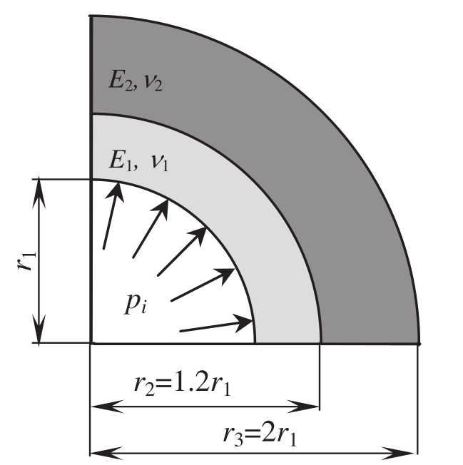
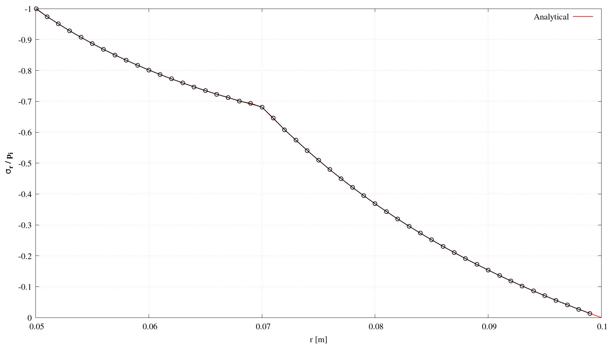
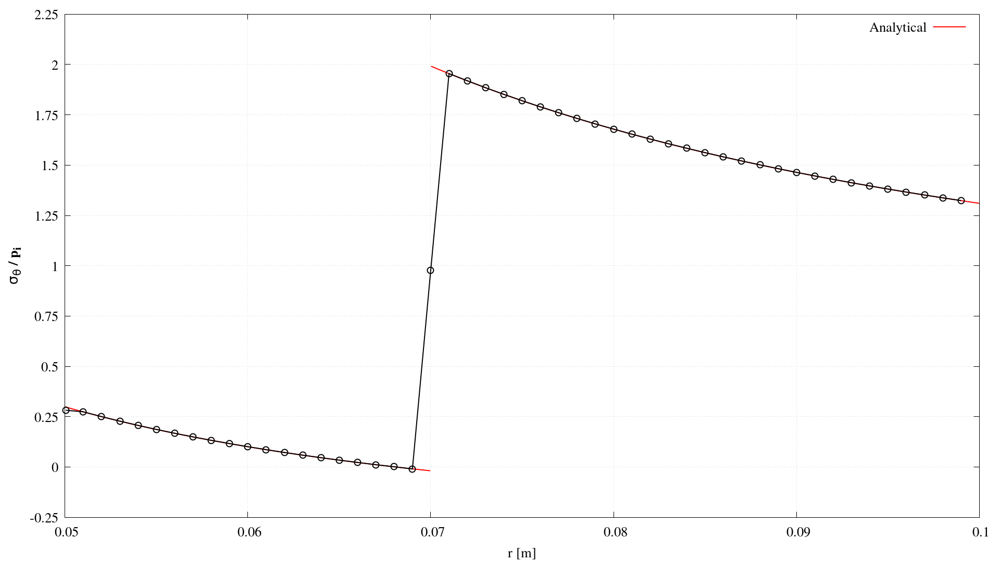

# Internally pressurised bi-material thick-walled cylinder: `layeredPipe`

---

Prepared by Željko Tukovic, Philip Cardiff and Ivan Batistić

---

## Tutorial Aims

- Demonstrate the solution of a multi-material solid mechanics problem;
- Compare the accuracy of a solid model against the available analytical solution.

---

## Case Overview

In this case, an internally pressurised bi-material thick-walled cylinder is analysed (Figure 1).  The problem is considered *plane stress*, with a quarter of the domain modelled because of symmetry.  The case is simulated as a steady state using one loading step. The outside surface is modelled as stress-free, and the left and bottom boundaries are symmetry planes. The inner bore surface has a prescribed constant pressure $$p_i=1\times 10^5$$ Pa. The inner material (region 1 in Figure 1) has a Poisson’s ratio of $$\nu_1=0.35$$ and a Young's modulus of $E_1 = 20$ GPa, while the outer material (region 2 in Figure 1) has a Poisson’s ratio of  $$\nu_2=0.3$$and a Young's modulus of $E_2 = 200$ GPa; this results in an order of magnitude difference between the Young's modulii, i.e.,  $$E_2/E_1=10$$. The number of cells is set to $$120$$ circumferentially and $$50$$ radially.

<div style="text-align: center;">
  
    <figcaption>
     <strong>Figure 1: Problem geometry [1]</strong>
    </figcaption>
</div>
---

## Expected Results

* Comparison between numerical and analytical solutions is performed in terms of circumferential
  and radial stresses in the radial direction through the cylinder, for which the analytical solutions are as follows [1]:

$$
\sigma_r = \frac{r_1^2p_i-r_2^2p_{12}+(p_{12}-p_i)\left(\dfrac{r_1r_2}{r}\right)^2}{r_2^2-r_1^2} \qquad \text{for } r_1 \leq r < r_2,
$$

$$
\sigma_r = \frac{r_2^2p_{12}-p_{12}\left(\dfrac{r_2r_3}{r}\right)^2}{r_3^2-r_2^2} \qquad \text{for } r_2 < r \leq r_3,
$$

$$
\sigma_{\theta} = \frac{r_1^2p_i-r_2^2p_{12}-(p_{12}-p_i)\left(\dfrac{r_1r_2}{r}\right)^2}{r_2^2-r_1^2} \qquad \text{for } r_1 \leq r < r_2,
$$

$$
\sigma_{\theta} = \frac{r_2^2p_{12}+p_{12}\left(\dfrac{r_2r_3}{r}\right)^2}{r_3^2-r_2^2} \qquad \text{for } r_2 < r \leq r_3,
$$

​	where the pressure at the interface, $p_{12}$ is given as follows:
$$
p_{12}=\dfrac{\dfrac{2r_1^2p_i}{E_1(r_2^2-r_1^2)}}{\dfrac{1}{E2}\left(\dfrac{r_3^2+r_2^2}{r_3^2-r_2^2}+\nu_2  \right) + \dfrac{1}{E1}\left(\dfrac{r_2^2+r_1^2}{r_2^2-r_1^2}-\nu_1  \right)}.
$$
Figures 2 and 3 show a comparison between the analytical and numerical solutions of radial $$\sigma_r$$ and circumferential $$\sigma_{\theta}$$ stress distributions. One can see that the numerical solution closely matches the analytical one.

<div style="text-align: center;">
  
    <figcaption>
     <strong>Figure 2: Comparison of numerical (circles) and analytical (line) radial stress distributions</strong>
    </figcaption>
</div>

<div style="text-align: center;">
  
    <figcaption>
     <strong>Figure 3: Comparison of numerical (circles) and analytical (line) circumferential stress distributions</strong>
    </figcaption>
</div>


The Figures above are created automatically within the `Allrun` script using `sample` utility and `gnuplot`. The `transformStressToCylindrical` function object in `system/controlDict` is used to transform the $$\sigma$$ stress tensor from Cartesian coordinates to the cylindrical:

```c++
functions
{
    transformStressToCylindrical
    {
        type        transformStressToCylindrical;

        origin      (0 0 0);
        axis        (0 0 1);
    }
}
```

The cylindrical stresses (`sigma:Transformed`) are plotted along a $$\theta=45^{\circ}$$ line using the `sample` utility:
```c++
fields( sigma:Transformed );

sets
(
    line
    {
        type       face;
        axis       distance;
        start (0.0 0.0 0.0005);
        end   (0.07 0.07 0.0005);
    }
);
```

---

## Running the Case

The tutorial case is located at `solids4foam/tutorials/solids/multiMaterial/layeredPipe`. The case can be run using the included `Allrun` script, i.e. `> ./Allrun`.  In this case, the `Allrun` creates the mesh using `blockMesh` (`> blockMesh`) followed by calls to the `setSet` and `setsToZones` utilities to create cell zones for inner and outer cylinder materials. After that, the case is run with `solids4foam` solver (`> solids4Foam`). As the last step, the `sample` utility is used to extract data. Optionally, if `gnuplot` is installed, the radial and circumferential stress distributions are plotted in the `sigmaR.png`  and `sigmaTheta.png`  files.

```note
For multi-material cases, solids4foam expects to find a cellZone for each material defined in constant/mechanicalProperties, where the cellZone name is assumed to be the same as the material name in constant/mechanicalProperties.
```


---

### References

[1] Ž. Tuković, A. Ivanković, and A. Karač, “Finite-volume stress analysis in multi-material linear elastic body,” International Journal for Numerical Methods in Engineering, vol. 93, no. 4, pp. 400–419, 2013.
