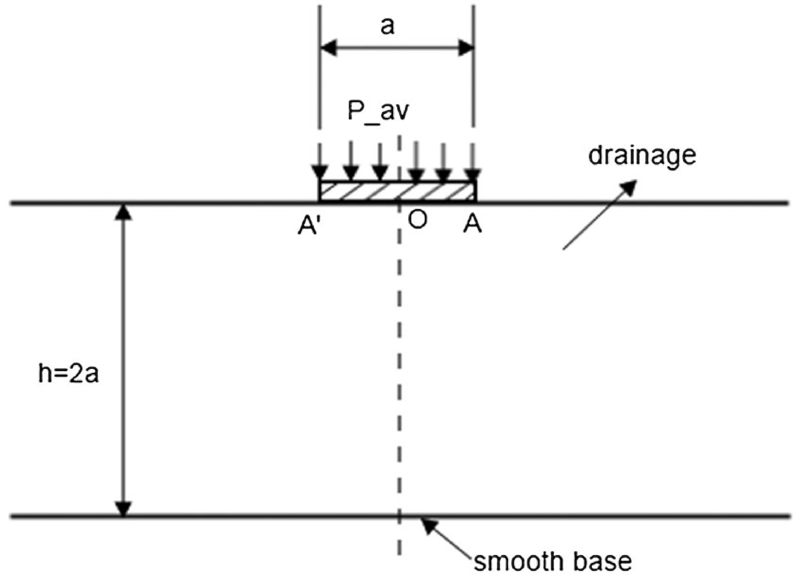
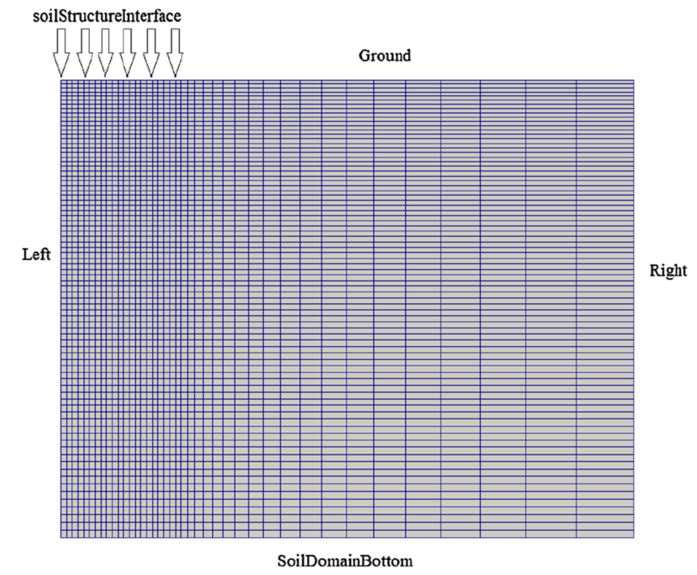
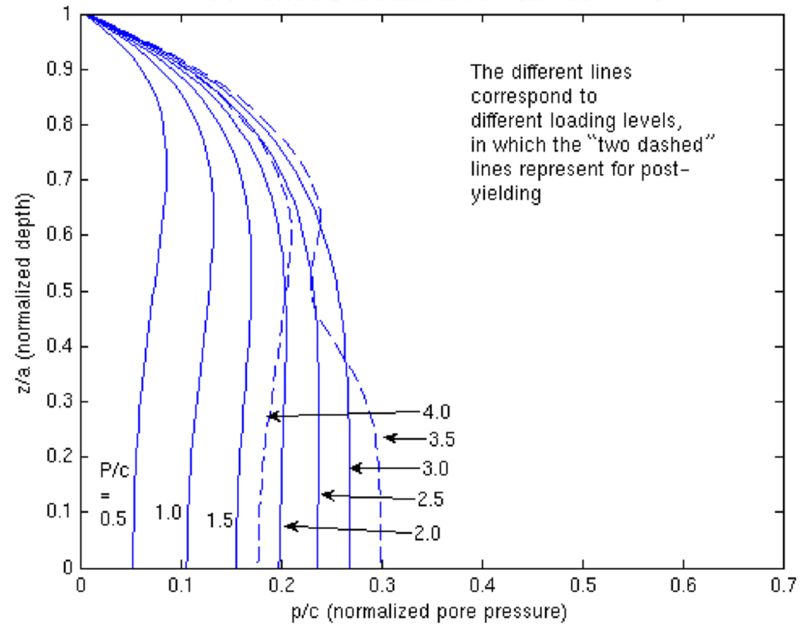
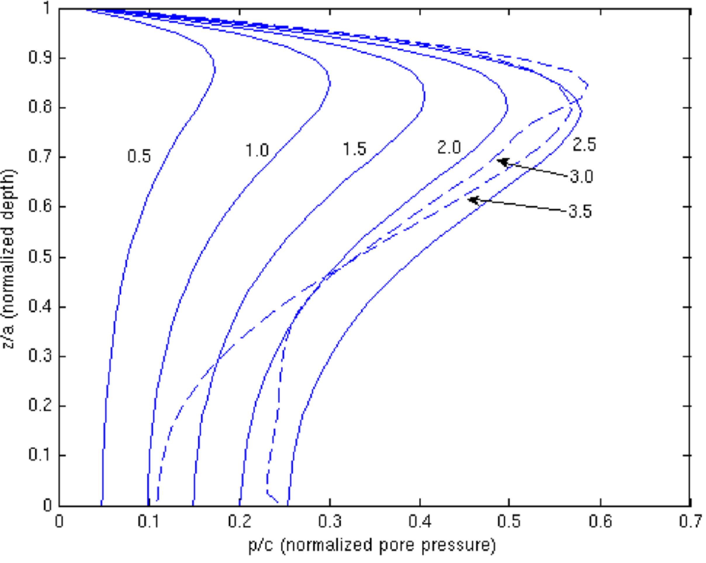

# Bearing capacity of strip footing: `stripFooting`

---

Prepared by Philip Cardiff and Ivan Batistić

---

## Tutorial Aims

- Demonstrate the poro-elasto-plasticity soil model.

---

## Case Overview

This case demonstrates elasto-plastic soil-pore-fluid coupling. Following Small
et al. [1], the validation case considers a smooth, perfectly flexible,
uniformly loaded, and permeable strip footing acting on a layer of soil resting
on a smooth rigid base. The problem also assumes that there is no horizontal
force on any vertical section. The original geometry is sketched in Figure 1,
and the soil and pore-fluid properties are given in Table 1. A plane strain
condition is considered and gravity is neglected.

**Figure 1 - Problem geometry [1,2]**

Table 1 - Soil and pore-fluid properties reported in [1,2]

| Parameter                | Symbol       | Value                    |
| ------------------------ | ------------ | ------------------------ |
| Young's modulus          | $$E$$        | $$2\cdot10^7$$ Pa        |
| Poisson's ratio          | $$\nu$$      | $$0.3$$                  |
| Hydraulic conductivity   | $$k$$        | $$0.001$$ m/s            |
| Porosity                 | $$n$$        | $$0.3$$                  |
| Water specific weight    | $$\gamma_w$$ | $$1\cdot10^4$$ N/m$$^3$$ |
| Water bulk modulus       | $$K_w$$      | $$2.1\cdot10^9$$ Pa      |
| Degree of saturation     | $$S_r$$      | $$0.99$$                 |
| Friction angle           | $$\phi$$     | $$30^\circ$$             |
| Dilation angle           | $$\Psi$$     | $$5^\circ$$              |
| Cohesion                 | $$c$$        | $$1\cdot10^5$$ Pa        |

The boundary conditions for the displacement field $$D$$ and pore-fluid
pressure field $$p$$ are listed in Table 2.

**Figure 2 - Mesh and boundary conditions [2]**

Table 2 - Boundary conditions for the displacement and pressure

| Boundary                 | $$D$$                        | $$p$$          |
| ------------------------ | ---------------------------- | -------------- |
| `soilStructureInterface` | `solidTraction`              | `fixedValue`   |
| `right`                  | `symmetry`                   | `symmetry`     |
| `left`                   | `solidTraction`              | `zeroGradient` |
| `ground`                 | `solidTraction`              | `fixedValue`   |
| `soilDomainBottom`       | `fixedDisplacementZeroShear` | `zeroGradient` |

The `soilStructureInterface` displacement condition applies the time-varying
load, the `solidTraction` conditions on `left` and `ground` are zero-traction
conditions, and the `fixedValue` pressure conditions use $$p=0$$.

Initially, there is no stress and no pore pressure in the domain. The load-rate
parameter $$\omega$$ is adopted from [1]:

$$
\omega = \frac{d(P/c)}{d(T_v)},
\qquad
T_v = \frac{c_vt}{a^2}.
$$

Here, $$P/c$$ is the external pressure normalized by the soil cohesion, $$T_v$$
is the dimensionless time, $$c_v$$ is the one-dimensional consolidation
coefficient, and $$a$$ is the strip-footing width.

> Note: some current case properties differ from the values reported in
> Table 1. In the dictionaries, the porosity is $$0.2$$, the water bulk modulus
> is $$2.0\cdot10^9$$ Pa, and the dilation angle is $$0^\circ$$. Note also
> that the current mesh uses a uniform cell size.

---

## Expected Results

In general, a smaller value of $$\omega$$ corresponds to a slower load rate.
Small et al. [1] suggested that $$\omega \leq 0.143$$ represents a drained
condition and $$\omega \geq 143$$ represents a fully undrained condition. The
intermediate values $$\omega = 1.43$$ and $$\omega = 14.3$$ represent slow and
fast load rates in partially drained conditions, respectively. Tang et al. [2]
provide a detailed comparison with Abaqus and the results from Small et al. [1].

Figures 3 and 4 show the pore-pressure distributions along the footing center
line at different load levels for the slow load rate $$\omega = 1.43$$ and the
fast load rate $$\omega = 14.3$$. The labels beside the curves indicate the
normalized load level $$P/c$$. At low load levels, the soil domain behaves
elastically. At higher load levels, the soil reaches failure. The simulations
show that excess pore pressure dissipates rapidly once plastic deformation
occurs and dilation develops. This demonstrates the solver's ability to capture
the interaction between pore-pressure development and nonlinear soil behaviour.

**Figure 3 - Pore-pressure distribution at slow load rate
$$\omega = 1.43$$ [2]**

**Figure 4 - Pore-pressure distribution at fast load rate
$$\omega = 14.3$$ [2]**

---

## Running the Case

The tutorial case is located at
`solids4foam/tutorials/solids/elastoplasticity/stripFooting`. The case can
be run using the included `Allrun` script, i.e. `> ./Allrun`.

The `Allrun` script first creates the mesh using `blockMesh`
and runs the `solids4Foam` solver.

---

## References

[1] [J. C. Small, J. R. Booker, and E. H. Davis, "Elasto-plastic
consolidation of soil," International Journal of Solids and Structures,
12(6):431-448, 1976.](https://doi.org/10.1016/0020-7683(76)90020-2)

[2] [T. Tang, O. Hededal, and P. Cardiff, "On finite volume method
implementation of poro-elasto-plasticity soil model," International Journal for
Numerical and Analytical Methods in Geomechanics, 39:1410-1430, 2015](https://doi.org/10.1002/nag.2361)
