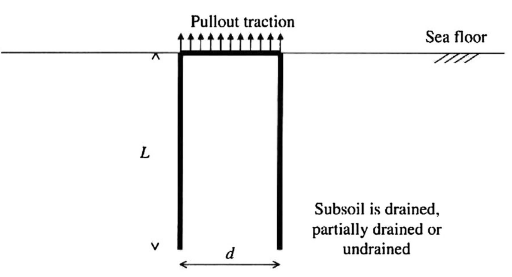
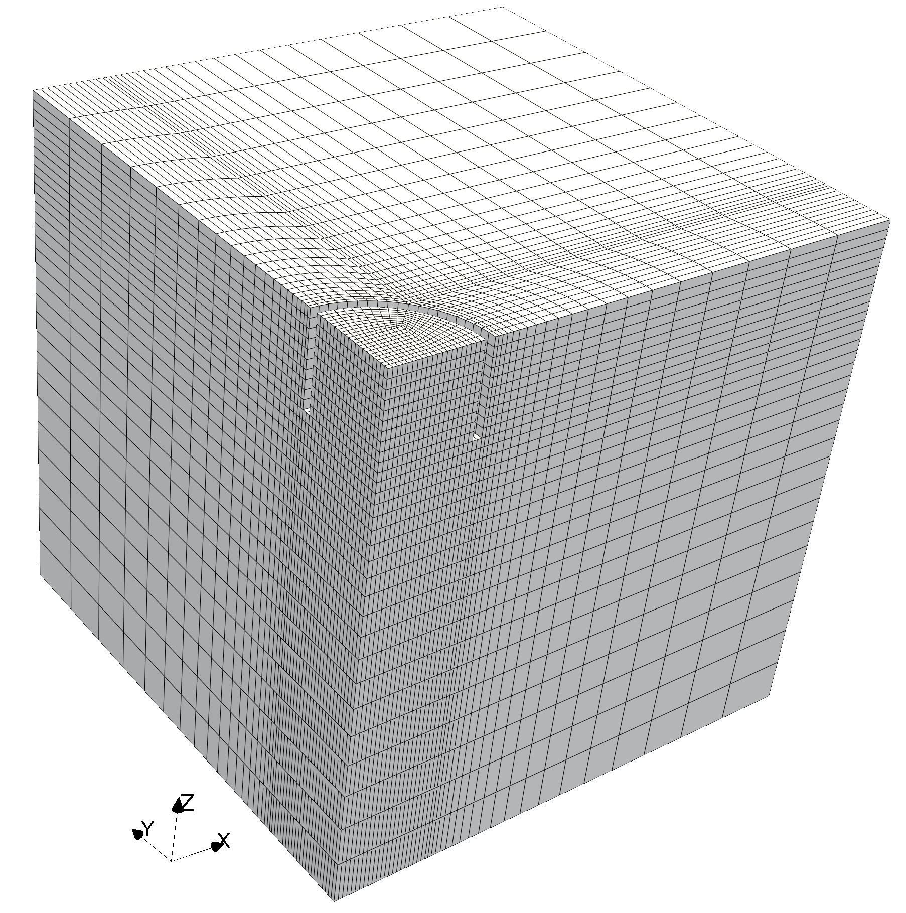
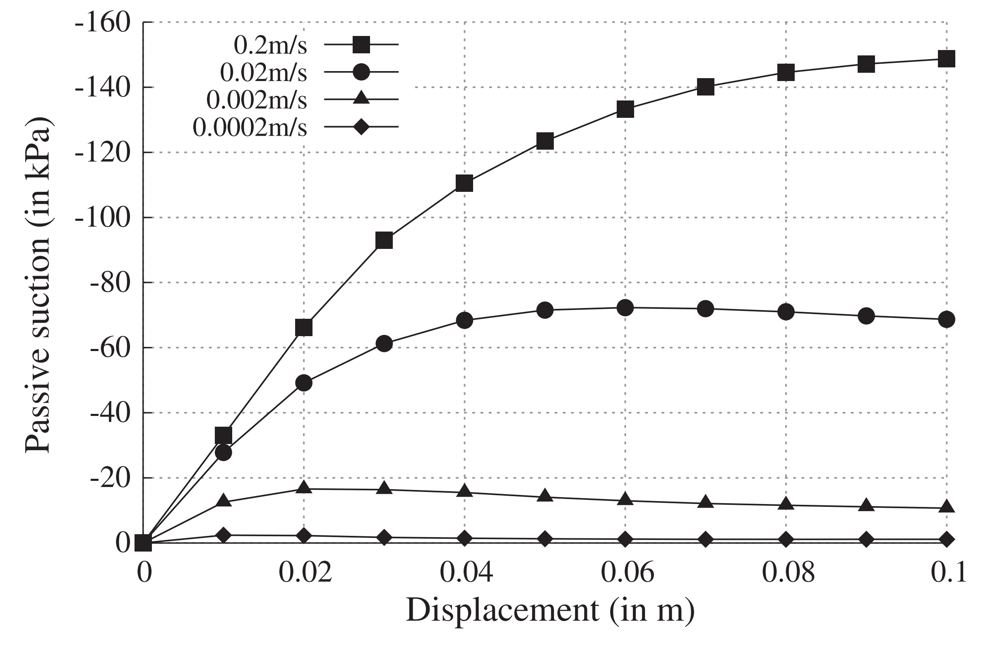

# Uplift capacity of suction caisson: `suctionCaission`

---

Prepared by Philip Cardiff and Ivan Batistić

---

## Tutorial Aims

- Demonstrate the poro-elasto-plasticity soil model.

---

## Case Overview

This case demonstrates vertical uplift of a suction caisson foundation, a common
problem in offshore geotechnical engineering. A suction caisson is open at the
bottom and closed at the top. It penetrates the seabed under its own weight and
by generating an internal under-pressure relative to the external water
pressure. The passive suction that develops inside the soil plug increases the
pullout capacity of the caisson.

Figure 1 shows a cylindrical suction caisson with overall diameter $$d$$ and
embedded length $$L$$. The caisson is subjected to an uplift displacement at the
top.



**Figure 1 - Suction caisson foundation under vertical uplift loading [1,2]**

Table 1 - Geometry, soil, pore-fluid, and loading properties reported in [1,2]

| Parameter             | Symbol       | Value                    |
| --------------------- | ------------ | ------------------------ |
| Embedment depth       | $$L$$        | $$1$$ m                  |
| Diameter              | $$d$$        | $$2$$ m                  |
| Young's modulus       | $$E$$        | $$2\cdot10^7$$ Pa        |
| Poisson's ratio       | $$\nu$$      | $$0.3$$                  |
| Hydraulic conductivity | $$k$$       | $$0.001$$ m/s            |
| Porosity              | $$n$$        | $$0.2$$                  |
| Water specific weight | $$\gamma_w$$ | $$1\cdot10^4$$ N/m$$^3$$ |
| Water bulk modulus    | $$K_w$$      | $$2.1\cdot10^9$$ Pa      |
| Degree of saturation  | $$S_r$$      | $$0.98$$                 |
| Friction angle        | $$\phi$$     | $$30^\circ$$             |
| Dilation angle        | $$\Psi$$     | $$0^\circ$$              |
| Cohesion              | $$c$$        | $$1\cdot10^5$$ Pa        |

The case uses `blockMesh` to discretize one quarter of the three-dimensional
domain, with symmetry conditions on the `left` and `front` patches, as shown in
Figure 2.

The reference pullout velocities range from $$2\cdot10^{-4}$$ to
$$2\cdot10^{-1}$$ m/s.

**Figure 2 - Computational mesh for one quarter of the geometry**

> Note: Tang et al. [2] also discuss an axisymmetric setup using a `wedge`
> boundary condition. The current tutorial uses a quarter-domain mesh with
> symmetry conditions.

The `soilStructureInterface` patch is prescribed an uplift displacement using
`constant/timeVsDisp`. In the current case, the displacement increases from
$$0$$ to $$0.2$$ m over $$5$$ s.

> Note: the current case uses a water bulk modulus of $$2.0\cdot10^9$$ Pa,
> slightly lower than the reference value in Table 1.

---

## Expected Results

The primary result is the pullout load-displacement response of the caisson.
Faster loading rates give larger pullout capacities, see Figure 3 [2].
This occurs because rapid uplift allows significant negative pore
pressure, or passive suction, to build up and persist inside the caisson.
For slower loading rates, the excess pore pressure has more time to dissipate,
so the pullout resistance is lower.



**Figure 3 - Comparison of passive suction under different loading rates [2]**

---

## Running the Case

The tutorial case is located at
`solids4foam/tutorials/solids/poroelasticity/suctionCaission`. The case can be
run using the included `Allrun` script:

```bash
./Allrun
```

The script creates the mesh using `blockMesh` and then runs the `solids4Foam`
solver.

---

## References

[1] [W. Deng and J. P. Carter, "A theoretical study of the vertical uplift
capacity of suction caissons," International Journal of Offshore and Polar
Engineering, 12(2):89-97, 2002](https://www.researchgate.net/profile/John-Carter-21/publication/262453485_A_Theoretical_Study_of_the_Vertical_Uplift_Capacity_of_Suction_Caissons/links/0deec53c665538a414000000/A-Theoretical-Study-of-the-Vertical-Uplift-Capacity-of-Suction-Caissons.pdf)

[2] [T. Tang, O. Hededal, and P. Cardiff, "On finite volume method
implementation of poro-elasto-plasticity soil model," International Journal for
Numerical and Analytical Methods in Geomechanics, 39:1410-1430, 2015](https://doi.org/10.1002/nag.2361)
