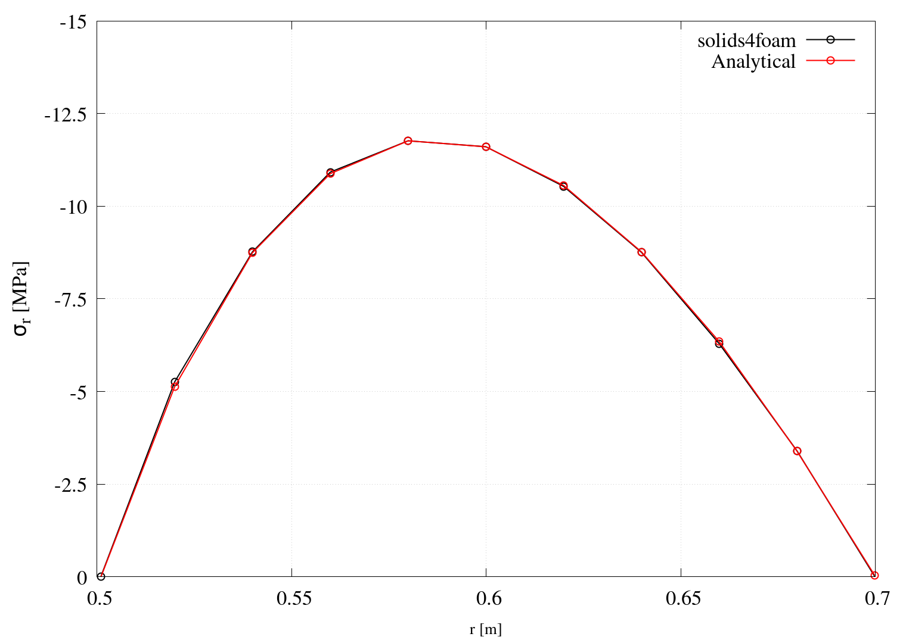
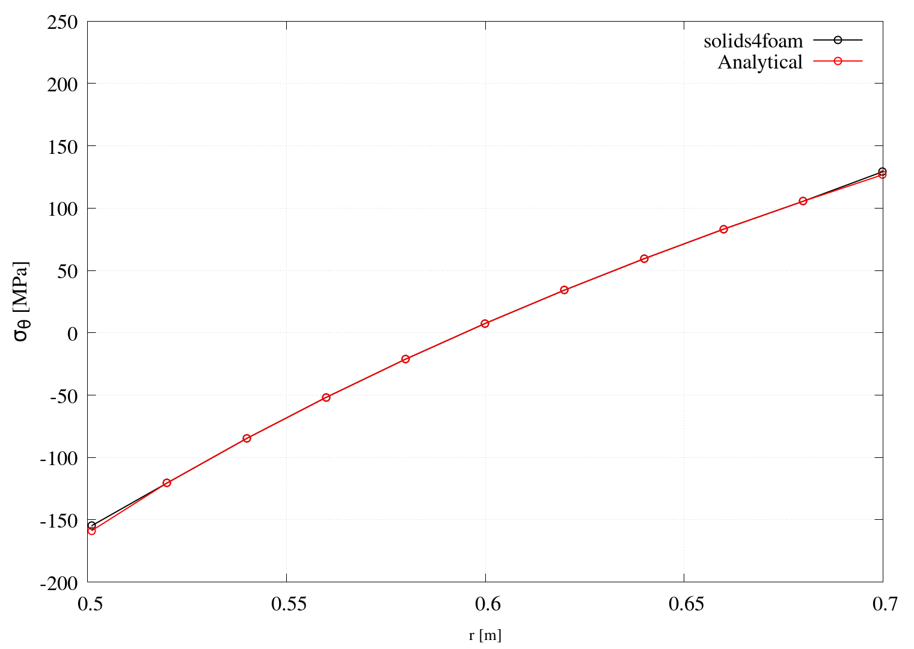
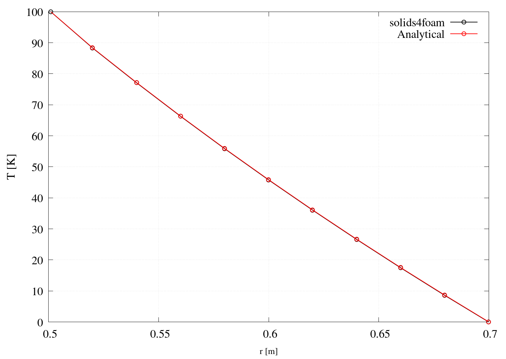

# Thermally loaded cylinder: `hotCylinder`

---

Prepared by Philip Cardiff and Ivan Batistić

---

## Tutorial Aims

- Demonstrate the solution of a thermo-elastic problem;
- Compare the solver accuracy for a thermo-elastic problem against the available analytical solution.

---

## Case Overview

This case considers a thick-walled cylinder subjected to a temperature difference between the inner ($$r_i=0.5$$ m) and outer ($$r_o=0.7$$ m) surfaces. The problem is considered plane strain, with a quarter of the domain modelled because of symmetry.  Gravity is neglected, and the case is simulated as a steady state using one loading step.  The outside and inner cylinder surfaces are modelled as stress-free. The inner cylinder surface has a prescribed temperature of $$T_i=100$$ K and the outer of $$T_o=0$$ K. The cylinder material has a Poisson’s ratio of $$\nu=0.3$$, a Young's modulus of $$E = 200$$ GPa and a coefficient of linear thermal expansion of $$\alpha = 1\times 10^{-5}$$ K$$^{-1}$$. The cylinder is discretised with $$10$$ cells in the radial direction and $$60$$ cells in the circumferential direction.

---

## Expected Results

Comparison between numerical and analytical solutions is performed in terms of circumferential and radial stresses in the radial direction through the cylinder, for which the analytical solutions are as follows [1]:
$$
\sigma_r = \dfrac{\alpha E (T_i-T_o)}{2(1-\nu)\ln\dfrac{r_o}{r_i}}\left[-\ln\dfrac{r_o}{r}-\dfrac{r_i^2}{r_o^2-r_i^2}\left(1-\dfrac{r_o^2}{r^2}\right) \ln\dfrac{r_o}{r_i}  \right],
$$

$$
\sigma_{\theta} = \dfrac{\alpha E (T_i-T_o)}{2(1-\nu)\ln\dfrac{r_o}{r_i}}\left[1-\ln\dfrac{r_o}{r}-\dfrac{r_i^2}{r_o^2-r_i^2}\left(1+\dfrac{r_o^2}{r^2}\right) \ln\dfrac{r_o}{r_i}  \right],
$$

$$
\sigma_z = \dfrac{\alpha E (T_i-T_o)}{2(1-\nu)\ln\dfrac{r_o}{r_i}}\left[1-2\ln\dfrac{r_o}{r}-\dfrac{2r_i^2}{r_o^2-r_i^2} \ln\dfrac{r_o}{r_i}  \right].
$$

The analytical equation for temperature distribution is [1]:

$$
T = \dfrac{(T_i - T_o)}{\ln\dfrac{r_o}{r_i}}\ln\dfrac{r_o}{r}.
$$
The `hotCylinderAnalyticalSolution` function object in `system/controlDict` is used to generate analytical solution fields (`analyticalT`, `analyticalRadialStress` and `analyticalHoopStress`):

```c++
analyticalHotCylinder
{
	type    hotCylinderAnalyticalSolution;

    // Inner pipe radius
    rInner  0.5;

    // Outer pipe radius
    rOuter  0.7;

	// Inner pipe temperature
    TInner  100;

    // Outer pipe temperature
    TOuter  0;

    // Young's modulus
    E       200e9;

    // Poisson's ratio
    nu      0.3;

    // Coefficient for linear thermal expansion
    alpha   1e-5;
}

```

```note
`hotCylinderAnalyticalSolution` function object does not read `mechanicalProperties` dictionary; therefore, it requires entering all material data that should correspond to those used in the case.
```

The `transformStressToCylindrical` function object in `system/controlDict` is used to transform the $$\sigma$$ stress tensor from Cartesian coordinates to the cylindrical:

```c++
transformStressToCylindrical
{
    type        transformStressToCylindrical;
    origin      (0 0 0);
    axis        (0 0 1);
}
```

Analytical solution fields generated by the `hotCylinderAnalyticalSolution` function object, the cylindrical stresses (`sigma:Transformed`) and the temperature field `T` are plotted along a $$\theta=45^{\circ}$$ line using the `sample` utility:
```c++
fields( sigma:Transformed analyticalRadialStress analyticalHoopStress T analyticalT );

sets
(
    line
    {
        type       face;
        axis       distance;
        start      (0.0 0.0 0.05);
        end        (0.5 0.5 0.05);
    }
);
```

If `gnuplot` is installed, Figures 1, 2 and 3 are automatically generated when running the case using the `Allrun` script. Figures 1 and 2 compare the analytical solutions with the numerically calculated ones.

<div style="text-align: center;">
  
    <figcaption>
     <strong>Figure 1: Radial stress</strong>
    </figcaption>
</div>

<div style="text-align: center;">
  
    <figcaption>
     <strong>Figure 2: Circumferential stress</strong>
    </figcaption>
</div>

<div style="text-align: center;">
  
    <figcaption>
     <strong>Figure 3: Temperature profile</strong>
    </figcaption>
</div>

---

## Running the Case

The tutorial case is located at `solids4foam/tutorials/solids/thermoelasticity/hotCylinder/hotCylinder`. The case can be run using the included `Allrun` script, i.e. `> ./Allrun`.  In this case, the `Allrun` creates the mesh using `blockMesh` (`> blockMesh`), followed by running the case with the `solids4Foam` solver (`> solids4Foam`). As the last step, the `sample` utility is used to extract data along $$\theta=45^{\circ}$$ line. Optionally, if `gnuplot` is installed, the temperature profile and the profile of the radial and circumferential stresses are plotted in the `T.png`, `sigmaR.png`  and `sigmaTheta.png`  files.


---

### References

[1] S. Timoshenko and J. Goodier, Theory of Elasticity. McGraw-Hill, 3 ed., 1970.
