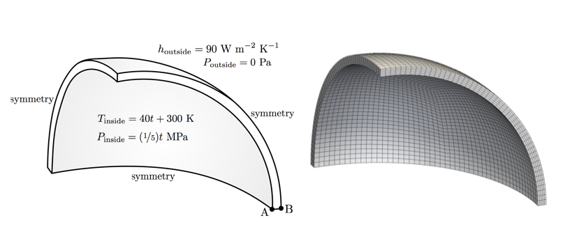
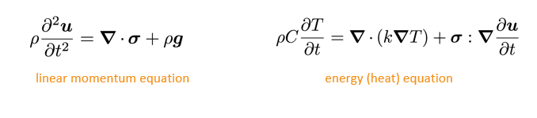
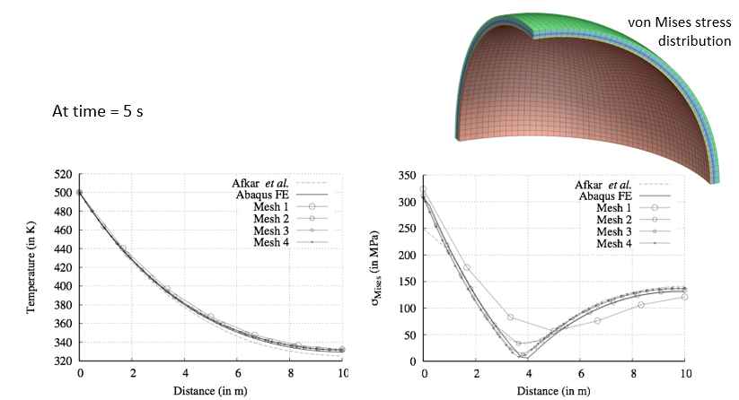
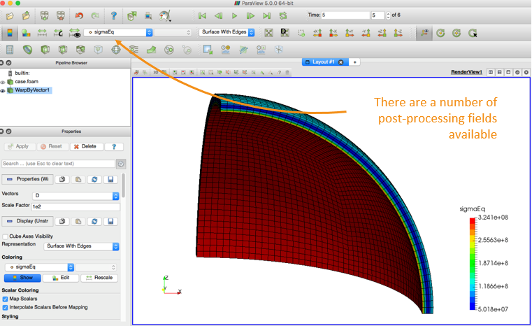
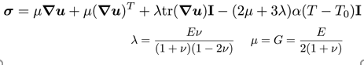
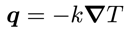
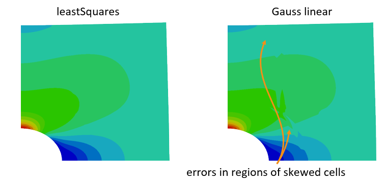
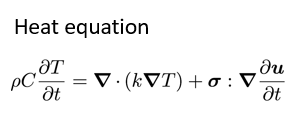
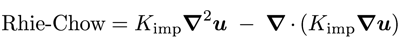
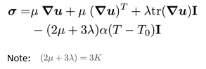

# My first tutorial: `hotSphere`

You can find the files for this tutorial under
[`tutorials/solids/thermoelasticity/hotSphere`](https://github.com/solids4foam/solids4foam/tree/master/tutorials/solids/thermoelasticity/hotSphere).

---

## Tutorial Aims

- Demonstrate how to perform a solid-only analysis in solids4foam;
- Describe the structure of a solids4foam solid-only case;
- Demonstrate how to perform a thermo-elastic analysis;

## Case Overview



This case analyses the stresses and displacements generated in a spherical
pressure vessel subjected to an increasing internal pressure and temperature.
The problem is 1-D axisymmetric in nature, but for demonstration purposes one
eighth of the vessel is modelled here and symmetry planes are used. The outer
surface of the vessel is stress/traction free and the heat flux is given by
Newton’s law of cooling (a simplified convection boundary condition). The
internal pressure and temperature are a function of time $t$:

$$
\begin{align}
    T_{\text{inside}} = 40t + 300 ~\text{K} \\
    p_{\text{inside}} = (1/5)t ~\text{MPa}
\end{align}
$$

We expect the vessel to deform due to the applied pressure and also due to the
thermal gradient. The deformations (strains/rotations) are expected to be
“small”: this means we can use a small strain (linear geometry) approach, where
the displacements are assumed not to affect the material geometry. The governing
equations are given by the conservation equations are linear momentum (linear
geometry form) and energy (heat equation form): 

In this case, the solver employs a segregated solution methodology, where a loop
is performed over the momentum equation (solved for displacement `D`) and the
energy equation (solved for temperature `T`) until convergence is achieved. This
loop is performed within each time-step resulting in an overall method that is
implicit in time.

```pseudocode
for all time-steps
    do
        solve energy equation for T (terms depending on D are calculated explicitly)
        solve momentum equation for D (terms depending on T are calculated explicitly)
    while not converged
end
```

---

## Expected Results

At 5 s, the expected temperature distribution across the wall thickness is
expected to be close to linear, where, the von Mises stress distribution is
quite nonlinear with a minimum 4 mm from the inner wall.


---

## Running the Case

As in all solids4foam tutorials, the tutorial case can be run using the included
`Allrun` script, i.e. `> ./Allrun`. In this case, the `Allrun` script is

```bash
#!/bin/bash

# Source tutorial run functions
. $WM_PROJECT_DIR/bin/tools/RunFunctions

# Source solids4Foam scripts
source solids4FoamScripts.sh

# Check case version is correct
solids4Foam::convertCaseFormat .

# Create the mesh
solids4Foam::runApplication fluentMeshToFoam hotSphere.msh

# Run the solver
solids4Foam::runApplication solids4Foam
```

where the `solids4Foam::convertCaseFormat .` script makes minor changes to the
case to make it compatible with your version of OpenFOAM/foam-extend. As can be
seen, the mesh in the fluent format is converted to the OpenFOAM format before
running the `solids4Foam` solver.

```tip
A tutorial case can be cleaned and reset using the included `Allrun` script, i.e. `> ./Allclean`.
```

---

## Analysing the Results

When viewing the results in ParaView, it can be insightful to warp the geometry
by a scaled displacement field. This can be achieved using the _Warp By Vector_
filter, where the `D` displacement field is selected as the _Vector_ and a
_Scale Factor_ of 1 shows the true deformation. In this case, using a _Scale
Factor_ of 100 allows the deformation to be seen. 


---

# Delving Deeper

---

If you would like to learn more about the case, then please continue; if not,
how about you check out another tutorial.

---

## Case Structure

The case structure follows the typical OpenFOAM case structure:

```
hotSphere
├── 0
│   ├── D
│   └── T
├── Allclean
├── Allrun
├── constant
│   ├── dynamicMeshDict
│   ├── g
│   ├── mechanicalProperties
│   ├── physicsProperties
│   ├── polyMesh
│   │   └── …
│   ├── solidProperties
│   ├── thermalProperties
│   ├── timeVsPressure
│   └── timeVsTemperature
├── hotSphere.msh
└── system
    ├── controlDict
    ├── fvSchemes
    └── fvSolution

```

---

## Initial Conditions and Boundary Conditions

In this case, there are two primitive variables:

- displacement (vector)
- temperature (scalar)

```
├── 0
│   ├── D   displacement vector field
│   └── T   temperature scalar field
```

This initial displacement field is assumed to be zero, and the initial
temperature field is assumed to be 300 K.

### Displacement Field `D` Boundary Conditions

A zero-traction condition is specified on the outer wall:

```
outside
{
    type            solidTraction;
    traction        uniform ( 0 0 0 );
    pressure        uniform 0;
    value           uniform (0 0 0);
}
```

```note
`pressure` here is referring to the normal component of the boundary traction vector; in general, this is not the same as the hydrostatic pressure. The total applied traction is: `appliedTraction = traction - n*pressure` where `n` is the boundary unit normal field.
```

A time-varying traction condition is given on the inner wall:

```
inside
{
    type            solidTraction;
    traction        uniform ( 0 0 0 );
    pressureSeries
    {
        "file|fileName" “$FOAM_CASE/constant/timeVsPressure";
        outOfBounds clamp;
    }
    value           uniform (0 0 0);
}
```

where `timeVsPressure` specifies time vs pressure as a XY piecewise linear
series:

```
(
    ( 0 0 )
    ( 5 1e6 )
)
```

### Temperature Field `T` Boundary Conditions

For the temperature field, a convection condition (Newton’s law of cooling) is
specified on the outer wall:

```
outside
{
    type            thermalConvection;
    alpha           uniform 90;
    Tinf            300;
    value           uniform 300;
}
```

A time-varying temperature is given on the inside wall:

```
inside
{
    type            fixedTemperature;
    temperatureSeries
    {
       fileName "$FOAM_CASE/constant/timeVsTemperature";
       outOfBounds clamp;
    }
    value           uniform 300;
}
```

where `timeVsTemperature` specifies time vs temperature:

```
(
    ( 0 300 )
    ( 5 500 )
)
```

---

## Specifying the Type of Solid Analysis

The type of solid analysis, which is called by the `solids4Foam` solver, is
specified in the `constant/solidProperties` dictionary:

```
solidModel thermalLinearGeometry;

thermalLinearGeometryCoeffs
{
    nCorrectors          10000;

    solutionTolerance    1e-6;

    alternativeTolerance 1e-7;

    infoFrequency        100;
}
```

Here, the `thermalLinearGeometry` is a solid mathematical model where the heat
equation is solved (`thermal-`) and a linear geometry (`-LinearGeometry`)
mechanical approach is taken.

```tip
A **linear geometry** approach is also known as a “small strain” or “small strain/rotation” approach and means that we assume the cell geometry (volumes, face areas, etc.) to be **independent of the displacement field**. This assumption is typically OK when the deformation is “small”.
```

- `nCorrectors`: this is the maximum number of outer correctors per time-step.
  If `nCorrectors` is reached, this means the equations have not converged to
  the required tolerance.
- `solutionTolerance` and `alternativeTolerance`: these are solution tolerances
  for the outer corrector loop. Further details are given below.
- Iterations will continue until either the D (and T) have converged to the
  specific **tolerances** or the maximum number of correctors has been reached.
- `infoFrequency`: this is the frequency that the outer loop residuals are
  printed to the standard output.

---

## The Mechanical Law

A “solid” analysis requires the definition of the mechanical properties via the
`mechanicalProperties` dictionary; in this case the `thermoLinearElastic` law is
specified (Duhamel-Nuemann form of Hooke’s law): 

```
mechanical
(
    steel
    {
        type  thermoLinearElastic;
        rho   rho [1 -3 0 0 0 0 0] 7750;
        E     E [1 -1 -2 0 0 0 0] 190e+9;
        nu    nu [0 0 0 0 0 0 0] 0.305;
        alpha alpha [0 0 0 -1 0 0 0] 9.7e-06;
        T0    T0 [0 0 0 1 0 0 0] 300;
    }
);
```

where, in addition to the density, three mechanical properties must be
specified: Elastic/Young’s modulus `E`, Poisson’s ratio `ν` and the coefficient
of linear thermal expansion `α`.

As we are performing a heat analysis, so we also need to specify the thermal
properties via the `thermalProperties` dictionary. In this case the constant law
is specified (Fourier’s conduction law) by specific heat `C` and thermal
conductivity `k`: 

```
thermal
{
    type      constant;
    C         C [0 2 -2 -1 0 0 0] 486;
    k         k [1 1 -3 -1 0 0 0] 20;
}
```

---

## Examining the Solver Output

Let us examine the output from the `solids4Foam` solver for this case:

```
Time = 1

Evolving thermal solid solver
Solving coupled energy and displacements equation for T and D
    Corr, res (T & D), relRes (T & D), matRes, iters (T & D)
    100, 3.37856e-10, 9.48897e-06, 0, 3.1907e-05, 0, 0, 12
    200, 1.97288e-10, 2.07022e-06, 0, 7.17093e-06, 0, 0, 10
    300, 9.26738e-10, 4.86841e-07, 0, 1.6726e-06, 0, 0, 10
    The residuals have converged
    337, 1.64639e-10, 2.83573e-07, 0, 9.86025e-07, 0, 0, 12

Max T = 340
Min T = 301.118
Max magnitude of heat flux = 321505
Max epsilonEq = 0.000254994
Max sigmaEq (von Mises stress) = 5.56883e+07
ExecutionTime = 8.73 s  ClockTime = 9 s
```

For solid analyses, the `solids4Foam` solver checks three types of residuals:

- `res`: linear solver residual
- `relRes`: relative residual - change of the primitive variable
- `matRes`: material residual - for nonlinear material laws

where the tolerances are specified in the `solidProperties` dictionary. In this
case, there are residuals for `T` and `D`. The material residual is zero because
a linear mechanical law was selected (no need to iterate).

---

## `fvSchemes`

Switching between `steadyState` and `transient` analyses requires changing the
_d2dt2_ and _ddt_ schemes.

The **gradient** schemes should almost always be `leastSquares` as the standard
`Gauss linear` method can produce large errors in the stress field for skewed
cells, e.g. on the `plateHole` case 

---

## `fvSolution`

The `D` and `T` equations are similar to the `p` equation in standard CFD
approaches; as such, the preconditioned conjugate gradient (PCG) or the
algebraic multi-grid (GAMG) linear solvers tend to work best. The `relTol` can
set be 0.1 as outer iterations are performed over the momentum equation until
convergence.

In general, the `D` equation and `D` field do not require under-relaxation;
however, it is beneficial or required in some cases:

- equation relaxation
  - to restrict rigid body motion in contact analysis
- field relaxation
  - complex boundary conditions
  - complex material behaviour, e.g. plasticity
  - large strains
  - poor meshes

Equation relaxation values of 0.99-0.9999 are typical, while field relaxation
factors should typically be greater than 0.1.

---

## Code

### `solidModel`

For the `hotSphere` test case, we have selected a “solid” analysis in the
`physicsProperties` dictionary: this means a `solidModel` class will be
selected; then, we specify the actual `solidModel` class to be the
`thermoLinGeomSolidModel` class.

The code for the thermoLinGeomSolidModel class is located at:

```
solids4foam/src/solids4FoamModels/solidModels/thermalLinGeomSolid/thermalLinGeomSolid.C
```

Let us examine the “evolve” function of this class to see the equations solved:

```c++
bool thermalLinGeomSolid::evolve()
{
    Info<< "Evolving thermal solid solver" << endl;

    int iCorr = 0;
    lduSolverPerformance solverPerfD;
    lduSolverPerformance solverPerfT;
    blockLduMatrix::debug = 0;

    Info<< "Solving coupled energy and displacements equation for T and D"
        << endl;

    // Momentum-energy coupling outer loop
    do
    {
        // Store fields for under-relaxation and residual calculation
        T().storePrevIter();

        // Heat equation
        fvScalarMatrix TEqn
        (
            rhoC_*fvm::ddt(T_)
         == fvm::laplacian(k_, T_, "laplacian(k,T)")
          + (sigma() && fvc::grad(U()))
        );
...
```



```c++
        // Under-relaxation the linear system
        TEqn.relax();

        // Solve the linear system
        solverPerfT = TEqn.solve();

        // Under-relax the field
        T_.relax();

        // Update gradient of temperature
        gradT_ = fvc::grad(T_);

        // Store fields for under-relaxation and residual calculation
        D().storePrevIter();

        // Linear momentum equation total displacement form
        fvVectorMatrix DEqn
        (
            rho()*fvm::d2dt2(D())
         == fvm::laplacian(impKf_, D(), "laplacian(DD,D)")
          - fvc::laplacian(impKf_, D(), "laplacian(DD,D)")
          + fvc::div(sigma(), "div(sigma)")
          + rho()*g()
          + mechanical().RhieChowCorrection(D(), gradD())
        );
...
```


Also, we add an additional diffusion term to quell numerical oscillations (e.g.
checker-boarding) based on Rhie-Chow correction:

 

```c++
        // Under-relaxation the linear system
        TEqn.relax();

        // Solve the linear system
        solverPerfT = TEqn.solve();

        // Under-relax the field
        T_.relax();

        // Update gradient of temperature
        gradT_ = fvc::grad(T_);

        // Store fields for under-relaxation and residual calculation
        D().storePrevIter();

        // Linear momentum equation total displacement form
        fvVectorMatrix DEqn
        (
            rho()*fvm::d2dt2(D())
         == fvm::laplacian(impKf_, D(), "laplacian(DD,D)")
          - fvc::laplacian(impKf_, D(), "laplacian(DD,D)")
          + fvc::div(sigma(), "div(sigma)")
          + rho()*g()
          + mechanical().RhieChowCorrection(D(), gradD())
        );
...
```


```c++
        // Under-relaxation the linear system
        DEqn.relax();

        // Solve the linear system
        solverPerfD = DEqn.solve();

        // Under-relax the field
        relaxField(D(), iCorr);

        // Update increment of displacement
        DD() = D() - D().oldTime();

        // Update velocity
        U() = fvc::ddt(D());

        // Update gradient of displacement
        mechanical().grad(D(), gradD());

        // Update gradient of displacement increment
        gradDD() = gradD() - gradD().oldTime();

        // Calculate the stress using run-time selectable mechanical law
        mechanical().correct(sigma());
    }
    while
    (
        !converged(iCorr, solverPerfD, solverPerfT, D(), T_)
     && ++iCorr < nCorr()
    ); // loop around TEqn and DEqn

    // Interpolate cell displacements to vertices
    mechanical().interpolate(D(), pointD());

    // Increment of displacement
    DD() = D() - D().oldTime();

    // Increment of point displacement
    pointDD() = pointD() - pointD().oldTime();

    return true;
}
```

The values of impK can affect convergence, but not the answer, assuming
convergence is achieved.

### `mechanicalLaw`

For the `hotSphere` test case, we have selected the `thermoLinearElastic`
mechanical law in the `mechanicalProperties` dictionary: this class will perform
the calculation of stress for the solid.

The code for the `thermoLinearElastic` mechanical law class is located at:

```bash
solids4foam/src/solids4FoamModels/materialModels/mechanicalModel/mechanicalLaws/linearGeometryLaws/thermoLinearElastic/thermoLinearElastic.C
```

which calculates the stress according to the Duhamel-Neumann form of Hooke’s
law: 

Let us examine the “correct” function of this class to see how the stress is
calculated:

```c++
void Foam::thermoLinearElastic::correct(volSymmTensorField& sigma)
{
    // Calculate linear elastic stress
    linearElastic::correct(sigma);

    if (TPtr_.valid())
    {
        // Add thermal stress component
        sigma -= 3.0*K()*alpha_*(TPtr_() - T0_)*symmTensor(I);
    }
    else
    {
        // Lookup the temperature field from the solver
        const volScalarField& T = mesh().lookupObject<volScalarField>("T");

        // Add thermal stress component
        sigma -= 3.0*K()*alpha_*(T - T0_)*symmTensor(I);
    }
}
```

As `thermoLinearElastic` derives from the **linearElastic law**, we will also
examine the “correct” function for this class:

```bash
solids4foam/src/solids4FoamModels/materialModels/mechanicalModel/mechanicalLaws/linearGeometryLaws/linearElastic/linearElastic.C
```

```c++
void Foam::linearElastic::correct(volSymmTensorField& sigma)
{
   // Calculate total strain
    if (incremental())
    {
        // Lookup gradient of displacement increment
        const volTensorField& gradDD =
            mesh().lookupObject<volTensorField>("grad(DD)");

        epsilon_ = epsilon_.oldTime() + symm(gradDD);
    }
    else
    {
        // Lookup gradient of displacement
        const volTensorField& gradD =
            mesh().lookupObject<volTensorField>("grad(D)");

        epsilon_ = symm(gradD);
    }
    // For planeStress, correct strain in the out of plane direction
        if (planeStress())
        {
            if (mesh().solutionD()[vector::Z] > -1)
            {
                FatalErrorIn
                (
                    "void Foam::linearElasticMisesPlastic::"
                    "correct(volSymmTensorField& sigma)"
                )   << "For planeStress, this material law assumes the empty "
                    << "direction is the Z direction!" << abort(FatalError);
            }

            epsilon_.replace
            (
                symmTensor::ZZ,
            -(nu_/E_)
            *(sigma.component(symmTensor::XX) + sigma.component(symmTensor::YY))
            );
        }

    // Hooke's law : standard form
    //sigma = 2.0*mu_*epsilon_ + lambda_*tr(epsilon_)*I + sigma0_;

    // Hooke's law : partitioned deviatoric and dilation form
    const volScalarField trEpsilon = tr(epsilon_);
    calculateHydrostaticStress(sigmaHyd_, trEpsilon);
    sigma = 2.0*mu_*dev(epsilon_) + sigmaHyd_*I + sigma0_;
}
```

where `sigma0_` is an optional initial residual stress field, and the standard
Hooke’s law can be expressed in a number of equivalent forms:

