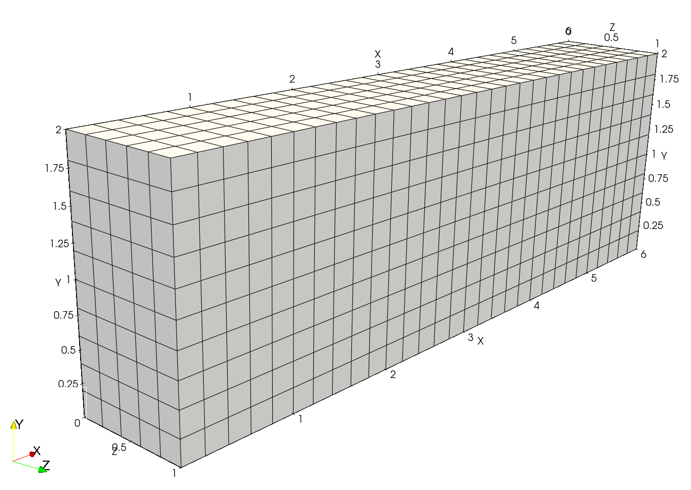
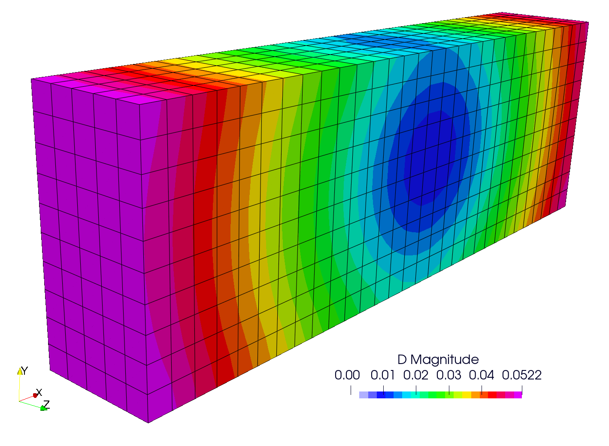
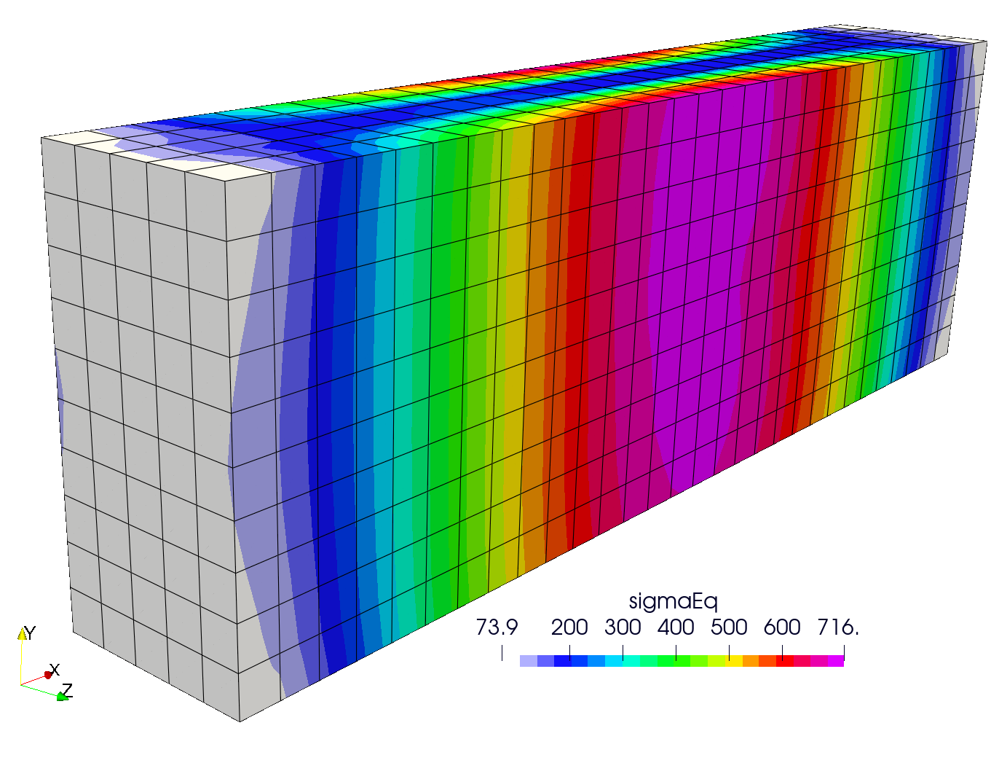

# The cooling of a solid slab: `slabCooling`

---

Prepared by Philip Cardiff, Duo Huang and Ivan Batistić

---

## Tutorial Aims

- Demonstrate how to perform a thermo-elastic analysis;
- Demonstrate how to constrain the displacement of an internal cell using the `cellDisplacements` functionality.

---

## Case Overview

This case [1] demonstrates the process of cooling the slab from the initial $$T_o = 800$$ K to the reference temperature,  $$T_{ref} = 300$$ K. The slab is $$6$$ m long, $$2$$ m wide, and $$1$$ m deep (Figure 1). The material of the slab is linear elastic with a Young modulus of $$E = 69$$ GPa and a Poisson's ratio of $$\nu = 0.33$$. The material density is $$\rho=7854$$ kg m$$^{-3}$$, thermal conductivity is $$k=250$$ W m$$^{-1}$$ K$$^{-1}$$, specific heat capacity is $$C = 434$$ J/kgK, and the coefficient of linear thermal expansion is $$\alpha = 2.3\times 10^{-5}$$ K$$^{-1}$$. Gravity and inertia are neglected, and the case is solved under the plane strain assumption. All slab faces are traction-free. The slab is discretised with $$30 \times 10 \times 5$$ cells.

A steady-state solution is required, meaning the case can be solved without temporal discretisation (using one loading increment). In this case, the values of density, thermal conductivity and specific heat capacity are not important for the resulting stress and displacement fields.

To avoid rigid-body translation, the displacement of one cell (near the centre of the slab) is constrained to zero.

<div style="text-align: center;">
  
    <figcaption>
     <strong>Figure 1: Problem geometry; computational mesh</strong>
    </figcaption>
</div>

### Avoiding Rigid-Body Translations

Since a displacement value is not specified at any boundary point, the body is unconstrained in all three directions and can freely float in space. This results in an ill-defined steady-state problem: adding any uniform displacement to a possible solution field will result in another valid solution field. This is similar to incompressible fluid solvers where a pressure reference must be supplied (`pRefValue` and `pRefCell`). 

To avoid these rigid-body translations or *modes*, a displacement value should be specified at some location in the domain. This can be done in the following ways:

- If appropriate, employ symmetry planes;
- Set the displacement of one boundary face; 
- Set the displacement of one internal cell.

All three approaches could work for this case; however, for demonstration purposes, the third approach (Set the displacement of one internal cell) is shown. It should also be noted that restricting rigid rotation may also be required, but this is not shown here.

The displacement of an internal cell can be specified in the `solidProperties` dictionary as follows:

```c++
// Set displacements of internal cells
cellDisplacements
{
    // Set displacement to zero for the cell closest to the centre of the block
    cellDisp1
    {
        approximateCoordinate    (3 1 0.5);
    	displacement             (0 0 0);
    }
}
```

---

## Expected Results

The predicted displacement field is shown in Figure 2, where the slab contracts uniformly about its centre (where the displacement of an internal cell is constrained).

<div style="text-align: center;">
  
    <figcaption>
     <strong>Figure 2: Displacement magnitude field</strong>
    </figcaption>
</div>

As all boundaries are traction-free, the steady-state solution should be stress-free. This is shown in Figure 3, where one can see that the resulting stress field has a magnitude of a few hundred pascals, which can be considered negligible and is caused by the usage of iterative procedures and chosen tolerances.

<div style="text-align: center;">
  
    <figcaption>
     <strong>Figure 3: Equivalent stress field</strong>
    </figcaption>
</div>


---

## Running the Case

The tutorial case is located at `solids4foam/tutorials/solids/thermoelasticity/slabCooling`. The case can be run using the included `Allrun` script, i.e. `> ./Allrun`.  The `Allrun` creates the mesh using `blockMesh` (`> blockMesh`), after which the case is run with the `solids4Foam` solver (`> solids4Foam`). 


---

### References

[1] [Link to forum discussion where the initial case is provided](https://www.cfd-online.com/Forums/openfoam-community-contributions/126706-support-thread-solid-mechanics-solvers-added-openfoam-extend-22.html#post726239)
