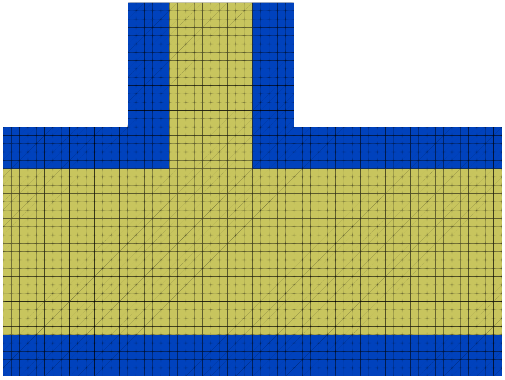
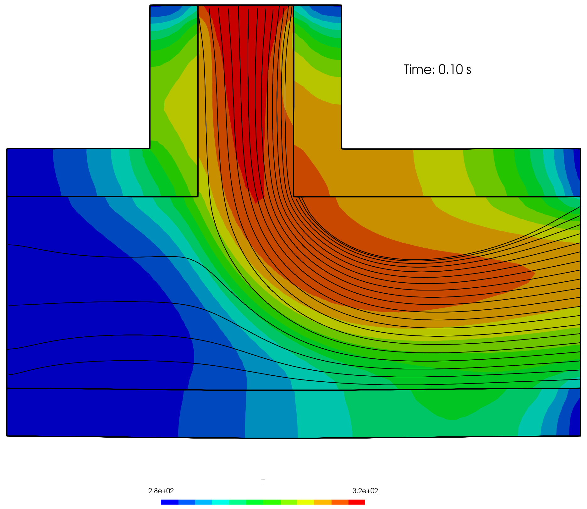
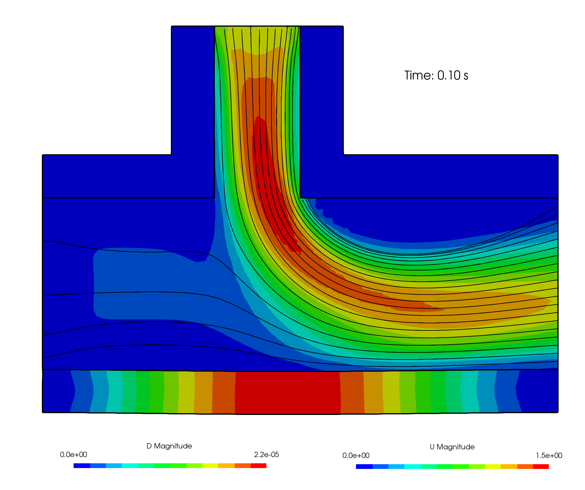
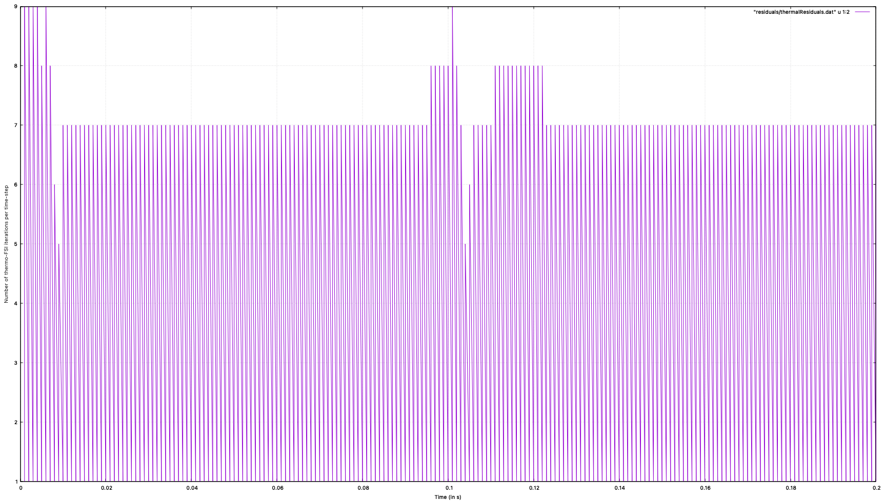

# Thermo-fluid-solid interaction within a T-junction channel: `hotTJunction`

---

Prepared by Philip Cardiff

---

## Tutorial Aims

- Demonstrates how to perform a thermal-fluid-solid interaction analysis.

---

## Case Overview

This case presents a 2-D coupled thermo-mechanical fluid-solid interaction
analysis in a T-junction channel. The fluid domain geometry consists of 6
$$\times$$ 2 mm long channel intersecting with a smaller 2 $$\times$$ 1 mm side
channel (Figure 1). An outer 0.5 mm wall forms the solid domain. A coupled
thermo-fluid-solid interaction analysis is performed where the heat equation is
solved in the fluid and solid regions in addition to the Navier-Stokes equations
in the fluid and the momentum equation in the solid. The coupling procedure
enforces temperature and heat flux continuity at the fluid-solid interface.
Within the fluid, the temperature differences generate forces that drive fluid
flow, while in the solid, increases in temperature cause volumetric expansion.

  
    <figcaption>
     <strong>Figure 1: Problem geometry and mesh. The fluid domain is shown in yellow, and the solid domain in blue.</strong>
    </figcaption>

At time $$t = 0$$, the fluid and solid temperatures are $$280$$ K. The larger left fluid inlet has a prescribed constant velocity of $$(0.1\,0\,0)$$ m/s at $$280$$ K, whereas the smaller upper fluid inlet has a time-varying velocity which linearly ramps from $$(0\;0\;0)$$ at time = 0 s to $$(0\;-1\;0)$$ m/s at time = 0.1 s before linearly ramping back to $$(0\;0\;0)$$ at time = 0.2 s. The temperature at the smaller upper fluid inlet is temperature is $$320$$ K. A constant uniform pressure of 0 Pa is assumed at the outlet on the right. The smaller ends of the solid domain at the outlet and two inlets are fixed (zero displacement), held at a fixed temperature of $$280$$ K. The outer surface has a zero-traction condition and is assumed to be adiabatic (zero heat flux). The solid internal and remaining fluid external boundaries represent the fluid-solid interface, where kinematic (velocity continuity), kinetic (force continuity) and thermal constraints (temperature and heat flux continuity) are enforced. No slip is enforced on the fluid interface.
In both fluid and solid, gravity is assumed to act in the negative vertical direction $$(0\;$$-$$9.81\; 0)$$ m/s$$^{2}$$ and inertial effects are included, albeit mechanical inertia is small. Small deformations are assumed in the solid. The end time is $$0.2$$ s and time-step size $$\Delta t = 1$$ ms. A uniform quadrilateral cell size of 0.1 mm is used in solid and fluid domains.

Table 1 gives the assumed fluid and solid physical parameters. The solid
behaviour is linear elastic, and plane strain conditions are assumed.

**Table 1: Physical Parameters**

|               Parameter                |       Symbol       |                 Value                  |
| :------------------------------------: | :----------------: | :------------------------------------: |
|         Solid Young's Modulus          |       $$E$$        |                0.5 kPa                 |
|             Solid Density              |     $$ \rho$$      |            1 kg m$$^{-3}$$             |
|          Solid Poisson Ratio           |      $$ \nu$$      |                  0.3                   |
| Solid Coefficient of Thermal Expansion |    $$ \alpha$$     |         $$10^{-5}$$ K$$^{-1}$$         |
|       Solid Thermal Conductivity       |       $$k$$        |            $$0.04$$ W/(m K)            |
|      Solid Specific Heat Capacity      |      $$C_p$$       |           $$1010$$ J/(kg K)            |
|      Solid Reference Temperature       |      $$T_0$$       |                $$0$$ K                 |
|            Fluid Viscosity             |      $$\mu$$       |       $$2.15\times10^{-5}$$ Pa s       |
|             Fluid Density              |      $$\rho$$      |            1 kg m$$^{-3}$$             |
| Fluid Coefficient of Thermal Expansion |     $$ \beta$$     |    $$2.85\times10^{-3}$$ K$$^{-1}$$    |
|       Fluid Thermal Conductivity       |    $$\lambda$$     |            $$0.03$$ W/(m K)            |
|      Fluid Specific Heat Capacity      |      $$ C_p$$      |           $$1010$$ J/(kg K)            |
|      Fluid Reference Temperature       |    $$T_{ref}$$     |               $$303$$ K                |
|     Fluid Turbulent Prandtl Number     | $$ \text{Pr}\_t $$ |                  0.85                  |
|                Gravity                 |       $$g$$        | $$(0 \; $$-$$9.81 \; 0)$$ m $$s^{-2}$$ |

A fixed under-relaxation factor of 1.0 is used for both the mechanical and
thermal interface coupling. Dirichlet-Neumann coupling to used to enforce the
interface mechanical constraints, while Robin-Neumann coupling is used for the
thermal constraints.

## Results

Over the first half of the simulation (0.1 s), the velocity at the smaller,
upper fluid inlet increases bringing hot fluid into the domain (Figure 2 and
Video 1). This causes the solid domain to heat up and expand due to volumetric
heating (Figure 3). As the fast, hot jet impinges on the lower wall of the
larger channel, it causes it to bend downwards, in addition to volumetrically
expanding. As the upper inlet velocity ramps back to 0 from 0.1 to 0.2 s, the
deformations in the solid reduce, but still remain non-zero due to the residual
temperature field which has yet to return to the initial stress-free conditions.

  
    <figcaption>
     <strong>Figure 2: Temperature distribution at time = 0.1 s</strong>
    </figcaption>



**Video 1: Evolution of the temperature and velocity distributions within the
fluid and solid domains**

  
    <figcaption>
     <strong>Figure 3: Displacement distribution in the solid domain and velocity distribution in the fluid domain at time = 0.1 s</strong>
    </figcaption>

Figure 4 shows the number of thermo-fluid-solid interaction iterations per time
step. The number of iterations remains constant at 7, apart from during early
time steps and around time = 0.1 s when the upper inlet acceleration switches
direction.

  
    <figcaption>
     <strong>Figure 4: Number of thermo-fluid-solid interaction iterations per time step.</strong>
    </figcaption>

---

## Running the Case

The tutorial case is located at
`solids4foam/tutorials/thermofluidSolidInteraction/hotTJunction`. The case can
be run using the included `Allrun` script, i.e. `> ./Allrun`. The `Allrun`
script first executes `blockMesh` for both `solid` and `fluid` domains
(`> blockMesh -region fluid` and `> blockMesh -region solid` ), and the
`solids4foam` solver is used to run the case (`> solids4Foam`).
