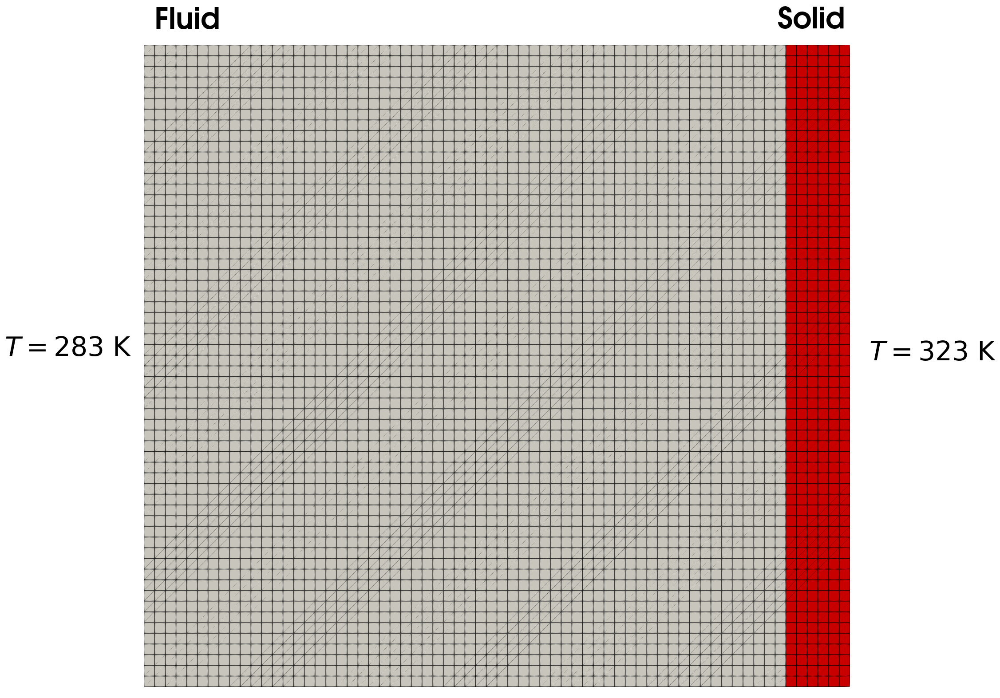
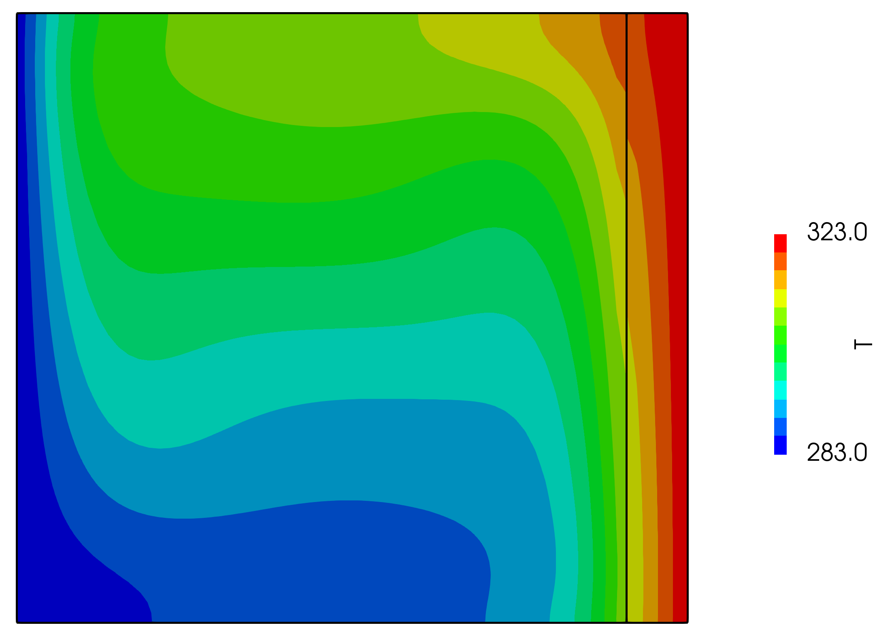
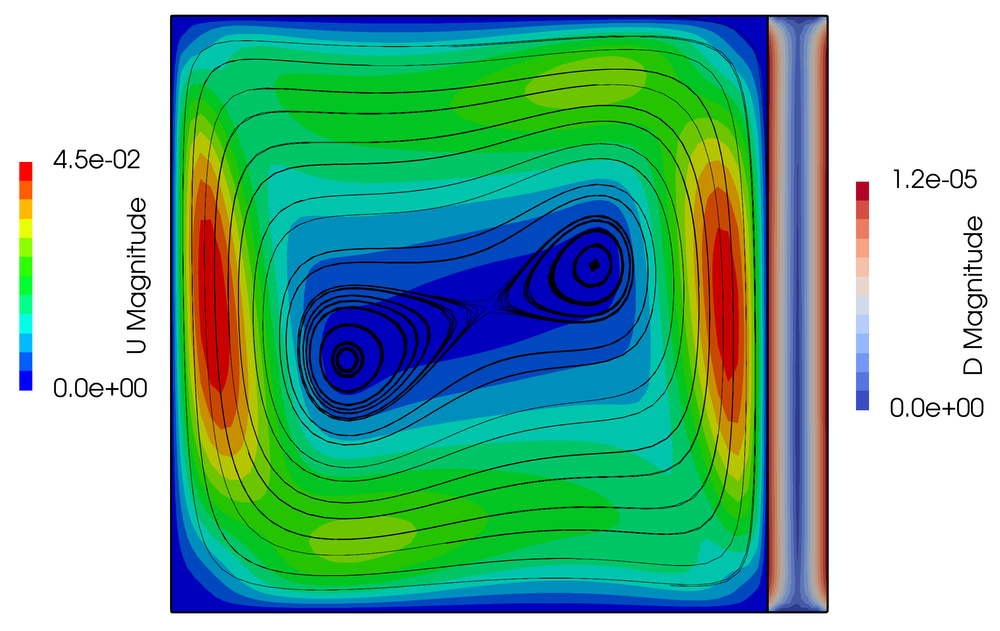

# Lid-driven cavity flow with a hot wall: `thermalCavity`

---

Prepared by Željko Tuković and Philip Cardiff

---

## Tutorial Aims

- Demonstrates how to perform a thermal-fluid-solid interaction analysis.

---

## Case Overview

This case extends the traditional OpenFOAM `cavity` tutorial to include a coupled thermal analysis. The right wall of the cavity is assumed to be elastic and initially hotter than the cavity fluid (Figure 1). A coupled thermo-fluid-solid interaction analysis is performed where the heat equation is solved in the fluid and solid regions in addition to the Navier-Stokes equations in the fluid and the momentum equation in the solid. The coupling procedure enforces continuity of temperature and heat flux at the fluid-solid interface. Within the fluid, the differences in temperature generate forces that drive fluid flow, while in the solid, incresaes in temperature causes volumetric expanision.

At time $$t = 0$$, the fluid temperature is $$283$$ K, whereas the solid temperature is $$323$$ K. The top, left and bottom of the fluid domain are assumed to be stationary no-slip walls. The top and bottom of the solid domain are fixed (zero displacement), while the right has a zero-traction condition.
The left of the fluid boundary is held at a fixed temperature of $$283$$ K, while the right of the solid is held at $$323$$ K. All other external boundaries are assumed to be adiabatic (zero heat flux). The right of the fluid domain and the left of the solid domain represent the fluid-solid interface, where kinemtic (velocity continuity), kinetic (force continuty) and thermal contraints (temperature and heat flux continuity) are enforced. In both fluid and solid, gravity is assumed to act in the negative vertical direction $$(0 -9.81 0)$$ and inertial effects are included. Small deformations are assumed in the solid.

  
    <figcaption>
     <strong>Figure 1: Problem geometry and initial conditions </strong>
    </figcaption>

The end time is $$10$$ s and time-step size $$\Delta t = 0.01$$ s. The assumed fluid and solid physical parameters are given in Table 1. The solid behaviour is assumed to be linear elastic and plane strain conditions are assumed.

**Table 1: Physical Parameters**

| Parameter   | Symbol | Value    |
| :-----: | :---: | :---: |
| Solid Young's Modulus  | $$E$$ | 1 kPa  |
| Solid Density | $$ \rho$$ | 1 kg m$$^{-3}$$ |
| Solid Poisson Ratio | $$ \nu$$ | 0.3   |
| Solid Coefficient of Thermal Expension | $$ \alpha$$ | $$1\times10^{-5}$$ K$$^{-1}$$   |
| Solid Thermal Conductivity | $$k$$ | $$0.04$$ W/(m K)   |
| Solid Specific Heat Capacity | $$C_p$$ | $$1010$$ J/(kg K)   |
| Solid Reference Temperature | $$T_0$$ | $$0$$ K  |
| Fluid Viscosity| $$\mu$$ | 0.001 Pa s  |
| Fluid Density | $$\rho$$ | 1 kg m$$^{-3}$$ |
| Fluid Coefficient of Thermal Expension | $$ \beta$$ | $$2.85\times10^{-3}$$ K$$^{-1}$$   |
| Fluid Thermal Conductivity | $$\lambda$$ | $$0.03$$ W/(m K)   |
| Fluid Specific Heat Capacity | $$ C_p$$ | $$1010$$ J/(kg K)   |
| Fluid Reference Temperature | $$T_{ref}$$ | $$303$$ K   |
| Fluid Turbulent Prandtl Number | $$ \text{Pr}_t $$ | 0.85 |
| Gravity | $$g$$ | $$(0 \; $$-$$9.81 \; 0)$$  m $$s^{-2}$$ |

## Results

Over the duration of the simulation, the solid heats the fluid causing a thermal circulation to form in the fluid. The evolution of the temperature of veloecity fields are shown in Video 1. The temperature distribution at $$t = 10$$ s is shown in Figure 2 and the fluid velocity and solid displacement fields are shown in Figure 3.

  
    <figcaption>
     <strong>Figure 2: Temperature distribution at $$t = 10$$ s</strong>
    </figcaption>



**Video 1: Evolution of the temperature and veloecity distributions within the fluid and solid domains**

  
    <figcaption>
     <strong>Figure 3: Velocity distribution in the fluid and displacement distribution in the solid at $$t = 10$$ s</strong>
    </figcaption>

---

## Running the Case

The tutorial case is located at `solids4foam/tutorials/thermofluidSolidInteraction/thermalCavity`. The case can be run using the included `Allrun` script, i.e. `> ./Allrun`.  The `Allrun` script first executes `blockMesh` for both `solid` and `fluid` domains (`> blockMesh -region fluid` and `> blockMesh -region solid` ), and the `solids4foam` solver is used to run the case (`> solids4Foam`).
